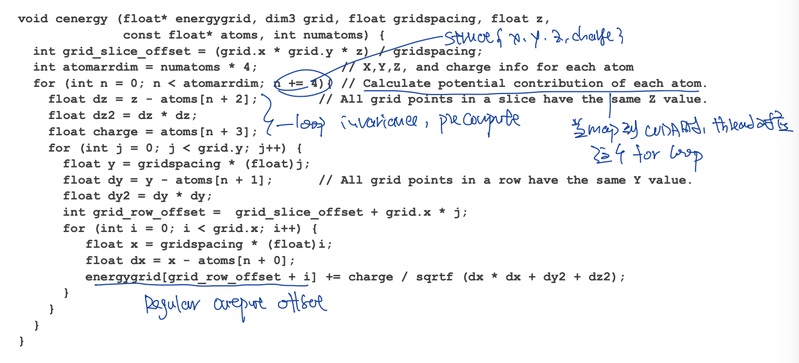

# Cases


### Direct Coulombs Summation DCS

> Reference
>
> 1. Programming Massive Parallel Processors Chapter 15
> 2. UIUC ECE 508


irregular input atom and regular output potential grid. Every input influence every output. Given a input atom array, calculate potential on each output grid location.

DCS是最精确的方法，也可以使用其余的方法从而更快，但是就没有这么精确了

DCS算法is not data scalable, 因为complexity是O(V^2) 而不是O(V) where n m ≈ V volume


#### Scatter C Code

minimize computation by moving loop invariance out of loop

计算2D slices of a 3D grid

on the fly 计算grid point location。只需要small amount of calculation来减少额外的对内存的访问，所以不是问题。




#### Scatter CUDA Code

替换C code部分的最外层for loop为thread，也就是每个thread负责一个atom对应全部grid point的影响

需要使用CUDA atomic。由于atoimic导致serialization，会慢。


#### Gather C Code

存在重复计算varaible

存在重复访问atom array

在C的版本下，比simple scatter版本更慢

对于energygrid的写入更加连续


#### Gather CUDA Code

替换for grid x与for grid y为2d block thread

对于一个warp内的thread来说，同步读取same atom array value，也就只访问一次atom array

写入energygrid充分利用memory burst

对于sequential来说更快的代码（simple scatter），计算量更少的代码，并不一定在parallel上更快


* constant cache

atom array可以通过constant cache读取。这样一个warp内32个thread会通过constant cache + broadcast机制加快读取


* thread coarsening 

一个thread可以负责多个grid point，从而（1）减少laucnh too much block （2）reuse some data access and computation


* further hide latency

可以在kernel/for loop的一开始，读取energygrid的数据，放到cache里。然后当for loop运行结束后再write into energygrid。

这样的话两个内存访问(一个read，一个write)中间有更久的间隔，更小的latency，更容易hide，减少number of warps needed by SM scheduler to hide global memory latency

read memory -> do some work -> write memory


#### Improved Gather C Code

对于CPU代码来说，cache的利用比computation更重要。尽管scatter C code的计算最少，但是并非是对cache利用最好的

问题中energygrid > 20 x atom array。 atom array可以被放在cache里重复读取，但是对energygrid的读取希望只读取一次，因为无法放入在cache里。

C code中更好办法在这个问题里实际上是output oriented的


#### CUDA Thread granularity

原来：each thread compute one output (见common optimization techiniques - scatter to gather - dcs example )

现在：each thread compute four output (grid point) in a row

原因：计算grid points in a row的时候，对于dy dysqpdzsq等变量的计算是可以复用的


优点

1. reuse memory access: reduce number of load of atoms array by factor of 4。原来每个grid point都需要读取一遍atom array，现在每次读取atom array的数据都会被应用在4个grid point上。
2. reuse computation result: eliminate redundant computation like dxx, dysqpdzsq


缺点：

1. 使用更多register，现在需要储存4个dxi, 4个energvalxi.


#### CUDA Memory Coarlesing

* 为什么不memory coarlesing了

在使用了上面的thread granularity调整以后，每个thread写入同一个row的连续4个grid point，导致two adjacent threads access memory location that's 3 elements aparts. 下面的Figure显示了一个thread写入的memory location（四个黑色箭头）


* 解决方法

assigning adjacent grid points (output location) to adjacent threads in each half-warp (prev gen Arch) / warp (recent gen Arch). 

idx 0-31 : thread 0-31

idx 32-63 : thread 0-31

也就是每个thread负责的4个grid point，现在不是连续的4个grid point，而是16/32 grid points away。

当read/write内存的时候，一个warp内全部的thread首先访问idx 0-31的数据，然后再访问idx 32-63的数据。

可以通过对于内存访问的reorder，从而同时利用write与read的双向bandwidth，而不是一开始都是read，结尾的时候都是write。


* Padding for aliasing

现在一个warp内会访问连续的内存，也就需要grid x-dim需要时16/32的倍数，从而在访问完row0，开始访问row1的时候，依旧是alias global memory access。

这也就需要padding。


如果不想用if branch来处理y dim的访问，也可以通过pad y to multiplier of 32的方法，俩减少（1）branch control instruction overhead (2) branch divergence


如果padding 3D的overhead过大的话，可以选择处理多个2D + padding slides


### Cutoff Biomolecules

> Reference
>
> 1. UIUC ECE 508 Lecture 5,6


是什么：忽略atoms contributiuon to grid point beyound cutoff distance C

这样大约有200-700 atoms within cutoff sphere for each grid point，这样对于每一个grid point就只有constant number of atom that's relavent

对于每一个thread/grid point，只需要examine atoms within cutoff radious


smoothing function：在计算atom对于grid point的作用的时候，使用一个smoothing function避免在cutoff boundary的地方的点是0/1这样的切换


#### Constant bin

把atom放到bin中

每个bin的property是这个bin的spatial location

每个bin有自己的unique index for O(1) parallel access

每个bin包含多个atom，bin中的每个atom有自己独立的位置

这是一种改变input data structure从而improve performence的方法


使用single overflow bin on cpu储存全部的overflow atom


* 选择constant bin capacity

每个thread block负责计算一个bin。这里假设每个bin放几个atom的大小与threads block负责的大小是一样的，都是bin capacity所对应的spatial location

一般选择bin capacity从而允许align & coarlesed memory access

一般选择capacity从而让95%的atom都在bin里，只有5%的在overflow bin里

如果bin capacity太大，需要过多的dummy atom in bin，同时thread需要检查很多atoms out of range（得到bin了以后，依旧要检查range）

如果bin capacity太小，过多的atom在overflow bin中，同时not enough grid points within bin 导致无法充分利用threads block（启动一个16 threads的threads block是不划算的）

选择每个bin包含8 x 8 x 8个grid points。4 grid points per thread。128 thread block cover one bin

也需要有足够的thread block per sm（也就是总threads block数量要多，每个threads block不要过大），因为load nbr bin data from global memory to shared memory花费很多时间，需要有足够的threads block才能够成功的hide latency，一般选择 >= 4 threads block per sm

每个constant size bin储存8 atoms，每个bin占用128 bytes的数据


* 使用constant bin的优点

可以使用array储存bin中atoms

可以使用relative bin offset来访问数据。neighbour bin offset是个复杂的计算，可以在cpu上计算一次，放在constant memory上，然后在gpu上使用


* 实现

load nbr bin data (constant size atom array) from global memory to shared memory

every threads in bin examine nbr bin data in shared memory

all threads inside thread block examine supersphere（全部蓝色格子画一个内切圆）。绿色的左上角的grid point对应着左上的circle，绿色的右下角的grid point对应右下的circle，左上的circle并不涉及super sphere中全部的bin，但是要一起查看是否within cuttoff。

每一个bin，有8x8x8=512 grid points，每个thread处理4个grid point，每个bin/thread block有128 threads


* 适用data

如果atom is uniform，这样每个bin中的atom也就是uniform的，减少divergence & wasted memory


* efficency

使用上面的configuration，只有34% exampined的atom是within cutoff distance的，之所以这么低是因为

1. 每个grid point涉及到的nbr bin只是全部检查的nbr bin（蓝色部分）的一部分
2. 每个bin里面有dummy atom
3. 有些bin只与cutoff相切了一点，但是整个bin内的atom需要被examine if within cutoff

对于每一个bin，一次处理8x8x8个grid size，也就是8x8x8的reuse。


* CPU GPU 工作分配

host：把atom分配到对应的bin中，产生nbr bin offset，当结果从gpu拷贝回来以后负责计算overflow bin中的数据

device：对于每个bin，测试nbr bin中全部的atom


* memory access optimization

shared memory放一个nbr bin：每个bin使用128 bytes的数据，可以使用32 threads，每个thread load 4 bytes，从而coarlesed memory load。

这种方法的warp divergence：每个thread block有4个warp，当第一个warp内的thread来负责load data into shared memory，剩下3个thread不运行对应的if branch没有warp divergence（只有额外的if branch instruction overhead），但是由于有syncthread barrier，需要有其余的warp来运行来hide latency


shared memory放4个nbr bin：全部128 threads within block load 4 bytes data，coarlesed memory access & 没有branch divergence。

但是由于使用了更多的share memory ，可能导致一个sm能够放心的threads block数量减少，当前不太会是问题因为只要512 bytes per block

但是由于一次load更多的数据到shared memory中，导致latency更多，需要更多的threads block per sm来hide latency。


threads coarlesed方向：每个thread负责4个grid point，这4个grid point需要是Y/Z方向的连续4个点，不能是X方向的连续4个grid point。因为grid point data是以X Y Z为单位储存，也就是连续的x数据是连续储存在一起的，don't coarsen in smallest linearization dimention of data unless locality doesn't matter。如果一个thread负责4个连续的x方向grid point，则连续的threads会访问不连续的memmory


当遇到当前bin的第一个dummy atom，则break，然后检查下一个bin


* ILP

注意：很多HPC engineer都忽视优化中ILP的作用，只关注memory的优化，这是不好的，因为instruction pipeline 的pressure也会是原因

对于每个threads负责的4个grid point，首先计算dx2 dz2，运行cylinder test来检查4个grid point是否在cutoff radious内（被4个grid point共享），如果成功的话再测试y。


在pass cylinder test后，对于thread负责的4个grid point，分辨计算dy2，然后check if within cutoff distance


不要启动过多的threads block，大约4 threads block per sm足够keep sm busy就好了。对于每个thread block，当计算完当前bin的数据以后，就计算下一个bin，直到全部的bin都被处理完。


#### Parallel binning


因为per atom idx只会在step2里使用，所以不需要write to memory然后再load from memory，可以使用kernel fusion

因为使用kernel fusion的方法，copy atom to bin的latency被atomic等待 hide掉了。尽管write to bin并没有coarlesed


在binning结束以后，得到bin以及bin count。

在使用gpu计算最终结果的时候，是使用bin count，还是检查dummy atom，是一个需要选择的。使用bin count代表需要load extra data，有些时候不如检查dummy atom


* 处理overflow bin

如果atom count > capacity，atomically reduce atomic count，place data in overflow list。

这样做的缺点是如果有一些unbalance，就会导致某一个bin的atom特别多，很多的atomic recrease


减少atomic的使用。

1. read counter value，如果too large的话，则放到overflow list里，这一步不涉及atomic decrease
2. 如果读到的值没有过大，使用atomic add

这样避免了很多atomic add + atomic decrease


* 实现


#### Dynamic binning

* dummy atom的问题

浪费了global memory bandwidth，shared memory storage，compute cycle to identify dummy atom


* 得到dynamic binning

1. (对于每个bin，计算atom relative idx)
2. 对于每个bin，保存bin count
3. 通过prefix sum on bin count, 得到bin start location
4. 对于每个atom，通过bin start location与relative idx（也可以现在run time产生）进行数据拷贝


* 使用dynamic binning计算

之前使用constant bin的时候，对于每个bin储存nbr bin的relative offset （这个relative offset shared by all bin)。

现在使用dynamic binning的时候，储存pencil的数据。

需要注意依旧要tile access to atom。


* avoid load imbalance

为了避免某一个特定的bin有很多的atom，从而导致load imbalance。设定max num atom in bin + 使用overflow list

cpu在overflow list上进行计算

只要在某个方位内，max num atom in bin对perf的影响不是很大


### 7 point Stencil

stencil难点: memory intense & little computation (one fma per load value)


#### Thread granularity

原来：每个thread计算一个output

现在：每个thread计算pencil along Z dim

效果：

1. 减少grid index的计算。现在可以 x + 1, y + 1 而不是 thread.x block.x blockdim.x 每次重新计算x y
2. 更少的thread block，更少的thread block scheduling overhead


#### register tiling

一个thread计算pencil along z axis，z-axis上的数据复用可以使用register tilning


效果：

原来一个output需要访问7个input through global memory access

现在一个output需要访问5个input through globlal memory access

节省了25%的global memory bandwidth


#### shared memory tiling 

对于每一个current，都会被xy dim上的4个nbr thread使用。可以使用shared memory来共享这个部分


对于每一个block来说，现在有4 slices of data 在 on-chip memory 上。这是有限的内存，会限制block 的大小

1. prev, curr, next 的 register slices。每一个thread使用3个register，对于block负责x y dim来说，就是3 slides of memory
2. shared memory of current


对于halo来说，使用与conv strategy3类似的方法，访问global memory。更新的gpu arch有更大的across block L2 cache，这些halo cell会被nbr block放到L2 cache里，所以导致的thread divergence不会太严重


效果：

原来计算一个elem需要访问5个global memory

现在计算一个eleme需要访问1个global memory与4个shared memory

但是由于shared memory与register的限制，block dim不能很大，导致halo的部分影响了reduce ratio


### GEMM C=AB

> Reference
>
> 1. UIUC ECE 408 Lecture4, lecture5, lecture6


#### Simple C Code

注意下面使用到的变量名，后面会都是用类似的变量名

```cpp
void GEMM(float* M, float* N, float* P, int width)
{
  for ( int i = 0; i < width; ++i )
  {
    for ( int j = 0; j < width; ++j )
    {
      float sum = 0f;
      for ( int k = 0; k < width; ++k )
      {
        float a = M[i * width + k];
        float b = N[k * width + j];
        sum += a * b;
      }
      P[i * width + j] = sum;
    }
  }
}
```


#### Simple CUDA Code

```cpp
__global__ 
void MatrixKernel( float* d_M, float* d_N, float* d_P, int width )
{
  // each thread corr to one output location defined by (row, col)
  // each thread read in row of M and col of N
  int row = blockIdx.y * blockDim.y + threadIdx.y;
  int col = blockIdx.x * blockDim.x + threadIdx.x;

  if ( ( row < width ) && ( col < width ) )
  {
    // 使用suffix f来避免implicit type conversion
    float pval = 0.0f;
    for ( int k = 0; k < width; ++k )
    {
      pval += d_M[ row * width + k ] * d_N[ k * width + col ]; // access global memory
    }
    d_P[row * width + col ] = pval; // access global memory
  }
}
```


* bandwidth 分析知道直接访问global memory的话是不够的

Load 1 N 1 M element : 4 bytes each, total 8 bytes

进行一次计算 2 FLOP 

4 bytes memory access / FLOP 


假设GPU计算与内存

1000 GFLOP/s computation power

150 GB/s memory bandwidth

实际computation usage 150 GB/s / (4B/FLOP) = 37.5 GFLOP/s

并没有充分的利用computation

在实际的运算中，memory并不是总busy，所以实际上代码只能运行在25GFLOPs左右


上面的分析其实比较简单，更加通用的分析应该从computation intensity出发，从而知道对于每一个bytes access to global memory, 需要how many flops


#### Simple Blocked CUDA Code

>  Reference
>
> 1. CUDA C++ best practice guide chapter 9.2.3.2


* 假设

这个方法的假设与其余gemm的有一些不一样。主要目的是为了说明shared memory的作用

w : warp size

A of dimension Mxw, B of dimension wxN, and C of dimension MxN

use a block and tile size of wxw threads.

A grid of N/w by M/w blocks is launched

Each thread block of size wxw calculates the elements of a different tile in C from a single tile of A and a single tile of B.

Each thread in the wxw-thread block calculates one element in a tile of C


* Code

```cpp
__global__ void simpleMultiply(float *a, float* b, float *c, int N)
{
    int row = blockIdx.y * blockDim.y + threadIdx.y;
    int col = blockIdx.x * blockDim.x + threadIdx.x;
    float sum = 0.0f;
    for (int i = 0; i < TILE_DIM; i++) {
      sum += a[row*TILE_DIM+i] * b[i*N+col];
    }
    c[row*N+col] = sum;
}
```


* analysis 

Each warp of threads calculates one row of a tile of C, which depends on a single row of A and an entire tile of B as illustrated in Figure 12.


For each iteration i of the for loop, the threads in a warp read a row of the B tile

对于B的global memory read是coarlesed，因为每个iteration threads读取连续的B的内存


For each iteration i, all threads in a warp read the same value from global memory for matrix A

对于A的global memory read是waste bandwidth的（假设cc 5.x+)，因为每一次memory transaction会传送32 bytes data，但是只使用了4 bytes (size of one float)。由于有很多的warp在运行，所以这个memory transaction不会成功的保存在cache line里，而是会被eciction。


#### Tiling shared memory for A

>  Reference
>
>  1. CUDA C++ best practice guide chapter 9.2.3.2


* 假设

继续上面的`Simple Block CUDA Code`的假设。

但是这里只对一个input使用tile并且只用syncwarp的想法可以扩展到其余的tile with shared memory


* Code

```cpp
__global__ void coalescedMultiply(float *a, float* b, float *c, int N)
{
  // TILE_DIM = 32
    __shared__ float aTile[TILE_DIM][TILE_DIM];

    int row = blockIdx.y * blockDim.y + threadIdx.y;
    int col = blockIdx.x * blockDim.x + threadIdx.x;
    float sum = 0.0f;
    aTile[threadIdx.y][threadIdx.x] = a[row*TILE_DIM+threadIdx.x];
    __syncwarp();
    for (int i = 0; i < TILE_DIM; i++) {
        sum += aTile[threadIdx.y][i]* b[i*N+col];
    }
    c[row*N+col] = sum;
}

```


* analysis

因为使用了shared memory，warp内的每个thread访问连续的gloabl memory address放到shared memory上

这里使用syncwarp因为only threads within the warp that write the data into shared memory read this data. 每个warp内的thread只会用(read)到one row of tile of A, 而这部分数据只会被当前的warp写入

注意，尽管这里shared memory A是 `[32][32]` ，但是对于shared memory的访问是stride1的，所以不存在bank conflict


#### Tiling shared memory for A&B / M&N

* 假设

假设 M N P 是 square matrix

single threads for each P_ij, parallize computation of elements of P

block size in 2D of TILE_WIDTH * TILE_WIDTH

grid size in 2D of ceil( width / TILE_WIDTH ) * ceil( width / TILE_WIDTH )


解决方法：把数据放到shared memory中（速度更快）从而做到数据复用。每一个thread block负责计算seprate ties。


* code

假设square tile + square matrix的情况。每一个thread会负责load 1 M elem，load 1 N elem，write 1 P elem

当使用了shared memory的时候，第一个想法就是注意需要有synchronize

这里因为 a warp reads data from shared memory that were written to shared memory by different warps.  所以不能再使用syncwarp，只能使用syncthread

**对于每一个M N中的input数据，通过tile的方法，被复用TILE_WIDTH次。**

```cpp
__global__ void SquareMatrixKernel1( float* d_M, float* d_N, float* d_P, int width )
{
  __shared__ float subTileM[TILE_WIDTH][TILE_WIDTH];
  __shared__ float subTilen[TILE_WIDTH][TILE_WIDTH];

  int bx = blockIdx.x;
  int by = blockIdx.y;
  int tx = threadIdx.x;
  int ty = threadIdx.y;

  // row col 对应着最后的 P 里面的index，也就对应着 M N 里面的Row Col
  int Row = by * TILE_WIDTH + ty;
  int Col = bx * TILE_WIDTH + tx;
  float Pvalue = 0;

    // 一个thread block负责多个tile block
  for ( int q = 0; q < width / TILD_WIDTH; ++q )
  {
    // load data to shared memory
    subTileM[ty][tx] = M[Row * width + q * TILE_WIDTH + tx];
    subTileN[ty][tx] = N[(q * TILE_WIDTH+ty)*Width+Col];

    // barrier, wait for all threads load finish
    __syncthreads();

    // This part require data loaded by other threads
    for ( int k = 0; k < TILE_WIDTH; ++k )
      Pvalue += subTileM[ty][k] * subTileN[k][tx];

    // barrier, wait for all threads load finish
    __syncthreads();
  }

  // write result
  P[Row*Width+Col] = Pvalue;
}
```


simple kernel 对应上面的case

```cpp
__global__ void sharedABMultiply(float *a, float* b, float *c,int N)
{
    __shared__ float aTile[TILE_DIM][TILE_DIM],
                     bTile[TILE_DIM][TILE_DIM];
    int row = blockIdx.y * blockDim.y + threadIdx.y;
    int col = blockIdx.x * blockDim.x + threadIdx.x;
    float sum = 0.0f;
    aTile[threadIdx.y][threadIdx.x] = a[row*TILE_DIM+threadIdx.x];
    bTile[threadIdx.y][threadIdx.x] = b[threadIdx.y*N+col];
    __syncthreads();
    for (int i = 0; i < TILE_DIM; i++) {
        sum += aTile[threadIdx.y][i]* bTile[i][threadIdx.x];
    }
    c[row*N+col] = sum;
}

```


* bandwidth 分析

16 * 16 tiles : 对于每一个从global memory读取的数据，复用16次。

可以做到150 GB/s / 4B/FLOP * 6 = 600 GFLOP/s

32 * 32 tiles ： 对于每一个从global memory读取的数据，复用32次。

可以做到150 / 4 * 32 = 1200 GFLOPS > 1000 GFLOPS

内存带宽不再是限制。


* bank 分析

注意，尽管这里shared memory B是 `[32][32]` ，但是对于shared memory的访问是stride1的，每个warp负责one row （而不是每个thread in one warp负责one row)，所以不存在bank conflict


#### handle boundary

如果data并不是TILE_WIDTH的整数倍，需要解决boundary的问题


* 两种boundary的问题
1. thread 计算有效的p value，但是load global memory的时候会访问out of data. 这个时候应该假设load上来的数据都为0


2. thread 没有计算有效的p value，而且load global memory的时候会访问out of data.这个时候应该假设load上来的数据都为0，并且不写入无效的output p中


* 解决方法

1. test during tile load

如果target within input matrix, load

如果target outside input matrix, put 0

尽管多了一个branching，但是保证了计算部分的代码不会变得复杂。而且这个branching只会影响到一个warp内的thread，对于大多数thread都是在一个warp内不会导致两个branch都运行


2. test during tile store

如果value p outiside valid range, 则不写入。


* 有关branch divergence

只针对于block on boundary, 因为在非boundary中，尽管代码中有if else，但是依旧全部的thread走一个path

```cpp
__global__ void SquareMatrixKernel1( float* d_M, float* d_N, float* d_P, int width )
{
  __shared__ float subTileM[TILE_WIDTH][TILE_WIDTH];
  __shared__ float subTilen[TILE_WIDTH][TILE_WIDTH];

  int bx = blockIdx.x;
  int by = blockIdx.y;
  int tx = threadIdx.x;
  int ty = threadIdx.y;

    // row 是P M N 对应的index。
  // 所以可以被用于判断写入index，以及load index
  int Row = by * TILE_WIDTH + ty;
  int Col = bx * TILE_WIDTH + tx;
  float Pvalue = 0;

    // 一个thread block负责多个tile block
  for ( int q = 0; q < (width-1) / TILD_WIDTH+1; ++q )
  {
    // load data to shared memory
    if ( Row < )

    subTileM[ty][tx] = M[Row * width + q * TILE_WIDTH + tx];
    subTileN[ty][tx] = N[(q * TILE_WIDTH+ty)*Width+Col];

    // barrier, wait for all threads load finish
    __syncthreads();

    for ( int k = 0; k < TILE_WIDTH; ++k )
      Pvalue += subTileM[ty][k] * subTileN[k][tx];

    // barrier, wait for all threads load finish
    __syncthreads();
  }

  // write result
  P[Row*Width+Col] = Pvalue;
}
```


#### Joint register and shared memory tiling
> Volkov and Demmel SC 08

一个dim进行register tiling。一个dim进行shared memory tiling


1. 对tile of N (S * U)，使用shared memory tiling。thread cooperatively load S*U tile into shared memory

   1. 对于每一个thread，使用S elem of M in reg 以及 S*U shared mem，计算U elem of P
   2. 每一个elem of N被复用T time，因为已经选择了U=16（相对小的val），所以希望T可以大。选择T=64，与之前的32*32的T\*T一致
   3. load of N tile可以被coalsed。可以使用corner-turning ，因为U是16 half warp

2. 对于tile of M (S*T), 使用register tiling。每个thread load S element of M into register

   1. 在shared memory tiling的情况下，S\*T elements是储存在shared memory，可以被多个thread访问的。现在S\*T element是private to each thread (S element for each thread, total T threads)。原来每个thread负责load一个M的elem，现在每个thread负责load 一行M的elem到register

   2. 同时每个thread也需要保存U个element of P来做privitization

      1. GPU普遍有10s reg per thread, 选择U=16

   3. 对于M的访问是不coalsed的，无法进行corner-truning。多个thread同一个时间点访问的内存是不连续的。需要对M进行transpose、。

      

3. sync 来确保tile of N都在shared memory上
4. 每个thread计算出U个P结果，T个thread计算出T*U个P结果。
   1. 不希望U*S (每个thread的工作量)小，否则每两个sync之间的工作就比较少，划不来
   2. 不希望S过于大，否则造成register pressure。而且S的load是到register的，是serialize的，也不希望大。
   3. 因为tile N需要load S * U(16)个数据，一共有T(64)个thread，希望每个thread都有load elem的工作，所以选择S=T/U=4。
5. sync来确保计算都完成，shared memory可以复用
6. 进行下一个tile of M，tile of N, 对同一个T * U的tile of P的计算


#### Thread granularity

reuse tile from matrix M for multipel tile N

原来每个thread block用一个tile M和一个tile N进行计算。

现在每个thread block用一个tile M和多个tile N进行计算，复用shared memory里面的tile M，让一个thread block进行多次计算。

`DenseLinearAlgebra-CommunicationLowerBound.md::GEMM-UIUC` 没有考虑这个部分。


### GEMM C=AA^T

> Reference
>
> 1. CUDA C++ Best practice guide 9.2.3.3


#### Simple Blocked CUDA Code

* assumption

同`GEMM C=AB Simple Blocked CUDA Code`


* code

```cpp
__global__ void simpleMultiply(float *a, float *c, int M)
{
    int row = blockIdx.y * blockDim.y + threadIdx.y;
    int col = blockIdx.x * blockDim.x + threadIdx.x;
    float sum = 0.0f;
    for (int i = 0; i < TILE_DIM; i++) {
        sum += a[row*TILE_DIM+i] * a[col*TILE_DIM+i];
    }
    c[row*M+col] = sum;
}

```


* analysis

每个iteration，threads in warp对于A^T的访问是strided access with stride of w (A is size Mxw)，导致了waste bandwidth


#### Tiling shared memory

* code

```cpp
__global__ void coalescedMultiply(float *a, float *c, int M)
{
    __shared__ float aTile[TILE_DIM][TILE_DIM],
                     transposedTile[TILE_DIM][TILE_DIM];
    int row = blockIdx.y * blockDim.y + threadIdx.y;
    int col = blockIdx.x * blockDim.x + threadIdx.x;
    float sum = 0.0f;
    aTile[threadIdx.y][threadIdx.x] = a[row*TILE_DIM+threadIdx.x];
    transposedTile[threadIdx.x][threadIdx.y] = a[(blockIdx.x*blockDim.x + threadIdx.y)*TILE_DIM +threadIdx.x];  
    __syncthreads();
    for (int i = 0; i < TILE_DIM; i++) {
        sum += aTile[threadIdx.y][i]* transposedTile[i][threadIdx.x];
    }
    c[row*M+col] = sum;
}

```


* analysis

The reads of elements in transposedTile within the for loop are free of conflicts, because threads of each half warp read across rows of the tile, resulting in unit stride across the banks. 读取的时候不存在bank conflict，因为threads within warp读取row of tile. 

bank conflicts occur when copying the tile from global memory into shared memory. 从global memory到shared memory的时候存在bank conflict，注意transposed shared memory是 `transposedTile[threadIdx.x][threadIdx.y]` 的方式访问的，这也就意味着threads in same warp会负责different row of tile + same col of tile. 

因为shared memory是 32 * 32 的，这也就意味着一个warp内全部的thread都是以stride 32来访问的，导致32-way bank conflict. 


#### Avoid shared memory bank conflict


* improvement

通过更改static allocated shared memory dim, 从而让shared memory stride 33 of 32 bits access, 避免了bank conflict

```cpp
__shared__ float transposedTile[TILE_DIM][TILE_DIM+1];
```


* 为什么不可以改变读取global memory来避免bank conflict

因为这样的话对于global memory的读取就不是coarlesed的，所以只能改变如何储存shared memory


### SpMV

> Reference
>
> 1. UIUC ECE 408 Lecture 19, 20
> 1. Programmming Massive Parallel Processor chapter 10


* 特点

1. irregular input data 
2. little or no data reuse
3. compiler 很难优化


* 常用于计算

很多时候SpMV用于iterative approach里，matrix不改变，vector改变。所以下面的很多data format transform只需要进行一次，就可以被iterative approach使用多次，amortize cost。


#### CSR

* data format

1. row pointer (index)：每个row储存的col idx/data的start position
2. nonzero data：每个row所对应的nonzero data
3. col idx：每个nonzero data对应的col


* 计算

每个thread负责一个row


* 特点

1. 一般sparse matrix有上百多个row，每个thread负责一个row可以充分的利用gpu hw
2. warp divergence, 一个warp内的thread由于负责不同的row，有不同的nonzero element，需要for loop运行的次数不一样
3. 没有coarlesed memory read，每个thread access random and non-adjacent memory location
4. performence由于(2) (3) 的原因，是data-dependent的，依赖于数据的分布


block performence由longest row决定。导致不同block所花费的时间也是不一样的


#### ELL

* data format

1. nonzero padded transposed data
2. column idx padded transposed 一一对应（1）中的数据


* 特点

1. pad row with 0 从而让每个thread的amount of work相同, no branch divergence
2. transpose input data从而coarlesed memory access
3. 相比起CSR的kernel，不再需要row_ptr的ptr了，现在使用num_elem这个变量


* 过多的padding

1. 占用global memory
2. 占用shared memory
3. 占用instruction pipeline


* 实现


#### COO

* 数据

1. nonzero data
2. 每一个nonzero data对应的col & row idx


* 特点

1. 可以reorder nonzero data，因为explicitly store row & col
2. 不常完全使用COO format，因为parallel的时候需要使用atomic来更新数据。


* 实现


parallel的时候

1. 按照num elem / num thread 切分就可以
2. 需要使用atomic来更新


#### Hybrid ELL + COO

* data

使用ELL处理绝大多数element

使用COO处理额外的数据，从而避免ELL的dummy value 太多


* 实现

使用device来计算ELL

使用host来计算COO, convert CSR to ELL + COO

也可以使用GPU实现COO的计算。每个thread负责portion of the data elements + 使用atomic operation来accumulate results into y


#### JDS

* 是什么

sort row into descending order基于num nonzero + keep track of original row number


* JDS + CSR

在sorted 版本上运行CSR，可以让临近的thread有相似的num nonzero element，从而减少warp divergence on number of for loop iteration

adjacent thread依旧访问non-adjacent memory location，无法coarlesed memory access


* JDS + CSR + Transpose

通过transpose储存，是的thread访问内存的时候连续访问


#### Hybrid JDS + ELL

* 是什么

首先使用JDS进行sorting，然后把数据分为多个section，在每个section内部使用ELL


* 特点

1. 每个section中的row数量得足够多，才值得使用一个kernel
2. 对于每个ELL section，使用一个kernel
3. 最新的gpu arch上，memory coarlesed越发不是问题，但是memory bandwidth越发是问题，所以要通过JDS+多个seciton的办法来避免使用过多的dummy elements


#### Summary

在什么情况下使用什么format


* 其余的sparse matrix format

1. DIA ： 用于strictly diagonal matrics
2. PKT : 通过reordering row col得到diagnoal matrix
3. DOK
4. CSC
5. Blocked CSR ：大部分sparse，有多个小部分是dense的 


### Conv

> Reference
> 1. Programming Massively Parallel Processors 3rd edition Chapter 7
> 2. UIUC 408 Lecture 7,8,9


* Defination

Convolution Masks / Filters (这里不用kernel来避免混淆)


#### Simple 1D Conv

* Math

N 是 input array

M 是mask

P 是output array

如果遇见boundary / ghost element，可以使用zero / padding的方法


* CUDA Code

```c
__global__ 
void convolution_1D_basic_kernel(float *N, float *M, float *P, int Mask_Width, int Width)
{ 
	// every thread in charge of one output element
	int i = blockIdx.x*blockDim.x + threadIdx.x;
	float Pvalue = 0;
	int N_start_point = i - (Mask_Width/2);
	
  // iterate through filter
	for (int j = 0; j < Mask_Width; j++) 
	{
  	if (((N_start_point + j) >= 0) && ((N_start_point + j) < Width)) 
  	{
  		Pvalue += N[N_start_point + j]*M[j];
 	 	} 
 	} 
} 
```


#### Simple 2D Conv

* Math


#### Constant Memory for Filter 

```cpp
// global variable, outside any kernel/function
__constant__ float Mc[MASK_WIDTH][MASK_WIDTH];

// Initialize Mask
float Mask[MASK_WIDTH][MASK_WIDTH];
for(unsigned int i = 0; i < MASK_WIDTH * MASK_WIDTH; i++) {
  Mask[i] = (rand() / (float)RAND_MAX);
  if(rand() % 2) Mask[i] = - Mask[i];
}

// Copy from host to device constant memory
cudaMemcpyToSymbol(Mc, Mask, MASK_WIDTH*MASK_WIDTH*sizeof(float));

// launch kernel
// constant memory is visible to all kernel functions throughout application lifetime
ConvolutionKernel<<<dimGrid, dimBlock>>>(Nd, Pd);
```


#### 3 Strategy for Tile

input数据存在复用，所以可以使用shared memory来减少对global memory的总访问次数


#### Strategy 1 for 1D


* 特点

1. 总thread个数=总output elem个数
2. 多个stage/step来load data
3. halo value放在shared memory中
4. parallel computation of each output element
5. 包含strategy1，下面的三个strategy都没有充分的利用shared memory的大小。在UIUC 408的homework里面涉及到了充分利用shared memory的部分


* adv

1. coalesce global memory access
2. no branch divergence during computation


* disadv

1. 使用更多的shared memory
2. branch divergence during reading data。只有在array两边的warp才会发生divergence的问题


* 算法 & 代码

1. all thread load data from start of input


2. 2 * halo threads load remianing data

只有最后的一个warp才会有divergence，前面array的warp都不会走if，也就没有warp divergence


3. no divergence during computation


* benifit analysis

下面分析了internal tile的影响，对于含有boundary的tile影响是不一样的


reduction ratio for different tile size and tile width


#### Strategy 2 for 2D


* 特点

1. 总thread个数=总input elem个数
2. halo value放在shared memory中
3. some threads (not all) compute output
4. parallel load memory from global memory to shared memory


* adv

1. coalesce global memory access
2. no divergence during read


* disadv

1. branch divergence during computation
2. 使用更多的shared memory


* 算法 & 代码 （2D)


复杂的点在于input coordinate map to output coordinate


* benifit analysis for 2D


#### Strategy 3 for 1D


* 特点

1. 总thread个数=总output elem
2. parallel computation of each output element
3. 只把internal element的部分放在shared memory上。halo value直接从gloabl memory访问 / 从 L2访问
4. 对于recent gpu arch来说，这个方法是prefered的，因为有L2 cache，halo value会被nbr block访问的时候放到L2 cache上


* Caching

总Fermi开始，就提供L1 L2 cache。L1是per sm的，L2是across SM的。

一个tile的ghost cell data对于nbr tile就是internal element。所以如果tile 0 访问ghost cell data from global memory，有很大的程度数据已经在L2 cache上了，因为tile 1做了blocking，数据被放到L2上。


* adv

1. 节省shared memory空间
2. no branch divergence during load memory


* disadv

1. branch divergence during computation。发生在array左右两边的warp上


* 算法/代码


#### Bandwidth Computation

2022年的GPU需要很大的reuse才能克服bandwidth限制利用computation。


需要很大的mask size才能更好的达到peak performence


### ConvNet

> Reference
>
> 1. Programming Massive Parallel Processors chapter 16


* 定义

input feature map X [C, H, W]

filter bank W[C, M, K, K] = set of M [C, K, K]

output feature map Y[M, H-K+1, W-K+1]

each output feature map m of M is the sum of convolutional of all input feature maps


#### C Code

```cpp
// Mini-batch of size n
parallel for ( n = 0; n < N; ++n )
{
  // For each output feature map
  parallel for ( m = 0; m < M; ++m )
  {
    // One pixel of the current (idx m) feature map
    parallel for ( h = 0; h < H_out; ++h )
    {
      parallel for ( w = 0; w < W_out; ++w )
      {
        Y[m, h, w] = 0;
        // 3D Convolution between 3D input feature map of channel C and 3D filter bank.
        for ( c = 0; c < C; ++c )
        {
          for ( p = 0; p < K; ++p )
          {
            for ( q = 0; q < K; ++q )
            {
              Y[m, h, w] += X[c, h+p, w+q] * W[m, c, q, p];
            }
          }
        }
      }
    }
  }
}
```


#### Forward path CUDA

3D thread blocks, each thread compute one element of one output feature map

X : corr to one sample in mini-batch

Y: corr to one output feature map

Z: one location on output feature map defined by (h, w)

each thread : 3 nested for loop of C K K来计算conv


* reduce global memory

1. put filter in shared memory
2. put part of input feature map into shared memory X[n, c]


#### Forward path as GEMM


unrolled input matrix的每个col包含all input values necessary to compute one element of output feature

unrolled input matrix一共有number of pixels in one output feature map个 （H_out * W_out)

unrolled input matrix的每个row = `C*K*K`

input data会被replicate多次 


unrolled filter bank的每个row对应着one output feature map所需要的全部weight

unrolled filter bank一共有number of output feature map个row

没有duplication of weight


* expansion ratio

当input output feature map比filter bank要显著的大的时候，expansion ratio of input matrix接近于K*K


* reduce memory footprint

只分配一个shared memory of size C * K * K * H_out  * W_out, 复用这块内存来储存不同channel的input unrolled matrix


* 特点

因为dim of matrix是product of feature map dim, 在network 前后总的matrix大小是相似的


#### CuDNN

可以选择计算方法

1. GEMM
   1. 使用on-the-fly lazy generation
2. Winograd
3. FFT


### Histogram

> Reference
>
> 1. UIUC 408 Lecture 18
> 2. Programming Massively Parallel Processors 3rd edition Chapter 9


histogram中有highly contentious output conflict，每个thread都有很多的写

通过让8 thread shared private histogram on shared memory （而不是all thread within block) 来保证atomic bandwidth。

如果使用all thread wihtin block share private copy的话，使用atoimic就会是一个问题

主要高速我们privitization的coarsening是取决于程序的，并不一定总是private to thread / private to block

privitization需要平衡level of contentions以及最后的merging cost. 所以一般privitization选择subset of thread而非单独thread来进行。


#### Simple Memory Coalesed

thread 之间访问连续的内存从而实现memory coalesed

使用global memory atomic来避免race condition


```cpp
__global__
void histo_kernel(unsigned char *buffer, long size, unsigned int *histo)
{
		int i = threadIdx.x + blockIdx.x * blockDim.x;
    
  	// stride is total number of threads
    int stride = blockDim.x * gridDim.x;
    // All threads in the grid collectively handle
   	// blockDim.x * gridDim.x consecutive elements
   	while (i < size) {
       atomicAdd( &(histo[buffer[i]]), 1);
			 i += stride; 
    }
}
```


#### Privitization

这里选择的privitization的范围是一个block内的全部thread

通过使用shared memory来privitization，这样减少了atomic latency, 增加了throughput

```cpp
__global__ void histogram_privatized_kernel(unsigned char* input, unsigned int* bins, unsigned int num_elements, unsigned int num_bins) 
{ 
    unsigned int tid = blockIdx.x*blockDim.x + threadIdx.x;

    // Privatized bins
    extern __shared__ unsigned int histo_s[];

    for(unsigned int binIdx = threadIdx.x; binIdx < num_bins; binIdx +=blockDim.x) 
    {
        histo_s[binIdx] = 0u; 
        __syncthreads();

        // Histogram
        for (unsigned int i = tid; i < num_elements; i += blockDim.x*gridDim.x) 
        {
        int alphabet_position = buffer[i] – “a”;
        if (alphabet_position >= 0 && alpha_position < 26) 
            atomicAdd(&(histo_s[alphabet_position/4]), 1);
        } 

        __syncthreads();
        // Commit to global memory
        for(unsigned int binIdx = threadIdx.x; binIdx < num_bins; binIdx += blockDim.x) 
        {
            atomicAdd(&(histo[binIdx]), histo_s[binIdx]);
        } 
    }
}
```


#### Aggregation

是什么：同一个thread如果连续遇到多个相同的值，则可以现在本地aggregate一个值，当值发生改变的时候，再进行atomic。这样可以减少总的atomic的次数。


* 缺点

1. 需要执行更多的instruction，因为现在需要判断当前的value是否与之前的value相同
2. 需要使用更多的register

当contentious 比较low的时候，使用aggregate的效果实际上是不好的


### Reduction

> Reference
>
> 1. UIUC 408 Lecture 17
> 2. Optimizing parallel reduction in cuda by Mark Harris [link](https://developer.download.nvidia.com/assets/cuda/files/reduction.pdf)
> 4. Faster Parallel Reductions on Kepler NVIDIA Blog [link](https://developer.nvidia.com/blog/faster-parallel-reductions-kepler/)


* 什么是reduction

Reduce a set of input to a single value with binary operator

sequential algorithm take O(n) step

parallel algorithm take O(log n) step with tree

但是使用parallel algorithm经常存在的问题是diminishing parallelisim。对于CUDA来说是不好的，因为CUDA的资源是以block为单位进行分配的。


* work efficency

parallel algorithm 是work efficent的


#### Simple reduction algorithm

* 特点

每个thread load 1 value from global memory to shared memory (will go through register)

使用tree based方法合并

privitization：每个block内有一个output的拷贝，最后一起放到global上


* 缺点

存在branch divergence，没有工作的warp因为divergence的原因依旧activate


#### Reduce branch divergence

* 特点

让activate thread是连续的，上面simple reduce里面activate thread是不连续的(e.g. step2中thread 0 4 8 12)，这样就避免了branch divergence。

在除最后5个iteration（warp内的32thread）以外，没有branch divergence。

需要注意的是， if ( index < blockDim.x ) 为false的warp依旧会被schedule运行，只不过运行完if判断为false以后就让其余的warp运行，所以这里依旧有schedule overhead。


* 缺点

对内存的访问会产生bank conflict，访问是gap of power of 2, 会导致访问的内存都在一个bank上面，无法充分利用aggregated memory bandwidth.


#### Reduce memory bank conflict

* 特点

使用连续的shared memory内存，从而避免bank conflict


#### On-the fly computation

* 特点

上面的kernel中有一半的thread会在load完数据以后就没有工作了，这是很浪费thread的，同时占用了很多shared memory。

每个thread可以load多个element from global memory to register, compute a result, and then put to shared memory.

相比起储存全部的数据到shared memory里，这个kernel可以使用更少的threads block来处理相同的数据/同样大小的thread block处理更多的数据。当threads block大小减小的时候，就减少了diminishing parallelisim的问题。


#### Reduce instruction overhead

* 特点

程序是memory bound的，之所以没有达到memory bandwidth是因为有其余的instruction overhead（也有其余的原因，像是kernel launch overhead等），希望减少其余的instruction 大小，减小instruction pipeline pressure。

因为CUDA有对于threads per block的限制，所以可以completely unroll避免for loop

使用template实现。因为template会给出blocksize的大小，红色的if branch会在compile time决定。


#### Avoid sync in last 5 iteration

> Reference
>
> 1. Volatile - when to use ? [link](https://forums.developer.nvidia.com/t/volatile-when-to-use-regarding-registers/21993/3)


对于最后5个iteration(within warp0)不需要sync，因为warp内的thread是concurrent executed的，所以内部一定是sync的。


* 使用shared memory

这里对shared memory的使用没有用memory fence或者sync，所以需要使用volatile来避免compiler cache shared memory data on register

volitile tells the compiler it is not to optimize variables (especially shared memory) by placing them in registers because another thread may update the variable. (The update would be ignored if the register was used instead).

volatile should be used when the data can be changed outside the current thread without memory fences (for writes) or synchronization (for reads and writes). Otherwise the compiler is free to optimize the reads/writes to the variable by caching the data in a local register.


* 使用warp shuffle

```cpp
  // Use XOR mode to perform butterfly reduction
    for (int i=16; i>=1; i/=2)
        value += __shfl_xor_sync(0xffffffff, value, i, 32);
```


#### Algorithm Cascading

> Reference
>
> 1. Stackoverflow CUDA algorithm cascading [link](https://stackoverflow.com/questions/23232782/cuda-algorithm-cascading)

是什么：结合sequential与parallel reduction。(sequential)每个thread首先从global memory读取多个值，sum up in register, 然后放到shared memory。(parallel) threads within block 从shared memory读取数据，parallel reduction。


为什么：保证了每个thread都有一些work来做(sequential 的部分每个threa都进行相加，相比起完全parallel的情况下只有部分thread相加)，减少shared  memory的使用


#### Compute centric

使用thread block以后，keep thread block active。

如果有thread不再active计算的话，则使用他们load数据。

没有看到有实现使用了这个方法，不是很确定这个方法怎么做


### Prefix-sum

> Reference
>
> 1. UIUC 408 Lecture 16, 17
> 2. Programming Massively Parallel Processors 3rd edition Chapter 8
>
> 
>
> Note: 之所以把scan放在algorithm cascading里面，是因为最重要的能够实现work efficent的three phase算法用到了Algorithm cascading的想法


* Inclusive scan defination


* Sequential C 

```cpp
y[0] = x[0];
for (i = 1; i < Max_i; i++)
    y[i] = y[i-1] + x[i];
```


#### Kogge-Stone


```cpp
__global__ void Kogge-Stone_scan_kernel(float *X, float *Y, int InputSize) 
{
    // num thread = SECTION_SIZE
    __shared__ float XY[SECTION_SIZE];

    int i = blockIdx.x*blockDim.x + threadIdx.x;

    // each thread load one element from global memory to shared memory
    if (i < InputSize)
        XY[threadIdx.x] = X[i];

    // the code below performs iterative scan on XY
  	// log(n) step in total from stride 1 to stride SECTION_SIZE in step 2
    for (unsigned int stride = 1; stride < blockDim.x; stride *= 2) 
    {
      	// ensure previous step all thread have finish write to shared memory 
        // and the shared memory contain new information
        __syncthreads(); 

      	int tmp;
        if (threadIdx.x >= stride)
            tmp = XY[threadIdx.x] + XY[threadIdx.x-stride];
     
        // ensure all thread have load required information from shared memory, 
      	// no data from previous step is needed (from shared memory), safe to overwrite.
        __syncthreads(); 
        if (threadIdx.x >= stride)
            XY[threadIdx.x] = tmp;
    }

    // write shared memory back to global memory
    Y[i] = XY[threadIdx.x];
}
```


* 特点

1. number of thread = number of elements
2. 处理within block scan
3. 随着iteration，第一个warp内会产生branch divergence，但是对于较大的block不是问题
4. 通过stride的方式来shared computation result
5. 需要两个syncthread在使用shared memory的时候
6. 可以使用warp内部的shuffle instruction来实现。


* speed and work efficency analysis

step : O(log n)

work : (n-1) + (n-2) + (n-4) + ... + (n-n/2) = N*log2N – (N–1) = O(n log n) work

speed up : (N*log2N)/P  where p is number of execution unit


当谈论speed up的时候，不是看step有多少，而是看speed up ratio。因为平行算法也只有有限的hardware resource (execution unit), 所以处理n个数据对于有限的execution unit需要花费多个step。

在有充分的hardware resource的时候，speedup是有效果的。

当硬件资源不充分的时候，就无法充分利用这个算法，同时更加energy consumption


#### Double buffer Kogge-Stone


* 特点

1. 避免了第二个sync thread的使用。因为现在可以直接overwrite，不需要判断是否可以overwrite


#### Brent-Kung


```cpp
__global__ void Brent_Kung_scan_kernel(float *X, float *Y, int InputSize) 
{
    __shared__ float XY[SECTION_SIZE];
    int i = 2*blockIdx.x*blockDim.x + threadIdx.x;
    
    // each thread load two elem from global memory to shared memory
    if (i < InputSize) XY[threadIdx.x] = X[i];
    if (i+blockDim.x < InputSize) XY[threadIdx.x+blockDim.x] = X[i+blockDim.x];
    
    // parallel scan step method 1
    for (unsigned int stride = 1; stride <= blockDim.x; stride *= 2) 
    { 
        // ensure all thread from previous step have finish
        // so that shared memory contain valid data to be used
        __synchthreads(); 
        if ((threadIdx.x + 1)%(2*stride) == 0) 
        {
           XY[threadIdx.x] += XY[threadIdx.x - stride];
        }
    }

    // parallel scan step method 2
    for (unsigned int stride = 1; stride <= blockDim.x; stride *= 2) 
    {
        // ensure all thread from previous step have finish
        // so that shared memory contain valid data to be used
        __syncthreads();
        int index = (threadIdx.x+1) * 2* stride -1;
        if (index < SECTION_SIZE) 
        {
            XY[index] += XY[index - stride];
        }
    }

    // post scan step
    for (int stride = SECTION_SIZE/4; stride > 0; stride /= 2) 
    {
        __syncthreads();
        int index = (threadIdx.x+1)*stride*2 - 1;
        if(index + stride < SECTION_SIZE) 
        {
            XY[index + stride] += XY[index];
        }
    }

    // thread write result from shared memory back to global memory
    __syncthreads();
    if (i < InputSize) Y[i] = XY[threadIdx.x];
    if (i+blockDim.x < InputSize) Y[i+blockDim.x] = XY[threadIdx.x+blockDim.x];
}
```


* 特点

1. number of thread = number of element / 2
2. 处理within block scan
3. 使用reduction tree来实现work efficent （因为用了reduction tree，每个iteration的work减少了，从而work efficent了）
4. 每个iteration，只用进行一次sync，因为每个thread的dst并不被其余的thread作为src，所以不需要考虑是否可以overwrite的问题


* parallel scan step 两种方法

method 2通过计算thread到index的映射关系（不直接使用thread id作为index），从而使用了decreasing number of contigious thread 来避免branch divergence

branch divergence 除了within warp 存在，其余都不存在

第一个iteration，thread 0-7负责idx 1,3,5,7,9,11,13,15

第二个iteration，thread 0-3 负责idx 3,7,11,15


* step and work analyaia

step : 2 log n

work : 2N-2-log2(N)

算法本身是work efficent的

但是由于cuda对资源的分配是以block为单位的，所以inactive thread虽然没有进行计算，但是依旧占用资源。导致占用的资源实际上接近 (N/2)*(2*log2(N)−1). 

由于cuda资源分配的特点，最终的work efficency与kogge-stone算法相近。


#### Algorithm cascaing : three-phase


* algorithm

1. input section partition into number of threads subsection. 
   1. num thread = 4, num input = 40, each subsection contain 10 element. (in the figure 8.7 above, subsection length is 4)
2. Corner turning to memory coalesed load input section to shared memory
3. (step 1) each thread perform scan within subsection serially 
   1. thread perform scan on 10 subsection elment 
4. (step 2) Kogge–Stone/Brent–Kung to scan with last element in each subsection array.
5. (Step 3) each thread add previous subsection sum to current array.


* 特点

1. work efficent in CUDA
2. 处理within block scan
3. 能够处理的elem不受到max thread per block 的限制，只收到shared memory的限制。
   1. kogge-stone最多处理max thread per block个element
   2. brent-kung最多处理2 * max thread per block个element


* work and step analysis

Assume that we use the Kogge–Stone algorithm for phase 2. For an input list of N elements, if we use T threads, the amount of work done is N−1 for phase 1, T\*log2T for phase 2, and N−T for phase 3. If we use P execution units, the execution can be expected to take (N−1+T\*log2T+N−T)/P time units.


#### Hierarchical scan


* 特点

1. 处理inter-block scan
2. 允许任何大小的scan，不再局限于max thread per block / max shared memory per block


* 算法

1. kernel 1 : 计算scan block的scan，可以使用kogge-stone/brent-kung/three-phase的方法。

   1. 需要多一个parameter S of dim SIZE/SECTION_SIZE，最后一个thread负责把partial sum写入到global memory array S里

   2. 需要把shared memory的partial result写入到shared memory中

      ```cpp
      __syncthreads();
      if (threadIdx.x == blockDim.x-1) {
        S[blockIdx.x] = XY[SECTION_SIZE – 1];
      }
      ```

2. kernel 2 : 可以使用kogge-stone/brent-kung/three-phase的方法，把S作为input，把S作为output。

   1. 通过kernel1运行完成，termiante kernel，从而实现全部kernel 1的synch

3. kernel 3：take S与Y（global memory array)作为input，把S对应value加到每一个Y的元素中。

   1. 需要读取global memory Y，写入global memory Y

   ```cpp
   int i = blockIdx.x * blockDim.x + threadIdx.x;
   Y[i] += S[blockIdx.x-1];
   ```


kernel 1，kernel 2可以使用三种algo的原因是因为一般scan block大小不会太大，由scan block最后sum组成的S也不会太大


#### Stream based scan hierchical scan

> reference
>
> 1. CUDA Toolkits document [link](https://docs.nvidia.com/cuda/cuda-c-programming-guide/index.html#memory-fence-functions)
> 2. stackoverflow cuda threadfence [link](https://stackoverflow.com/questions/5232689/cuda-threadfence)

```cpp
// scan_value : volatile global memory
// use volatile to ensure when other block read this memory, current block have write result to memory location instead of cache / register
__shared__ float previous_sum;
if (threadIdx.x == 0)
{
  // Wait for previous flag
  while (atomicAdd(&flags[bid], 0) == 0){;}
  // Read previous partial sum from global memory
  previous_sum = scan_value[bid];
  // Propagate partial sum
  scan_value[bid + 1] = previous_sum + local_sum;
  // Memory fence
  // ensures that the partial sum is completely stored to memory (scan_value有最终结果) before the flag is set with atomicAdd()
  __threadfence();
  // Set flag
  atomicAdd(&flags[bid + 1], 1);
}
// all other threads inside block wait for thread 1
__syncthreads();
```


* 特点

1. 避免了hierchical的两次global memory读写
2. 使用adjacent block synchronization在block之间传递信息。
   1. 对于每一个block，等待左边的block传递信息给他，然后再把信息传递给右边的block
   2. 通过使用atomic的方式来实现
   3. 在block之间传递消息的时候是serialize的
3. scan_value 需要是 volatile的，从而避免compiler把数据放在register/reorder代码，从而实际上没有写入scan_value
4. 对于scan_value与flag的访问尽管是在global memory上，但是在modern gpu时是在L2 cache上的访问。


* 通过dynamic block indexing 避免deadlock

为什么有deadlock：block scheduling不按顺序，如果block i在block i+1后面运行+block i+1占用了全部的resource，导致block i+1在运行结尾等待block i，但是block i由于没有resource无法被schedule，从而造成deadlock

什么是dynamic block index：decouple usage of thread bloxk index from blockIdx.x

```cpp
__shared__ int sbid;
if (threadIdx.x == 0)
  sbid = atomicAdd(DCounter, 1);
__syncthreads();
const int bid = sbid;
```


### MRI

> Reference
>
> 1. Programming Massive Parallel Processor chapter 14


* 两种scan的方法

1. uniform grid scan
   1. 计算简单
2. non-catersion scan
   1. 计算复杂，但是SNR更高
   2. GPU使得non-catersion计算成为可能


#### Core Computation in C

把MRI计算中最核心的计算用C代码表达出来，这个section只关注于如何加速这个core computation


```cpp
// each sample point in k space
for ( int m = 0; m < M; m++ )
{
    // real and imaginary component of Mu of each sample point in k-space
    rMu[m] = rPhi[m] * rD[m] + iPhi[m] * iD[m];
    iMu[m] = rPhi[m] * iD[m] - iPho[m] * rD[m];

    // each voxel in reconstructed image
    for ( int n = 0; n < N; n++ )
    {
        expFhd = 2 * PI * ( kx[m] * x[n] + \
                            ky[m] * y[n] + \
                            kz[m] * z[n] );
        cArg = cos(expFhd);
        sArg = sin(expFhd);
        
      	// real and imaginary component of FhD of each voxel in reconstructed image
        // No voxel element depend on other voxel element, all element of FhD can be computed independently
        rFhD[n] += rMu[m] * cArg - iMu[m] * sArg;
        iFhD[n] += iMu[m] * cArg + rMu[m] * sArg;
    }

}
```


#### Map to GPU threads

* 想法1

每个thread对应一个outer loop of m


优点：

1. 简单实现


缺点

1. 更新rFhD的时候需要使用atomic。Million of thread更新atomic会导致很大的bottleneck。rFhD很大无法privatization
2. scatter的计算方式


* 想法2

每个thread对应一个inner loop of n


优点：

1. 没有atomic的问题
2. gather的计算方式


缺点：

1. 需要loop interchange，但是loop of m与loop of n之间有其余的计算，无法直接loop interchange


* 想法2的解决方法：loop fission/splitting

通过split / fuse loop的方法来允许loop interchange


* 对于第一个loop

每个thread负责一个/多个iteration。


* 对于第二个loop+loop

首先进行loop interchange，然后每个thread负责一个或者多个iteration（每个thread负责多个iteration，减少对M的访问次数）


#### Reduce global memory bandwidth

##### Use register

* 对于n相关变量

使用register储存n dependent variable,  例如 x[n], y[n], z[n], rFhD[n], iFhD[n] 

CUDA Compiler不会默认把这些对array的固定位置的访问放到register上（CPU compiler可能会进行对应操作）


* 对于m相关有复用的变量

rMu iMu 这种简单的变量重复使用，compiler会意识到是只访问了两个位置，会使用temp register


##### Constant cache

与m相关的element没有被write，只有read。可以使用constant cache读取的方法，从而让一个warp内的全部thread通过constant cache + broadcast 的方法使用这些变量。

all threads in a warp will be accessing the same element of kx, ky, and kz in rouphly lock step (starting from kepler, no more lock step, but the memory will still be broadcast)

对于老版本的Arch，需要切分input为多个64kb部分+启动多个kernel

对于新版本的Arch，通过`const __restrict__` keyword/intrinsic 来使用const cache


##### AoS

对于kx, ky, kz来说，使用AoS而不是SoA会更好的利用cache


对于一个warp来说，访问kx[i], ky[i], kz[i]是被全部的thread shared的，只用访问一次global memory，数据会被broadcast到warp内的全部thread中

对于不同的warp来说，由于iter m可能在不同的位置，所以会访问不同的kx[i]的位置。

如果使用SoA的话，每个warp的每个iteration都会占用3个cache line，多个warp同时运行导致cache line eviction，导致cache line没有使用的地方被evict掉，让memory bandwidth浪费很多。

如果使用AoS的话，每个warp的每个iteration只占用1个cache line，多个warp同时运行不太容易导致cache line eviction，每个cache line被load了以后更充分的被使用了（访问三个元素而不是一个元素），充分利用memory bandwidth。

这里之所以使用AoS，是因为（1）在iteration内 （2）threads within warp访问array上同样的数据。

当使用SoA的时候，threads within warp访问array上contiguous data，所以使用SoA好


硬件上的原因：constant cache on some old device have insufficent entries to accomadate all warps within sm


##### Thread Coarsening

* 两种方法

1. for loop unroll
   1. 减少用于branch control的instruction
   2. 但是访问了更多的内存，有更大的latency，需要更多的warp来hide latency
2. 处理多个element n
   1. 减少对m的总访问次数（原来是每个n都需要访问全部的m）。现在对于每个load的m，可以应用于多个n的计算。
   2. register overhead


#### Instruction

##### SFU

对于sin cos的计算，在检验过正确性后，使用SFU (`__sin`)来进行计算，从而减少所需要执行的num instruction


### Bezier Curves

> Reference
>
> 1. Programming Massive Parallel Processors Chapter 13.7


* 特点

data dependent parallelisim

the larger the curvature, the more points it takes to draw smooth curve 


#### Simple CUDA Version

每个thread block负责一个3 point bezier curve

all thread一起计算rendered point

每个thread block由于不同bezier curve的curvature不同，所需要计算的rendered point个数也不同，导致每个thread block的工作也不同


#### Dynamic Parallelism

原来for loop内部的工作作为child block，forloop外面的工作作为parent block

one thread in each parent kernel 计算 curvature & num of rendered point & allocate dynamic memory & call child kernel

memory for storing the rendered point is dynamically allocated

避免的block imbalance

这里launch child kernel的时候使用null stream，为了更好的parallel效果可以使用per thread named stream


### Computational Fluid Dynamic & Quad Tree

> Reference
>
> 1. Programming Massive Parallel Processors chapter 13.8
> 2. UIUC ECE 508 Lecture 9


computation fluid dynamic 需要在每个iteration重新进行quad tree的计算。

在没有dynamic parallel之前，是在CPU上build quad tree，传输quad tree到GPU上，然后在GPU上使用quad tree

在有了dynamic parallel之后，可以在GPU上build & use quad tree，避免了moving data over PCIe，带来很大的速度提升


具体实现细节参考slides + textbook


### Parallel Merge Sort

> Reference
>
> 1. UIUC ECE 508 Lecture 11
> 2. Programming Massive Parallel Processors chapter 11


### Parallel Graph Search BFS

> Reference
>
> 1. Programming Massive Parallel Processors chapter 12
> 2. UIUC ECE 508 Lecture 7

