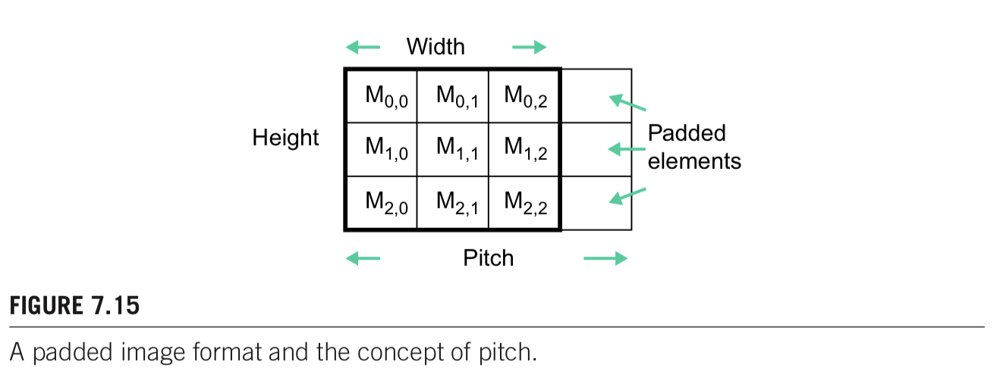
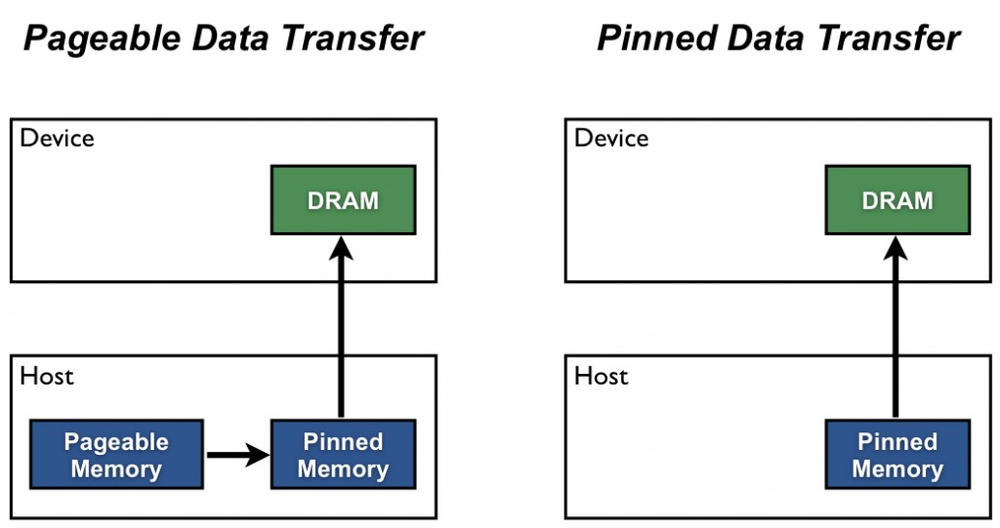
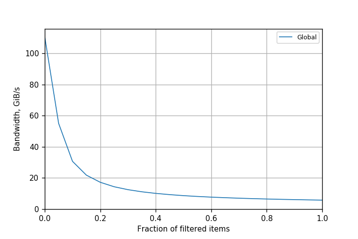

# Memory Model


## Memory Hierarchy

> Reference
>
> 1. CUDA C++ Best Practice Guide chapter 9.2
> 1. Programming Massively Parallel Processors 3rd edition 3rd chapter 5


* latency 

| type                       | clock cycle                             |
| -------------------------- | --------------------------------------- |
| register                   | 1                                       |
| shared memory              | 5                                       |
| local memory               | 500 (without cache)                     |
| global memory              | 500                                     |
| constant memory with cache | 1(same as register)-5(same as L1 cache) |
| L1 cache                   | 5                                       |


## Computation Capacity & Memory

## Computation Capacity & Instruction

> Reference
>
> 1. CUDA C++ Programming Guide chapter 


### 3.x

#### Resource

* Each SM contain

1. 192 CUDA core for arithmetic op
2. 32 special function unit for single precision float
3. 4 warp scheduler
4. L1 cache 用于 local memory
   1. cc 3.5 3.7 可以opt-in to cache global memory access on both L1 & L2 通过compiler `-Xptxas -dlcm=ca`，但是默认global memory访问不经过L1 

5. shared memory (same chip with L1)
   1. configurable partition with L1
   2. The initial configuration is 48 KB of shared memory and 16 KB of L1 cache.

6. read-only data cache of 48 KB 用于device memory
   1. cc 3.5 3.7 可以在global memory访问的时候也使用


* across SM contain

1. 1.5MB L2 cache 用于 local memory & global memory


#### schedule

dynamic assign warp to warp scheduler

each warp scheduler issue 2 independent instruction per clock cycle


#### global memory & constant memory 

L1&L2 cache line 128 bytes

L1 & L2 : 128 bytes memory transaction 

L2 only : 32 bytes memory transaction


#### shared memory bank

32 banks 

每个bank的bandwidth is 64 bits / clock

两个addresssing mode


* 64 bit / 8 bytes mode 

Successive 64-bit words map to successive banks. 每个bank放8个bytes，连续的bank放连续的内存

threads in warp access sub-word within same 64 bit word不产生bank conflict，尽管这个word是在一个bank内。

1. read access：64 bits word会被broadcast到全部的threads
2. write access：warp内只有一个thread会发生write，具体是哪个thread是undefined的


* 32 bit / 4 bytes mode

Successive 32-bit words map to successive banks. 每个bank放8个bytes，连续的bank放连续的内存

thread in warp access any sub-word within the same 32-bit word or within two 32-bit words whose indices i and j are in the same 64-word aligned segment 不产生bank conflict，尽管这个word是在一个bank内

1. read access：broadcast
2. write access：warp内只有一个thread会发生write，具体是哪个thread是undefined的


### 5.x

#### Resource

* each SM contain

1. 128 CUDA core for arithmetic op
2. 32 special function unit for single precision float
3. 4 warp scheduler
4. L1 cache/texture cache 在某些条件下可以通过config来用于访问global memory
   1. default not enable L1 cache for global memory access
5. shared memory
6. read-only constant cache 用于 constant memory space
   1. cc 3.5 3.7 可以在global memory访问的时候也使用


* across SM

1. L2 cache 用于 local or global memory


#### Schedule

dynamic assign warp to warp scheduler

each warp scheduler issue 1 instruction per clock cycle


#### global memory & constant memory 

L2 only : 32 bytes memory transaction

cc 5.0 + read only : 可以通过 `__ldg()` 使用L1 cache，依旧是32 bytes memory transaction

cc 5.2 : 可以通过compiler option使用L1 cache，依旧是32 bytes memory transaction.

default都是不适用L1 cache for global memory access


#### shared memory bank

32 banks, successive 32-bit words map to successive banks. 

Each bank has a bandwidth of 32 bits per clock cycle.

A shared memory request for a warp does not generate a bank conflict between two threads that access any address within the same 32-bit word

1. read : broadcast 
2. write : only one thread write, which one is undefined


### 6.x

#### Resource

* Each SM core

1. 64 (cc 6.0) / 128 (cc 6.1 & 6.2) CUDA core for arithemetic
2. 16 (cc 6.0) / 32 (cc 6.1 & 6.2) special function unit for single precision float 
3. 2 (cc 6.0) / 4 (cc 6.1 & 6.2) warp scheduler 
4. read-only constant cache 用于 read from constant memory space
5. L1/texture cache 用于read from global memory 
   1. default enable L1 cache when access global memory
6. shared memory


* across SM

1. L2 cache 用于 local or global memory


#### Schedule

dynamic assign warp to warp scheduler

each warp scheduler issue 2 independent instruction per clock cycle


#### global memory & shared memory

same as 5.x


### 7.x

#### Resource

* each SM

1. 64 FP32 cores for single-precision arithmetic operations,
2. 32 FP64 cores for double-precision arithmetic operations, 33
3. 64 INT32 cores for integer math,
4. 8 mixed-precision Tensor Cores for deep learning matrix arithmetic
5. 16 special function units for single-precision floating-point transcendental functions,
6. 4 warp schedulers
7. read only constant cache 用于 constant memory space
8. unified L1 & shared memory of size 128 KB (volta) / 96 KB (Turing)
   1. can be configued. 
   2. driver automatically configures the shared memory capacity for each kernel to avoid shared memory occupancy bottlenecks while also allowing concurrent execution with already launched kernels where possible. In most cases, the driver's default behavior should provide optimal performance. 自动config shared memory的大小，大多数情况是optimal的
   3. default enable L1 cache for global memory access


#### Schedule

static distribute warp among schedulers

each scheduler issue one instruction for one of its assigned warp per clock cycle

支持independent thread scheduling


#### global memory

Same as 5.x


#### shared memory

driver会自动选择optimal conf

使用cudaFuncSetAttribute() 设定shared memory比例 on per kernel bases，现在是一个hint，driver可以选择运行其余的config

原来使用cudaFuncSetCacheConfig()设定shared memory比例，这是一个强制要求的API


shared memory bank same as 5.x


### 8.x

#### Resource

* each SM have 

1. 64 FP32 cores for single-precision arithmetic operations in devices of compute capability 8.0 and 128 FP32 cores in devices of compute capability 8.6,
2. 32 FP64 cores for double-precision arithmetic operations in devices of compute capability 8.0 and 2 FP64 cores in devices of compute capability 8.6
3. 64 INT32 cores for integer math,
4. 4 mixed-precision Third Generation Tensor Cores supporting half-precision (fp16), __nv_bfloat16, tf32, sub-byte and double precision (fp64) matrix arithmetic (see Warp matrix functions for details),
5. 16 special function units for single-precision floating-point transcendental functions,
6. 4 warp schedulers.
7. read only constant cache
8. unified L1 & shared memory
   1. can be configed 
   2. default enable L1 cache for global memory access


#### schedule

static distribute warp to scheduler

each scheduler issue 1 instruction each clock cycle


#### global and shared memory

global same as 5.x

shared memory bank same as 5.x

shared memory configuration same as 7.x


## Global memory

### Bandwidth

> Reference
>
> 1. CUDA C++ Best Practices Guide chapter 8


* device memory 可以分为两类

1. linear memory
2. CUDA arrays。常用于texture


#### Timing

##### CPU Timer

相比起GPU event来说，比较粗糙

```cpp
// sync all kernel on device before timer
cudaDeviceSynchronize();

// start CPU timer

// do some work

// sync all kernel on device before timer
cudaDeviceSynchronize();

// end CPU timer

// compute time
```


##### GPU Event 

使用GPU clock，所以是OS independent的

```cpp
cudaEvent_t start, stop;
float time;
cudaEventCreate(&start);
cudaEventCreate(&stop);

// start event
cudaEventRecord( start, 0 );

// do some work
kernel<<<grid,threads>>> ( d_odata, d_idata, size_x, size_y, NUM_REPS);

// end event
cudaEventRecord( stop, 0 );

// wait for end event
cudaEventSynchronize( stop );

// compute time
cudaEventElapsedTime( &time, start, stop );
cudaEventDestroy( start );
cudaEventDestroy( stop );
```


#### Bandwith calculation

##### Theoratical

* HBM2 example

NVIDIA Tesla V100 uses HBM2 (double data rate) RAM with a memory clock rate of 877 MHz and a 4096-bit-wide memory interface.


$$
0.877 * 10^9 * 4096 / 8 * 2 / 10^9 = 898GB/s
$$


* GDDR

enable ECC的GDDR内存因为有ECC overhead会导致theoretical bandwidth降低

HBM2因为有专门给ECC的部分，所以没有ECC overhead


##### Effective

$$
((B_r + B_w) / 10^9 ) / time
$$


#### Visual profiler 

* requested global load/store throughput 

程序使用的内存的bandwidth，对应effective bandwidth

不考虑memory line/cache line的大小


* global load / store throuhput

考虑到memory line要一起传送的带宽。

相当于物理理论上的带宽


希望requested throughput靠近global throughput, 这样才没有浪费bandwidth


### DRAM

> Reference
>
> 1. UIUC ECE Lecture 4
> 2. Berkeley CS 267 Lecture 7 on memory colesing


##### Bit Line & Select Line


* 原理

一个capacitor储存bit

一个select选择读取哪个capacitor

一个bit line read / write数据。每个bit line只读取一个bit的数据，也就是多个select里面只select一个

需要constantly check value / recharge value (where the dynamic name come from)


* 特点

bit line的capacitance很大，导致速度很慢。

bit的capacitance很小，需要使用sense amplifier来放大信号


##### Core Array & Burst


多个bit line组成core array

数据传输分为两个部分。core array -> column latches / buffer -> mux pin interface 

core array -> buffer 的耗时比较久

buffer -> mux pin interface 的耗时相对较小

**burst** 当访问一个内存位置的时候，多个bit line的数据都会从core array传输到column latches （全部红色的line），然后再使用mux来选择传送给bus interace哪个数据 / one burst of memory access to get data that used by multiple attemps to read.

**burst size** 读取一次memory address，会有多少个数据从core array被放到buffer中。

常见的GPU burst size是 1024 bits / 128 bytes (from Fermi). 这里的burst size经常被叫做**line size**

当L1 cache disabled at compile time (default enable), burst size是32 bytes. 


##### Multiple Banks


只用burst并不能实现processor所需要的DRAM bandwidth。

因为bank访问core array cell的时间很长（上图蓝色部分）而实际使用bus interface传输数据时间很短（上图红色部分），通常比例是20:1， 如果只使用一个bank，interface bus会idle。所以需要在一个bus 上使用多个bank，来充分利用bus bandwidth。如果使用多个bank，大家交替使用interface bus，保证bus不会idle

通过多个bank链接到interface bus，从而让interface bus充分的使用，也就保证了每个时间都有数据从interface bus传送过来。


* 一个bus需要多少个bank？

如果访问core array与使用bus传输数据的时间比例是20:1，那么一个bus至少需要21个bank才能充分使用bus bandwidth。


一般bus有更多的bank，不仅仅是ratio+1，原因是

1. 使用更多的bank，更能让data spread out across bank。如果一块data只在一个bank上的话，需要多个burst才能完全访问（时间很久）。如果一块data在多个bank的话，可以overlap core array access time （总时间变短）
2. 每个bank可以存储的诗句有限，否则访问一个bank的latency会很大。


##### Multiple Channels


modern Double data rate （DDR） bus可以传输two word of data in each clock cycle. 

假设bus clock speed是1GHz， 每秒钟只能传送 8 bytes / words * 2 words per clock * 1 GHz = 16 GB/sec. 但是一般GPU processor要求128GB/s的数据

单独一个channel/一个bus interface不足以达到processor要求DRAM bandwidth，所以需要使用多个channel。


##### Interleaved data distribution 


是什么：把array spread across banks and channel in the memory system. 这样允许core array acccess time overlap, 减少总access time. 

为了实现max bandwidth, 对于数据的访问需要利用interleaved data distribution. 要让 memory accesses must be evenly distributed to the channels and banks. 


### Memory-coarlesed

> Reference
>
> 1. UIUC ECE Lecture 4
> 2. Berkeley CS 267 Lecture 7 on memory colesing
> 3. NVIDIA Tech Blog Coalesced Transaction Size [link](https://forums.developer.nvidia.com/t/coalesced-transaction-size/24602)
> 4. Blog CUDA基础 4.3 内存访问模式 [link](https://face2ai.com/CUDA-F-4-3-内存访问模式/)
> 5. CUDA C++ Best Practices Guide chapter 9.2.1


#### 是什么

 Global memory loads and stores by threads of a warp are coalesced by the device into as few as possible transactions。硬件会融合一个warp内对内存的多个访问为几个访问

previous GPU中的cache主要作用是memory coalesing，来combine access to DRAM into burst to reduce 总的 num access to DRAM


* CPU memory coarlesed

因为CPU有很大的cache，L1 L2是per core的，所以每一个CPU thread访问连续的一段内存是memory coarlesed的。

CPU thread1有自己的cache，CPU thread2有自己的cache，这两个cache不干扰。


* GPU memory coarlesed

因为GPU有较小的cache，一个SM内的多个thread会共享L1 cache。对GPU的连续内存访问需要以warp为单位进行考虑。warp内的32个thread是否访问连续的32个内存空间。


* Compute capacity 6.0+

transaction会被合并为多个32 bytes transaction

默认使用L1 cache，但是依旧传输单位是32 bytes

the concurrent accesses of the threads of a warp will coalesce into a number of transactions equal to the number of 32-byte transactions necessary to service all of the threads of the warp.


* compute capacity 3.4, 3.7, 5.2

如果使用L1 cache，transaction会被合并为多个128 bytes transaction

如果没有使用L1 cache，transaction会被合并为多个32 bytes aligned segments


#### From hardware

第一次访问，全部4个数据都放到buffer里

第一次使用前2个数据


第二次访问使用后面两个数据（连续内存访问），直接从buffer里读取数据，不用再去core array


**bursting** 每一次读取burst of data，读取的数据应该被充分使用，因为读取burst里面的两个数据的时间远远小于读取两个random address/两个burst。

蓝色的部分是core array到buffer的时间。红色的部分是buffer到pin的时间


#### From Transaction

> Reference
>
> 1. CUDA C++ Programing Guide chapter K.3


* Data request to coarlesed memory request

if the size of the words accessed by each thread is more than 4 bytes, a memory request by a warp is first split into separate 128-byte memory requests that are issued independently: 如果每个warp内的thread访问的数据大于4 bytes（整个warp访问的数据大于128 bytes），则会分为多个128 bytes个issued instruction

如果每个thread访问数据是8 bytes，则会issue 2 128 bytes memory request, one for each half-warp

如果每个thread访问数据是16 bytes，则会issue 4 128 bytes memory request，one for each quarter warp


* memory request to cache line request

每个memory request is then broken down into cache line request, issue independently. 


#### Alignment & padding

> Reference
>
> 1. Programming Massively Parallel Processors 3rd edition Chapter 7



当读取image 文件的时候，library经常会padded width = multiply of burst size. 

如果没有padded的话，raw 1的起始位置会是misaligned from DRAM burst，导致读取的时候多读几个burst/memory segment，让速度变慢

padded info叫做 `pitch` 


#### Driver/Runtime API on Align

> Reference
>
> 1. CUDA C++ Programming Guide chapter 3.2.2

```cpp
// 1d, aligned to 256 bytes
cudaMalloc();
cudaMemcpy();
cudaFree();

// 2d 分配, aligned to 256 bytes
cudaMallocPitch();
cudaMemcpy2D();

// 3d, aligned to 256 bytes
cudaMalloc3D();
cudaMemcpy3D();
```

使用CUDA Runtime API分配的linear array内存1D/2D/3D会pad data来满足alignment requirement

2D/3D会返回pitch/stride，需要使用这些stride来访问数据


#### Stride access

> reference
>
> 1. CUDA C++ Best Practices Guide chapter 9.2.1


non-unit-stride 是什么：thread in warp 访问有间隔/stride的memory，浪费bandwidth

unit-stride 是什么：thread in warp 访问连续的内存，100%利用bandwidth/传送的memory segment


#### Compiler alignment

> Reference
>
> 1. CUDA C++ Programming Guide chapter 5.2.3


Global memory instructions support reading or writing words of size equal to 1, 2, 4, 8, or 16 bytes. Any access (via a variable or a pointer) to data residing in global memory compiles to a single global memory instruction if and only if the size of the data type is 1, 2, 4, 8, or 16 bytes and the data is naturally aligned (i.e., its address is a multiple of that size). 全部对global memory的访问都会被编译为1/2/4/8/16 bytes的访问 (e.g. 访问3 bytes的数据会被编译为两个指令，一个访问2 bytes，一个访问1 bytes）。

如果访问global memory的大小不是1/2/4/8/16 bytes的话，则会被编译成多个内存访问instruction。

这样导致warp对global memory的访问无法被coalesced. (e.g. 每个thread访问3 bytes数据，warp内的thread访问连续的内存，这时对global memory access是interleaved的，因为两个instruction，一个2 bytes，一个1 bytes，第一个step访问2 bytes interleaved，第二个step是访问1 bytes interleaved)


* align struct

```cpp
// __align__(8) or __align__(16)
struct __align__(8) {
    float x;
		float y; 
};
```


#### Examples


##### Example GEMM data access

下面的例子中，每个thread沿着黑色的箭头访问4个元素。对于N的访问中每个thread访问一个column。对于M的访问中每个thread访问一个row。数据是row major order的


* 对于N的访问

是coarlesed的

在step1中4个thread访问的内存（N00,N01,N02,N03，黄色的部分) 在virtual memory中是连续的（在物理内存上会被分配到多个bank，多个channel中）

在step2中，访问新的连续的内存。


* 对于M的访问

不是coalesced的

每个thread读取的数据都会导致一次memory burst。

Step1的4个value(M00,M10,M20,M30)需要4个burst(每个burst对应一个颜色)。由于burst buffer只有一个，在step 1访问结束后只有最后访问的burst依旧留在burst buffer中。

step2的4个value访问(M01,M11,M21,M31)需要重新传送4个burst。


##### Example Aligned Coarlesed

CUDA compute capacity 6.0

each thread in warp access adjacent 4 byte words (e.g. float)

start memory location is multiply of 32 bytes

coalesed一共会产生 4 (bytes per thread) * 32 (threads in warp ) / 32 (bytes per aligned transaction) = 4 aligned transaction segment

只要warp内的thread同时使用这个range的内存（就算是交叉的，混乱的）也会传输4个segment


##### Example Misaligned

如果start memory location不是multiply of 32 bytes (on cc 6.0), 则会传输额外的32 bytes segment


如果多个warp对内存的访问是连续的misaligned的话，带来的bandwidth减少不是1/5, 而是1/10左右。因为cache会储存额外被传输的32 bytes segment


### Minimize host to device transfer

> Reference
>
> 1. CUDA C++ Best Practices Guide chapter 9.1


#### Batch Small Transfer

host memory -> device global memory 的拷贝是有overhead的。

希望避免多个small memory copy, 希望是one large memory copy

所以要pack多个small memory copy to large memory copy


#### Fully utilize transfer

一旦数据从host传送到device上，就尽量多的使用，不再传送数据

有些时候就算计算放在gpu上计算不划算，但是考虑到减少传送一次数据，使用gpu计算


## Page-locked host memory & Async exec

### Pinned Memory
> Reference
>
> 1. NVIDIA Tech Blog How to Optimize Data Transfers in CUDA C/C++ [link](https://developer.nvidia.com/blog/how-optimize-data-transfers-cuda-cc/)
>    1. 包含了一个memory bandwidth test的代码
> 2. Stackoverflow Why is CUDA pinned memory so fast? [link](https://stackoverflow.com/questions/5736968/why-is-cuda-pinned-memory-so-fast)


#### Sync copy

* 内存拷贝时发生了什么

Host (CPU) data allocations are pageable by default. The GPU cannot access data directly from pageable host memory, so when a data transfer from pageable host memory to device memory is invoked, the CUDA driver must first allocate a temporary page-locked, or “pinned”, host array, copy the host data to the pinned array, and then transfer the data from the pinned array to device memory. 为了避免要拷贝的数据page  out，首先会使用一个临时的pinned memory拷贝数据到那里，然后再拷贝到device上（下图左）。尽管是从CPU的memory->memory，这个过程会经过CPU core，导致内存收到限制。（CMU的最新arch研究关于如何从cpu mem直接拷贝的mem，不经过cpu）

Not-locked memory can generate a page fault on access, and it is stored not only in memory (e.g. it can be in swap), so driver need to access every page of non-locked memory, copy it into pinned buffer and pass it to DMA 如果内存不是pinned的，则访问的时候对应的内存可能在disk/ssd上，需要经过CPU进行page swap，拷贝到临时的pinned memory，再使用DMA从临时pinned memory拷贝到device global memory上

```cpp
int *h_a = (int*)malloc(bytes);
memset(h_a, 0, bytes);

int *d_a;
cudaMalloc((int**)&d_a, bytes);
// synchronize copy
cudaMemcpy(d_a, h_a, bytes, cudaMemcpyHostToDevice);
```


#### Async copy


* 是什么 & 为了什么

为了避免cpu change memory page, 需要使用pinned memory

之所以async是为了overlap data transfer with computation


* 特点

1. 可以有higher bandwidth比起没有pinned的内存。
2. Locked memory is stored in the physical memory (RAM), so device can fetch it w/o help from CPU (DMA, aka Async copy; device only need list of physical pages). pinned内存可以直接使用DMA拷贝到GPU，不需要经过CPU，从而有更大的bandwidth。
3. 因为pinned内存是有限的资源，分配pinned内存可能会失败，所以一定要检查是否有失败
4. You should not over-allocate pinned memory. Doing so can reduce overall system performance because it reduces the amount of physical memory available to the operating system and other programs. 不要过度使用pinned memory，这会导致系统整体速度变慢





* example

```cpp
int *h_aPinned, d_a;
cudaMallocHost((int**)&h_aPinned, bytes);
memset(h_aPinned, 0, bytes);

cudaMalloc((void**)&d_a, bytes);

// synchronize copy
cudaMemcpy(d_a, h_a, bytes, cudaMemcpyHostToDevice);

// pin memory on the fly without need to allocate seprate buffer
cudaHostRegister()
```


##### API

1. `cudHostAlloc()` and `cudaFreeHost` 分配page locked host memory

2. `cudaHostRegister()` page-locks a range of memory allocated by malloc()


##### Portable Memory

> Reference
>
> 1. CUDA C++ Programming Guide chapter 3.2.5


默认page-locked memory只可被分配时所对应的device看见。

如果希望全部的device都可以看见page-locked host memory，passing the flag cudaHostAllocPortable to cudaHostAlloc() or page-locked by passing the flag cudaHostRegisterPortable to cudaHostRegister().


##### Write-combining memory

> Reference
>
> 1. CUDA C++ Programming Guide chapter 3.2.5


默认page lock host memory是cachable，可以read+write。

可以config page-lock内存为write-combine by passing flag cudaHostAllocWriteCombined to cudaHostAlloc()。这样可以

1. free up host L1 L2
2. not snooped during transfers across the PCI Express bus, which can improve transfer performance by up to 40%. 增加host to device memory transfer的带宽

但是在使用write-combine了以后，只能write。如果read from host的话会非常的慢


#### Overlap comp w/ memory

> Reference
>
> 1. CUDA C++ Best Practices Guide chapter 9.1.2


* 查看设备是否支持同时comp与内存拷贝

```cpp
cudaDevicePeop dev_prop;
cudaGetDeviceProperties(&dev_prop, 0);

// 是否支持async compute & memory copy 
// 1: 支持 1 copy + 1 exec
// 2: 支持 1 copy host2device, 1 copy dev2host, 2 exec
dev_prop.asyncEngineCount; 
```


* example

```cpp
size=N*sizeof(float)/nStreams;
for (i=0; i<nStreams; i++) 
{
  offset = i*N/nStreams;
  cudaMemcpyAsync(a_d+offset, a_h+offset, size, dir, stream[i]);
  kernel<<<N/(nThreads*nStreams), nThreads, 0, stream[i]>>>(a_d+offset);
}

```


## Shared memory

### Basic

* 是什么

1. on chip (For volta use same physical resources SRAM)
2. SRAM support random access
3. don't have constrain of burst like DRAM


* 什么时候使用

1. 数据有复用的话，考虑使用shared memory
1. share memory只存在memory bank conflict的问题，没有non-sequential / unaligned access by warp 的问题


* 使用时需要注意

1. 使用shared memory一定要注意不要忘记synchronize的使用
2. shared memory时有限的resource，需要考虑使用shared memory以后一个sm能有多少个thread和block


* load from global memory to shared memory 过程

内存拷贝与CPU相似，需要经过register

global memory -> cache L1/L2 -> per thread register -> shared memory

不存在直接从global memory到shared memory的硬件


### Memory Bank

> Reference
>
> 1. CUDA C++ Best Practice Guide chapter 9.2.3
> 2. CUDA C++ Programming Guide chapter K.3
> 3. Caltech CS179 Lecture 5


#### 是什么

shared memory is divided into equally sized memory modules (banks) that can be accessed simultaneously. Therefore, any memory load or store of n addresses that spans n distinct memory banks can be serviced simultaneously, yielding an effective bandwidth that is n times as high as the bandwidth of a single bank。shared memory底层被切分为多个memory bank来使用。同时访问多个bank可以被同时serve，具有一个bank的n倍的bandwidth。

shared memory被切分为32个bank (all cc)，大多数的cc中每个bank大小为32 bits( except cc 3.x )，连续的bank放连续的数据，每个bank的bandwidth是32 bits / clock cycle (except cc 3.x). 

如果多个memory request对应到一个bank，则这些访问会被serialized。(Figure 21 middle image)

如果多个memory request对应到any sub-word of one aligned 32 bit word (尽管在一个bank内)，访问不会serialize。如果是read则会broadcast，如果是write则只要一个thread写，但是哪个thread写是undefined的 (Figure 22 right two image)


#### Stride access

stride access对于global memory是waste bandwith/not coarlesed access, 对于shared memory是bank conflict.

stride 指的是warp内的连续的thread，访问内存的间隔。如果t0访问float array idx0，t1访问float array idx1，则stride of one 32 bit word


* 不同的stride，对应的conflict类型

stride of one 32 bit word : conflict free (Fig 21 above left)

stride of two 32 bit word : 16 x 2-way (2-way表示会被serialize为两个access) bank conflict (Fig 21 middle)

stride of three 32 bit word : conflict free (Fig 21 right)

...

stride of 32 32 bit word : 1 x 32-way (32-way表示会被serialize为32个access) bank conflict


#### Avoid bank conflict

* stride of 32 32 bits word

stride of 32 32 bits word 产生 1 x 32-way bank conflict 经常发生在使用shared memory处理2D array of 32 x 32，每个thread负责一个row。这样每个thread对应的row开始都会是在同一个bank中。

解决方法是pad 2d array to sizd 32 x 33, 这样每个thread负责的一个row的开始都不是在一个bank中 (stride of 33 33 bit word是conflict free的)


* stride of 1 32 bits words

are both coarlesed global memory access & shared memory conflict free


* 常见pattern

In the “load from global, store into shared, do quadratic computation on shared data” pattern, you sometimes have to choose between noncoalesced loads or bank conflicts on stores. Generally bank conflicts on stores will be faster, but it’ s worth benchmarking. The important thing is that the shared memory loads in the “quadratic computation” part of the code are conflict-free (because there are more of these loads than either other operation).


### Corner-Turning

> Reference
>
> 1. UIUC ECE Lecture 4


#### 是什么

Use of a transposed thread order to allow memory loads to coalesce when loading global to shared.  如果直接访问global memory是不coarlesed的，通过使用transpose thread的方法，coarlesed load global memory到shared memory上。在使用shared memory的时候因为是SRAM所以不存在coarlesed的问题


#### Example GEMM data access

当使用tilnig+每个thread读取一个M N到shared memory的时候，读取M也是burst的。这是因为比起上面的simple code使用iteration读取，这里使用多个thread读取，一次burst的数据会被临近的thread使用(M00 M01分别被2个thread读取，每个thread只读取一个M elem)，而不是下一个iteration被清空。

这里对于M没有使用显性的memory transpose，但是因为使用多个thread读取数据，依旧保证了burst，这与CPU代码需要使用transpose是不一样的。

同时shared memory使用的是SRAM，不像DRAM有burst的问题，所以读取M的shared memory的时候尽管不是连续读取也没有问题。shared memories are implemented as intrinsically high-speed on-chip memory that does not require coalescing to achieve high data access rate.


### Async global memory to shared memory

> Reference
>
> 1. CUDA C++ best practice guide chapter 9.2.3.4

CUDA 11.0 允许async copy from global memory to shared memory


* 优点

1. Overlap copying data with computation
2. avoid using intermediary register file, reduce register pressue & reduce instruction pipeline pressure.
   1. thus further increase kernel occupancy
3. hardware accelerated on A100 (higher bandwidth, lower latency)
   1. 相比起sync的拷贝来说，async的latency (avg clock cycle)是更小的


* 与Cache关系

可以optionally 使用L1 cache. 

如果每个thread拷贝16 bytes数据，L1 cache会被bypassed (enabled)

因为shared memory是per SM的，所以不涉及使用L2 cache(across SM)


* optimization

对于sync拷贝，num data是multiply of 4是最快的。估计compiler是使用了内部的vector

对于async拷贝，data size是8/16是最快的。


## Constant cache

* 特点

1. Read only
2. higher throughput than L1 cache. Same 5 cycle latency as L1 cache.


#### Serialization

> Reference
>
> 1. CUDA C++ Best Practice Guide 9.2.6

warp内对于constant cache不同地址的访问是serialized的。Accesses
to different addresses by threads within a warp are serialized, thus the cost scales linearly with the number of unique addresses read by all threads within a warp.

如果t0访问constant cache addr 0， t1访问constant cache addr 1，这两个对constant cache的访问会serialized。


#### Static indexing

> Reference
>
> 1. Caltech CS179 lecture 5

If all threads of a warp access the same location, then constant memory can be as fast as a register access. 这是因为 thread within warp access same memory address via constant cache. data will be broadcast to all threads in warp. 


### How to use

#### intrinsic

> Reference
>
> 1. CUDA C++ Programming Guide chapter B.10


当使用了`const __resirtct__` keyword以后，compiler会automatic load throuh read-only cache. 


对于computation capacity > 3.5 的设备，可以使用intrinsic来强制得到对应data type T的数据。

使用`__ldg`读取的数据会被cache在read only cache中

```cpp
T __ldg(const T* address);
```


#### constant memory

> Reference
>
> 1. UIUC 408 Lecture 7


* 特点

1. 物理上与global memory都在off chip device memory上
2. 目的是为了使用constant cache，从而减小对global memory的访问
3. visible to all grid / 全局可见
4. 64 kb for user, 64 kb for compiler
   1. kernel arguments are passed through constnat memory 

5. 用于image filter的weight，math formula的参数


```cpp
// constant memory declared outside all function
__constant__ float Mc[MASK_WIDTH][MASK_WIDTH];

// copy from device to constant memory
cudaMemcpyToSymbol(Mc, Mask,, MASK_WIDTH*MASK_WIDTH*sizeof(float));
```


A request is then split into as many separate requests as there are different memory addresses in the initial request, decreasing throughput by a factor equal to the number of separate requests.


## L1 & L2 Cache

#### Cache VS Shared Memory

* same

1. both on chip. For volta use same physical resources SRAM


* different

1. programmer control shared memory 
2. micro-arch determine content of cache


#### Disable L1 Cache

> Reference
>
> 1. NVIDIA Tech Blog Cache behavior when loading global data to shared memory in Fermi [link](https://forums.developer.nvidia.com/t/cache-behavior-when-loading-global-data-to-shared-memory-in-fermi/29259)
> 1. NVIDIA Tech Blog Coalesed Transaction Size [link](https://forums.developer.nvidia.com/t/coalesced-transaction-size/24602)


load from global memory to register will be cache at L1 at default. 

If you use the inline PTX call “ld.global.cg”, the read will be cached in L2 but not L1. “ld.global.cs” will not cache the read in L1 or L2. Alternatively, you can use a simple NVCC flag to make either of these types of reads the default by using “-Xptxas -dlcm=cg” or “-Xptxas -dlcm=cs”, though of course that then applies to ALL reads in your program.


#### Read only cache

> Reference
>
> 1. Blog CUDA-F-4-3-内存访问模式 [link](https://face2ai.com/CUDA-F-4-3-内存访问模式/)
> 2. Stackoverflow What is the difference between __ldg() intrinsic and a normal execution? [link](https://stackoverflow.com/questions/26603188/what-is-the-difference-between-ldg-intrinsic-and-a-normal-execution)

从computation capacity 3.5+， 可以利用read only cache来读取global memory。

read only cache的burst size是32 bytes，而不是L1 cache的128 bytes。

更适合于random access data

```cpp
__global__ void copyKernel(float * in,float* out)
{
    int idx=blockDim*blockIdx.x+threadIdx.x;
    out[idx]=__ldg(&in[idx]);

}
```


#### L2 cache persisting

> Reference
>
> 1. CUDA C++ Best Practices Guide chapter 9.2.2
> 2. CUDA C++ Programming Guide chapter 3.2.3


* 是什么

CUDA 11.0 + compute capacity 8.0 可以config persistence of data in L2 cache

可以设定L2中有多少数据是用于persistance的。


* 设定L2 persistance

Persisting accesses have prioritized use of this set-aside portion of L2 cache, whereas normal or streaming, accesses to global memory can only utilize this portion of L2 when it is unused by persisting accesses.

```cpp
cudaGetDeviceProperties(&prop, device_id);
cudaDeviceSetLimit(cudaLimitPersistingL2CacheSize, prop.persistingL2CacheMaxSize); 
/* Set aside max possible size of L2 cache for persisting accesses */
```


* 设定user data access policy window

可以通过L2 access policy window设定user data中有多少数据是persistance的，windows的大小

`hitRatio` 的意义是 if the hitRatio value is 0.6, 60% of the memory accesses in the global memory region [ptr..ptr+num_bytes) have the persisting property and 40% of the memory accesses have the streaming property

需要确保num_bytes * hitRatio部分的数据小于使用L2 persistance的大小（剩余部分的num_bytes将会使用L2 streaming来访问，帮助减少cache thrashing）。如果超过了L2 persistance的大小，CUDA runtime依旧会尝试把数据放到L2 persistance的部分，导致thrashing of L2 cache line. 


使用stream （也可以使用graphkernelnode，见C++ programming guide）

```cpp
cudaStreamAttrValue stream_attribute;                                         // Stream level attributes data structure
stream_attribute.accessPolicyWindow.base_ptr  = reinterpret_cast<void*>(ptr); // Global Memory data pointer
stream_attribute.accessPolicyWindow.num_bytes = num_bytes;                    // Number of bytes for persisting accesses.
                                                                              // (Must be less than cudaDeviceProp::accessPolicyMaxWindowSize)
stream_attribute.accessPolicyWindow.hitRatio  = 1.0;                          // Hint for L2 cache hit ratio for persisting accesses in the num_bytes region
stream_attribute.accessPolicyWindow.hitProp   = cudaAccessPropertyPersisting; // Type of access property on cache hit
stream_attribute.accessPolicyWindow.missProp  = cudaAccessPropertyStreaming;  // Type of access property on cache miss.

//Set the attributes to a CUDA stream of type cudaStream_t
cudaStreamSetAttribute(stream, cudaStreamAttributeAccessPolicyWindow, &stream_attribute);   
```


* 例子

如果L2 set-aside cache是16 kb，num_bytes in accessPolicyWindow 是32kb

With a hitRatio of 0.5, the hardware will select, at random, 16KB of the 32KB window to be designated as persisting and cached in the set-aside L2 cache area.

With a hitRatio of 1.0, the hardware will attempt to cache the whole 32KB window in the set-aside L2 cache area. Since the set-aside area is smaller than the window, cache lines will be evicted to keep the most recently used 16KB of the 32KB data in the set-aside portion of the L2 cache. 产生cache liner eviction，反而导致perf降低


* hitProp

1. cudaAccessPropertyStreaming ：  less likely to persist in the L2 cache because these accesses are preferentially evicted.
2. cudaAccessPropertyPersisting： more likely to persist in the L2 cache because these accesses are preferentially retained in the set-aside portion of L2 cache.
3. cudaAccessPropertyNormal： resets previously applied persisting access property to a normal status. 
   1. Memory accesses with the persisting property from previous CUDA kernels may be retained in L2 cache long after their intended use. This persistence-after-use reduces the amount of L2 cache available to subsequent kernels that do not use the persisting property.  前一个kernel的L2 cache可能会在前一个kernel运行结束后依旧在L2中，使用这个property来清空前一个kernel所使用的L2 cache


* reset all presisting l2 cache

hitProp=cudaAccessPropertyNormal会reset a previous persisting memory region 

cudaCtxResetPersistingL2Cache会reset all persisting L2 cache line

L2 cache也会automatic reset在一定时间后，但是不推荐依赖于automiatic reset，因为重甲的时间会很大


* concurrent kernel utilization L2 set-aside cache

L2 set-aside cache portion is shared among all these concurrent CUDA kernels. As a result, the net utilization of this set- aside cache portion is the sum of all the concurrent kernels' individual use. 如果有多个kernel concurrent的话，则使用的总persistance=每一个kernel的sum，可能会存在oversubscrabe resource的情况导致cache thrashing， 反而导致perf不好。

如果多个concurrent kernel同时运行的话，需要让sum of persistance使用< L2 set aside


## Local memory

#### Basic

* local memory (software concept) 对应的hardware

local memory与global memory都是放在off-chip device memory上


* 什么样的automatic variable会放在local memory上

array如果fix size + small in size有可能会被compiler放在register上。

否则会被放在local memory上，因为compiler不知道这个array会有多长，无法把array拆分后放到regsiter中。

struct如果占用空间很大的话，也有可能被放在local memory上


* 如何确定var是在local memory上

通过PTX只可以确定第一轮编译以后是否在local memory上。

但是第一轮不再local memory上不代表后面不会放到local memory上

可以通过 `--ptxas-options=-v` 查看总local memory使用用量。


#### Coarlesed

> Reference
>
> 1. CUDA C++ Programming guide 5.2.3


##### local memory access 特点

因为和global memory一样都在device memory的硬件上。所以与global memory一样有high latency & low bandwidth

对于local memory的访问也需要和global memory一样需要coarlesed


##### automatic coarlesed layout

consequtive 32 bits / 4 bytes words are accessed by consequtive thread. 

也就是如果local memory array是4 bytes的话，只要每个thread同时访问的idx是一样的，对device memory的访问就是coarlesed。


local memory在device上的layout：t0 idx0, t1 idx0, t2 idx0, ... t31 idx0, t0 idx1, t1 idx 1


##### cache behaviour 

compute capability 3.x local memory accesses are always cached in L1 and L2 in the same way as global memory accesses (see Compute Capability 3.x).

compute capability 5.x and 6.x, local memory accesses are always cached in L2 in the same way as global memory accesses (see Compute Capability 5.x and Compute Capability 6.x).


## Atomic


#### Non-atomic write behavior

> Reference
>
> 1. CUDA C++ Programming guide chapter k.3


如果warp内的多个thread non-atomic write to same memory location, 则只要一个thread会进行write，但是是哪个thread是undefined的


#### Latency & Throughput 

> Reference
>
> 1. UIUC 508 Lecture 2
> 2. Programming Massively Parallel Processors 3rd edition Chapter 9


* latency

atomic 操作的latency = dram load latency + internal routing + dram store latency

因为需要先读取gloabl memory，把数据传送给SM（这个时候其余的thread/SM不能r/w这块内存)，再把数据传送给global memory

对于global memory，latency是few hunderdes cycle

对于last level cache, latency是few tens cycle

对于shared memocy, latency是few cycle


modern GPU支持在last level cache上进行atomic操作，也就把atomic的latency从few hunderdes cycle变为了few tens cycle. 这个优化不需要任何programmer的更改，是通过使用更先进的hardware来实现的。


* Throughput

GPU通过很多thread来hide latency。也就要求many DRAM access happen simutaniously来充分利用hardware bandwidth.

使用atomic操作以后，对于某一个memory location的访问是serialize的，导致实际bandwidth降低。

atomic throughput与latency是成反比的。


* 例子

假设64 bit double data rate DRAM with 8 channel 1GHz clock frequency. DRAM latency is 200 cycles

peak throughput是 8 (64 bit per transfer) * 2 (two transfer per clock pe channel) * 8 (channels) * 1G (clock per second) = 128GB/second


atomic的latency如果是400 clock cycle

throughput就是 1/400 atomic / clock * 1GHz clock/second = 2.5 M atomic / second


如果uniform的atomic 26 alphabet，则throughput是 2.5M * 26 / second


#### Evolving
> Reference
>
> 1. UIUC 408 Lecture 18


GPU atomic随着GPU Arch也在改进

atomic on shared memory (latency & bandwidth) >> atomic on global memory 


* GT200

atomic is on global memory, no L2 cache 


* Fermi to Kelpler

both atomic on L2 cache

Improve atomic by add more l2 cache buffer 


* kepler to maxwell

improve shared memory atomic through using hardware. 

Kepler use software for shared memory atomic


* after maxwell

atomic is rouphly the same

the flexibility of atomic is changed. now have atomic within warp / block.


#### Warp-aggregated

> Reference
>
> 1. CUDA Tech Blog CUDA Pro Tip: Optimized Filtering with Warp-Aggregated Atomics [link](https://developer.nvidia.com/blog/cuda-pro-tip-optimized-filtering-warp-aggregated-atomics/)


NVCC compiler (from CUDA 9) now performs warp aggregation for atomics automatically in many cases, so you can get higher performance with no extra effort. In fact, the code generated by the compiler is actually faster than the manually-written warp aggregation code. NVCC现在支持自动编译代码使用warp aggregation而且速度比手写的warp aggregation要更快，下面的例子只是用于展示warp aggregation这个方法。


是什么：In warp aggregation, the threads of a warp first compute a total increment among themselves, and then elect a single thread to atomically add the increment to a global counter. This aggregation reduces the number of atomics performed by up to the number of threads in a warp (up to 32x on current GPUs), and can dramatically improve performance. 以warp为单位进行atomic，首先在warp内部计算出来要atomic的值，然后选出一个thread执行atomic。这样减少了atomic操作的执行次数（atomic操作导致serial execution以及更低的bandwidth，更多的atomic操作带来更低的bandwidth）。

atoimc次数与bandwidth是log的反向相关。下图中的横轴可以理解为number of atomic operation.




## Others

#### Volatile

> Reference
>
> 1. CUDA Toolkits Document I.4.3.3 [link](https://docs.nvidia.com/cuda/cuda-c-programming-guide/index.html#volatile-qualifier)


* 是什么

compiler可以对global memory/shared memory的read write进行优化，例如cache在L1 cache或者register上，只要符合memory fence的要求就可以进行优化。

声明volatile以后，compiler会不optimize，全部的写入会写入到gloabl memory/shared memory上。这样另一个thread可以读取对应的内存并且得到正确的数值。


* 例子

==TODO: ADD 例子==


#### restrict

> Reference
>
> 1. CUDA C++ Programming Guide chapter B.2.5


* 作用

不使用restrict，compiler会假设input ptr存在底层数据overlap，也就会存在write to one pointer would overwrite content of another register. 所以每次读取ptr data的时候都会从array中读取，不进行任何的reuse。

这也就导致不适用restrict会导致compiler的一些优化不能进行。这包含

1. reduce number of memory access
2. reduce number of computaiton 

需要all ptr都使用restrict才能起到作用。


* 缺点

由于对数据进行了复用，要求kernel使用更多的register，也就增加了kernel register pressure。

对于一些register是压力的kernel来说，使用restrict增加了register 使用反而是个不好的选择


* 例子

```cpp
// 不使用resirtci
void foo(const float* a,
         const float* b, 
         float* c) {
    c[0] = a[0] * b[0];
    c[1] = a[0] * b[0];
    c[2] = a[0] * b[0] * a[1];
    c[3] = a[0] * a[1];
    c[4] = a[0] * b[0];
    c[5] = b[0];
    ...
}

// 使用restrict后compilier优化的对应代码
void foo(const float* __restrict__ a,
         const float* __restrict__ b,
         float* __restrict__ c)
{
    float t0 = a[0];
    float t1 = b[0];
    float t2 = t0 * t1;
    float t3 = a[1];
    c[0] = t2;
    c[1] = t2;
    c[4] = t2;
    c[2] = t2 * t3;
    c[3] = t0 * t3;
    c[5] = t1;
    .
}
```


### Register

> Reference
>
> 1. CUDA Form Saving registers with smaller data types? [link](https://forums.developer.nvidia.com/t/saving-registers-with-smaller-data-types/7376)


Registers 是 32 bit / 4 bytes 大小的 (same size as int / single precision float)。如果数据类型是double的话，则使用2个register。

可以通过pack small data into a register (e.g. 2 short) and use bitmask + shift 来读取。从而减少register usage per thread


* Bank conflict 

> Reference
>
> 1. CUDA C++ Best practice 9.2.7

Register 也会有bank conflict，只不过这是完全由compiler处理的，programmer对于解决register bank conflict没有任何控制。

并不需要特意把数据pack成vector type从而来避免bank conflict


* 控制per thread max register

可以通过compiler option来控制max register pre thread

```shell
-maxrregcount=N
```


### Memory Fence

> Reference
>
> 1. CUDA Toolkits document [link](https://docs.nvidia.com/cuda/cuda-c-programming-guide/index.html#memory-fence-functions)
> 2. stackoverflow [link](https://stackoverflow.com/questions/5232689/cuda-threadfence)


* 是什么

CUDA使用weakly-ordered memory model。一个thread写入shared memory, global memory, paged lock memory的顺序与另一个thread观察到的顺序是不一样的。如果两个thread一个read，一个write，没有sync的话，则行为是undefined的

通过使用memory fence，保证 (1) all write before fence对于程序(不同的scope)来说发生在all write after fence之前. (2) all read before fence对于程序(不同的scope)来说发生在all read after fence之前


* 三个方程

```cpp
// fence for all thread within one block
void __threadfence_block();

// fence for all thread within one GPU device
void __threadfence();

// fence for all thread across all GPU device
void __threadfence_system();

```


* 例子 1

下面这个例子中，不可能得到A=1,B=20。因为X=10一定发生在Y=20之前，如果observe了Y=20的话，则X=10一定运行完了

```cpp
__device__ int X = 1, Y = 2;

__device__ void writeXY()
{
    X = 10;
    __threadfence();
    Y = 20;
}

__device__ void readXY()
{
    int B = Y;
    __threadfence();
    int A = X;
}
```


* 例子 2

Imagine, that one block produces some data, and then uses atomic operation to mark a flag that the data is there. But it is possible that the other block, after seeing the flag, still reads incorrect or incomplete data.

一个block写入global memory数据以及用atomic写入flag，另一个block通过flag判断是否可以读取global memory的数据。

 If no fence is placed between storing the partial sum and incrementing the counter, the counter might increment before the partial sum is stored 

如果没有memory fence的话，可能flag会首先被atomic设置了，然后才设置global memory的数据。这样另一个block在读取到flag以后就开始读取global memmory的值可能就是不对的。

通过使用memory fence，确保在fence后面读取memory的数据确实是fence之前写入的数据

