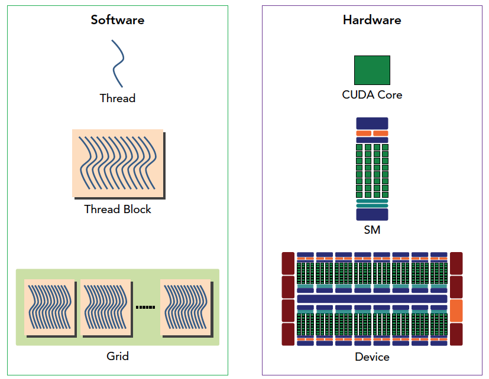
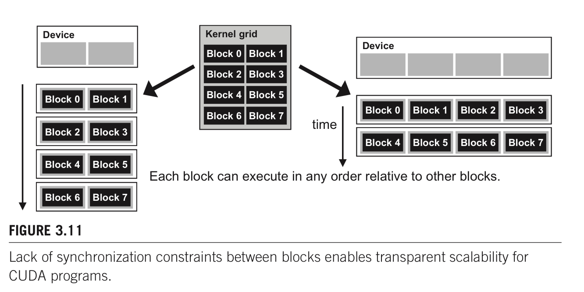
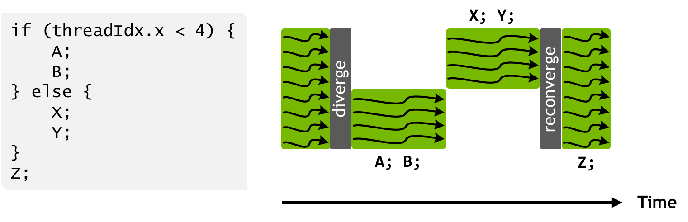
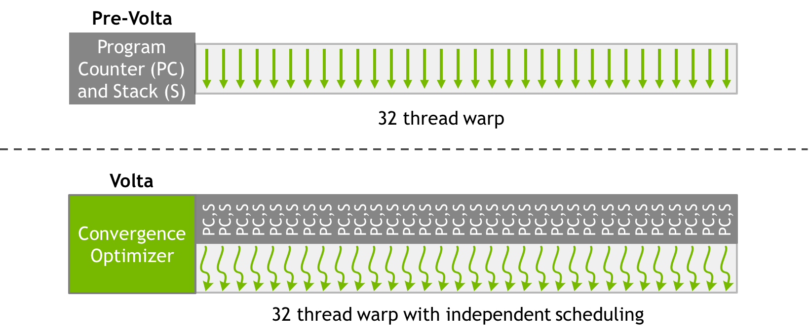
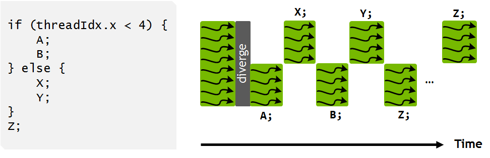
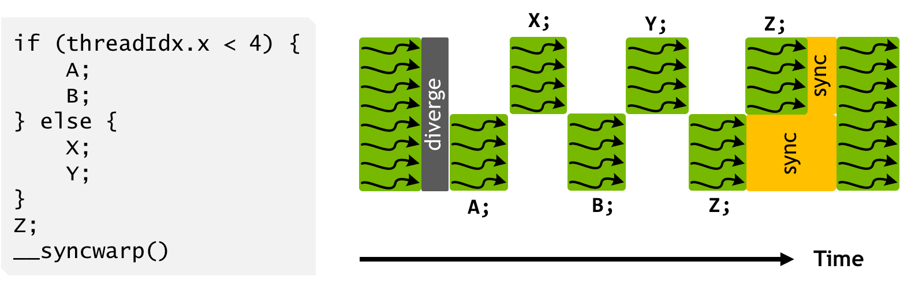
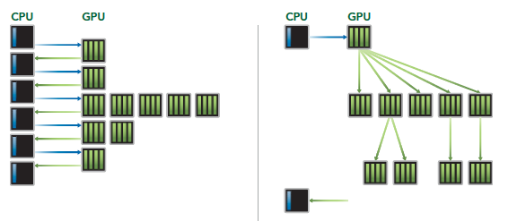
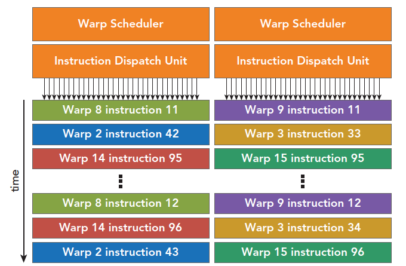
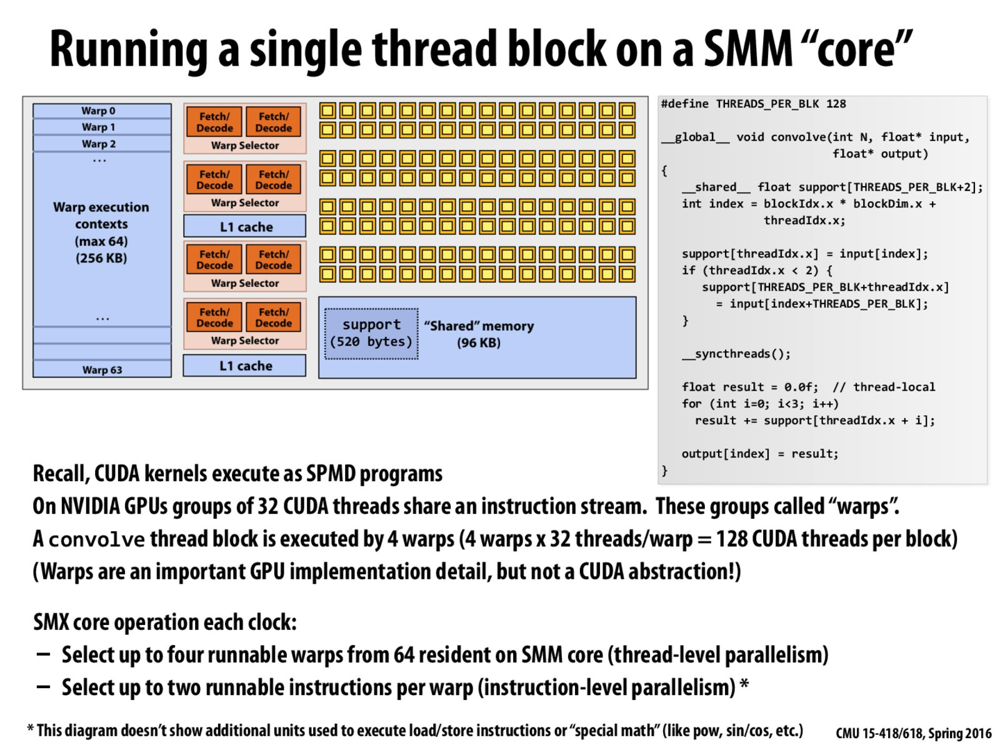
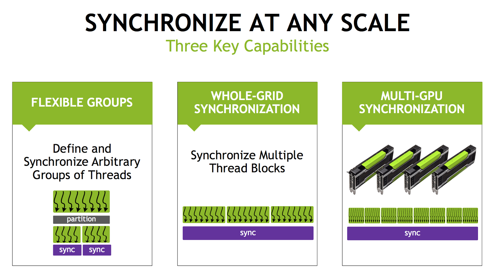

# Program Model

## Program Hierarchy

#### Grid, Block, Warp, Thread


* Grid 

1. 每个kernel function被映射到一个grid上
2. Thread between block 通过global memory进行交流
3. CPU call GPU kernel function 是 asynchronize 的


* Block 

1. 每个block运行在一个sm (GPU Core上)
2. threads in same block 通过shared memory + sync进行交流


* Thread

1. CUDA Threads: SPMD single program multiple data
2. threads on GPUs are extremely lightweight


#### Map to Hardware




#### 什么时候使用CUDA

1. 大量数据，大量thread，能够充分利用CUDA多线程硬件
2. Host->Device的内存拷贝是很花费时间的，所以只有在device上进行足够的op操作，才值得使用device


## Device

#### Property

```cpp
cudaDevicePeop dev_prop;
cudaGetDeviceProperties(&dev_prop, 0);

dev_prop.maxThreadsPerBlock;
dev_prop.multiProcessorCount;
dev_prop.clockRate;
dev_prop.maxThreadsDim[0/1/2];
dev_prop.maxGridSize[0/1/2];
dev_prop.warpSize;
dev_prop.regsPerBlock; // 每个sm可以使用的register的个数，通常与算法中总共的thread数量一起使用，从而确定每个thread可以使用多少个register，从而dynamic select which kernel to run。
dev_prop.sharedMemPerBlock; // 每个sm可以使用的shared memory大小。希望host code根据不同的hardware从而使用不同的shared memory大小，从而充分使用硬件。

// 是否支持async compute & memory copy 
// 1: 支持 1 copy + 1 exec
// 2: 支持 1 copy host2device, 1 copy dev2host, 2 exec
dev_prop.asyncEngineCount; 
```


## Block

#### Sync

> Reference
>
> 1. Programming Massively Parallel Processors 3rd edition chapter 3


`__syncthreads()` 用来synchronize all threads in block

如果有if else then statement + syncthreads 在branch内部的话，all threads inside block either all run if or all run else. 否则就会wait forever

CUDA runtime只有在确保一个block所需要的全部resource都有的时候才会run block，否则会出现跑到一半发现resource不够，某些thread无法运行，其余的thread因为synchronize等待无法运行的thread。


#### Transparent calability

> Reference
>
> 1. Programming Massively Parallel Processors 3rd edition chapter 3


同样的代码，在拥有不同资源的硬件上都可以运行。

blocks can execute in any order relative to each other, which allows for transparent scalability across different devices

CUDA为了保证transparent scalability，所以不允许block之间的synchronize。因为只有block之间不synchonize，block之间没有依赖关系，cuda runtime才可以arbitrary schedule block  on different hardware.




## Warp & Thread

### Branch Divergence

GPU对于每一个thread使用predicated execution。

如果一个warp内的多个thread会走不同的path，则multiple path被实际运行。

```cpp
if ( threadIdx.x > 2 )
{
  // path 1
}
else
{
  // path 2
}
```

如果代码中有branching (if else)，但是warp内的thread只走一个path(都走了if condition)，不会有branching

一个解决branching的常用方法就是branch granularity是warp的倍数、这样就能保证一个warp内的全部thread都只走一个brach，而且依旧two cotrol path

```cpp
if ( threadIdx.x / WARP_SIZE > 2 )
{
  // path 1
}
else
{
  // path2
}
```


### Hide Latency

> Reference
>
> 1. CUDA C++ Programming Guide chapter 5.2.3
> 1. CUDA C++ Best practice guide 11.2


#### Why & How GPU Hide latency

CUDA sm 计算资源的使用率与num resident warps in SM直接相关。每次issue instruction, warp scheduler会选择1个instruction来运行（可能来自于同一个warp/不同的warp）

latency是num clock cycle一个warp可以运行下一个instruction(从waiting变为ready status)。

充分利用sm 硬件是通过让warp scheduler总能找到某些instruction来issue，当等待前一个warp的latency。也就是我们希望有尽量多个instruction ready to be executed. 

从编程的角度，希望更多的warp resident in SM + instruction independent 

Much of this global memory latency can be hidden by the thread scheduler if there are sufficient independent arithmetic instructions that can be issued while waiting for the global memory access to complete.


* Hide L cycle latency需要所少个instruction

cc 5.x 6.1 6.2 7.x 8.x : 4L, 因为4个warp scheduler, 每个clock cycle可以issue1个instruction per warp scheduler

cc 6.0 : 2L, 因为两个warp scheduler,  每个clock cycle可以issue1个instruction per warp scheduler

cc 3.x : 8L : 因为4个warp scheduler, 每个clock cycle可以issue 2个instruction per warp scheduler


#### Source of latency

##### register dependencies

当全部的operands在register上的时候，由于register dependency导致latency，前一个instruction还没有运行结束，没有把结果放到对应register中，导致当前instruction依赖的数据还没有在register


cc 7.x arithmetic instruction 需要 16 warp来hide latency，因为计算操作一般是4 clock cycle，需要4*4(L=4)=16 instruction/warps (cc 7.x 每个warp scheduler issue 1 instruction per clock cycle)。如果ready warp数量不够16的话，会导致idle


##### Off-chip memory 

当arithemetic intensity低的时候，需要更多的warp来hide latency。


##### sync thread block

syncthread 会导致latency (warp not ready to execute next instruction due to barrier)

让sm有更多的resident block可以reduce idle in this case. 当一个block存在syncthread idle的时候，其余block的warp可以运行来hide latency


### Warp level primative

> reference
>
> 1. NVIDIA TECH BLOG Using CUDA Warp-Level Primitives [link](https://developer.nvidia.com/blog/using-cuda-warp-level-primitives/)
> 2. Stackoverflow activatemask vs ballot_sync [link](https://stackoverflow.com/questions/54055195/activemask-vs-ballot-sync)
> 3. CUDA C++ Programming Guide chapter K.6


* 是什么：

使用shuffle指令，threads within single warp can access register of other threads within warp. warp内的thread可以访问其余thread的寄存器。

warp内的thread叫做lane。lane number from 0 to 31


* 为什么好

1. 更大的编程flexible
2. 原来thread之间进行数据交换需要使用shared memory，latency以及bandwidth都比register要小。现在在一个warp内部可以使用register，更小的latency以及更大的bandwidth


* example with reduction

```cpp
// warp shuffle for reduction
val += __shfl_down_sync(0xffffffff, val, 16);
val += __shfl_down_sync(0xffffffff, val, 8);
val += __shfl_down_sync(0xffffffff, val, 4);
val += __shfl_down_sync(0xffffffff, val, 2);
val += __shfl_down_sync(0xffffffff, val, 1);

#define FULL_MASK 0xffffffff
for (int offset = 16; offset > 0; offset /= 2)
    val += __shfl_down_sync(FULL_MASK, val, offset);
```


```cpp
// Use XOR mode to perform butterfly reduction
    for (int i=16; i>=1; i/=2)
        value += __shfl_xor_sync(0xffffffff, value, i, 32);
```


#### Independent thread scheduling

> Reference
>
> 1. NVIDIA TECH BLOG Inside Volta: The World’s Most Advanced Data Center GPU [link](https://developer.nvidia.com/blog/inside-volta/)


* 总结

从volta版本开始的program model开始，warp within thread schedule independently，而不是lock step

Volta GV100 is the first GPU to support independent thread scheduling, which enables finer-grain synchronization and cooperation between parallel threads in a program. 


##### Pascal SIMT Model

Pascal and earlier NVIDIA GPUs execute groups of 32 threads—known as warps—in SIMT (Single Instruction, Multiple Thread) fashion. The Pascal SIMT execution model maximizes efficiency by reducing the quantity of resources required to track thread state (one program counter shared across threads in warp) and by aggressively reconverging (下图中的reconverge) threads to maximize parallelism. 之前的GPU arch使用SIMT的运行方法，这样的优点是只用一个control unit. 程序的特点是aggresively reconverge，因为只有reconverge了以后一个instruction才可以被全部的thread运行，最大化instruction的使用（e.g. 如果下面的程序没有在Z之前converge，可能发生的情况就是Z也被分成两个step运行，尽管可以一个step运行）。

保证了lock step的运行结构（在non-diverge的部分）




##### Volta SIMT model

maintaining execution state per thread, including the program counter and call stack 每一个thread都有自己的program counter

threads can now diverge and reconverge at sub-warp granularity, and Volta will still group together threads which are executing the same code and run them in parallel. threads会diverge然后converge，依旧是group thread来运行相同的instruction。





execution is still SIMT: at any given clock cycle CUDA cores execute the same instruction for all active threads in a warp just as before, retaining the execution efficiency of previous architectures. 程序依旧是以SIMT来运行的。在同一个clock cycle，运行instruction给全部的thread，然后用mask mask掉不参与instruction的thread。

只不过现在不同branch的工作允许intreleave了。这也就允许更多的hide latency的可能。

the scheduler supports independent execution of threads (through use of SIMT), it optimizes non-synchronizing code to maintain as much convergence as possible for maximum SIMT efficiency. scheduler允许每个thread独立运行（通过SIMT），但是会尽量converge来增加SIMT利用率，因为只有converge了以后全部的thread才会一起使用instruction。

需要注意的是下图中Z运行之前并没有进行reconverge(因为thread scheduled independently），这是因为compiler认为Z可能与X Y有某些data dependency。但是这也导致SIMT的efficency降低（本来可以一个cycle运行Z，但是现在需要两个cycle，每次跑一部分）。



可以使用cuda9的syncwarp来保证线程之间converge，从而实现更大的SIMT efficency。如果在Z之前就syncwarp，则会提高SIMT利用率。




#### Primatives

##### Synchronized data exchange
> exchange data between threads in warp.

1. 这些sync语句要求thread首先被sync（也就是不需要再单独使用syncwarp()语句了），所以在调用这些语句的时候，数据thread会被sync 
2. The new primitives perform intra-warp thread-level synchronization if the threads specified by the mask are not already synchronized during execution.
3. Mask 的作用：mask to mean the set of threads in the warp that should participate in the collective operation.
4. 老版本的warp primative 不enforce synchronization。使用老版本的代码叫做implicit warp-synchronous programming，是一个危险的行为。

```cpp
__all_sync, __any_sync, __uni_sync, __ballot_sync
__shfl_sync, __shfl_up_sync, __shfl_down_sync, __shfl_xor_sync
__match_any_sync, __match_all_sync

// Each thread that calls __shfl_sync() or __shfl_down_sync() receives data from a thread in the same warp
```


`unsigned __ballot_sync(unsigned mask, int predicate);` 会首先synchronize，不同的thread之间交换一个predicate （true/false)。用于create mask for other warp operation

```cpp
// 使用ballot_sync决定warp内只有部分thread参与计算，从而允许reduction计算的时候不是32的倍数
//  __ballot_sync() is used to compute the membership mask for the __shfl_down_sync() operation. __ballot_sync() itself uses FULL_MASK (0xffffffff for 32 threads) because we assume all threads will execute it.
unsigned mask = __ballot_sync(FULL_MASK, threadIdx.x < NUM_ELEMENTS);
if (threadIdx.x < NUM_ELEMENTS) { 
    val = input[threadIdx.x]; 
    for (int offset = 16; offset > 0; offset /= 2)
        val += __shfl_down_sync(mask, val, offset);
}
```


##### Active mask query
> returns a 32-bit mask indicating which threads in a warp are active with the current executing thread.

1. 并没有强制caller thread 会进行synchronize。The CUDA execution model does not guarantee that all threads taking the branch together will execute the __activemask() together. Implicit lock step execution is not guaranteed. 也就是一步一步的lock step是不保证的
2. activamask只是用来知道哪些thread碰巧convergent了，并不保证activemask调用后也会lock step。activemask相当于detect，但并不是set。
3. Don’t just use __activemask() as the mask value. __activemask() tells you what threads happen to be convergent when the function is called, which can be different from what you want to be in the collective operation.

```cpp
__activemask
```


下面这个例子就是一个错误的使用activemask的例子，因为并不保证activemask是被多个thread同clock执行的

```cpp
if (threadIdx.x < NUM_ELEMENTS) { 
    unsigned mask = __activemask(); 
    val = input[threadIdx.x]; 
    for (int offset = 16; offset > 0; offset /= 2)
        val += __shfl_down_sync(mask, val, offset);
}
```


##### Thread synchronization
> synchronize threads in a warp and provide a memory fence.

1. 之所以需要使用syncwarp是因为cuda9开始，warp内的thread并不保证在一个clock内同时运行相同的instruction (not lock step)。
2. memory fence的道理是和syncthread与shared memory一起使用相同的。因为warp内的thread并不能保证lock step，所以在写入/读取shared memory的时候，需要使用syncwarp来确保memory fence. 
3. syncwarp need to be insert between any steps where data is exchanged between threads via global or shared memory. Assumptions that code is executed in lockstep or that reads/writes from separate threads are visible across a warp without synchronization are invalid.

```cpp
__syncwarp
```


```cpp
// 一个错误的例子
// read write to shared memory 依旧可能导致race condition, 因为 += 代表read comp write 
shmem[tid] += shmem[tid+16]; __syncwarp();
shmem[tid] += shmem[tid+8];  __syncwarp();
shmem[tid] += shmem[tid+4];  __syncwarp();
shmem[tid] += shmem[tid+2];  __syncwarp();
shmem[tid] += shmem[tid+1];  __syncwarp();

// 正确的例子
// CUDA compiler 会在针对不同版本的arch选择删除_syncwarp。 
// 如果在cuda9之前的硬件上，threads in warp run in lock step, 则会删除这些syncwarp。
unsigned tid = threadIdx.x;
int v = 0;
v += shmem[tid+16]; __syncwarp();
shmem[tid] = v;     __syncwarp();
v += shmem[tid+8];  __syncwarp();
shmem[tid] = v;     __syncwarp();
v += shmem[tid+4];  __syncwarp();
shmem[tid] = v;     __syncwarp();
v += shmem[tid+2];  __syncwarp();
shmem[tid] = v;     __syncwarp();
v += shmem[tid+1];  __syncwarp();
shmem[tid] = v;
```


注意：syncwarp + 老版本的warp primative +  syncwarp 不等于新版本的 warp primative 。因为CUDA program model不保证thread stay convergent after leaving syncwarp


* 老版本效果

可以使用下面的command编译得到老版本的lock step效果

```cpp
 -arch=compute_60 -code=sm_70
```


## Dynamic Parallelisim

> Reference
>
> 1. Programming Massively Parallel Processors 3rd edition Chapter 13


从Kepler开始，GPU Kernel可以启动GPU Kernel。

Kepler之前，GPU kernel只能从CPU启动





## Resource

### Dynamic partition of resource

SM resource是动态分配给每一个block的，resource是有限的，需要决定block大小等来within limit of resource + use as many threads as possible

对资源的分配是以block为单位进行分配的


##### 常见限制

1. num threads per sm
2. Num registers per sm
3. shared memory size per sm


#### Block/SM & Thread/Block

thread到硬件的映射是以block为单位的。一个SM可以包含多个（有最多限制）的block。

如果SM内的一种多种resource不够支持最多block一起运行，cuda runtime则会以block为单位减少同时在一个SM上运行的block，从而保证all resources fall into limit of SM


* 假设 (下面的数据会依据使用的不同硬件改变)
1. SM take 8 blocks 
2. SM take 1536 threads 
3. 三个block分块的方式 $8*8, 16*16, 32*32$


* $8*8$ : 

64 threads per block

each sm can take 1536 / 64 = 24 blocks

但是sm限制最多8个block，也就是最多 8 * 64 = 512 threads ( out of 1536 threads ) go into one sm

这个是不好的，我们希望SM中的thread能够多到足够掩盖memory latency （warp schedule data已经好了的）


* $16 * 16$

256 threads per block

each sm can take 1536 / 256 = 6 blocks (小于block/sm的限制)

可以在硬件上使用full threads & block capacity


* $32 * 32$

1024 threads per block

each sm can take 1 block (小于block/sm的限制)

无法使用full threads


#### Shared memory

* 假设
1. 64 kb shared memory per SM
2. 2048 threads / sm
3. 150 GB/s bandwidth
4. 1000 GFlops
5. square matrix computation 使用 simple shared memory 16 / 32 的tile size
6. 使用shared memory进行tilening


* TILE_WIDTH 16

each block 使用 2 (submatrix M and N) * 16 * 16 * 4 bytes (float) = 2048 bytes shared memory

150 / 4 (bytes per float) * 16 = 600 GFlops : not yet fully utilize computation resources

64 kb / 2048 bytes/block = max 32 block per sm due to share memory constrain 

2048 threads / (16*16) = 8 block per sm due to threads limit

每一个时间点会有 2 (two load / threads) * 16*16 * 8 block/sm = 4096 pendig load (通过检查pending load来判断是否有让SM busy)。这个点很重要，因为使用多个thread的目的就是让sm有很多pending load，这样才能swap between warp


* TILE_WIDTH 32

each block 使用 2 * 32 * 32 * 4 bytes (float) = 8kb bytes share memory

150 / 4 (bytes per float) * 32 = 1200 GFlops : have potential to fully utilize computation resource

64/8 = max 8 block per sm due to share memory constrain

2048 / (32*32) = 2 block per sm due to threads limit

每一个时间点会有 2 * 32 * 32 * 2 = 4096 pending loads

同样的memory parallelsim exposed. 

尽管32的复用的内存更大，memory paralle与16一样。可能会存在一些block schedule的问题，因为更少的总block个数。


### Occupancy


#### API

> Reference
>
> 1. CUDA C++ Programming Model chapter 5.2.3.1


##### prediction

`cudaOccupancyMaxActiveBlocksPerMultiprocessor` 给定block size, shared memory usage, 可以预测number of concurrent thread block per multiprocessor. 


##### configure

`cudaOccupancyMaxPotentialBlockSize` and `cudaOccupancyMaxPotentialBlockSizeVariableSMem` 可以计算optimal configuration给定kernel


## Scheduling


### warp scheduling

warp是sm内部的schedule unit。

size of warp 是取决于硬件的，现在的GPU硬件都是warp size32的，但是以后可能改变

最近的architecture，每一个SM可以同时运行多个warp的instruction。

warp within a block can be execute in any order w.r.t each other


* 为什么使用warp

为了share control unit


* block中thread到warp的映射

如果block是1D的，则每32个映射到一个warp上

如果block是2D/3D的，会先把2D/3D project到1D上，然后每32个thread映射到一个warp上


* 为什么每个SM中需要放多个warp，如果同一时间只能跑有限个warp？

如果一个warp的instruction无法立刻执行（等待前一个instruction的资源），则这个warp not selected for execution.

其余的resident warp nolonger waiting for resources会被运行。如果多个resident warp都可以运行，则会采用latency hiding的priority mechanism来选择先运行谁。




##### threads的状态

1. all thread inside block not scheduled on SM
2. all thread inside block scheduled on SM
   1. Warp that's SM is currently executing
   2. Warp that ready to be executed by SM
   3. Warp that not ready to be executed because of dependency (e.g. load memory not finish yet)


#### Zero-overhead scheduling

是什么：selection of ready warps for execution avoid introducing idle or waisting time into execution timeline. 

如果有sufficent resident warp，则hardware will likely find warp to execute at any point in time.

能够切换到其余的warp来hide latency是GPU不需要大的cache，不需要branch prediction等硬件，可以把更多的硬件给floating point operation的原因

GPU的warp一旦分配到资源，就会占用资源直到block整个运行结束，不存在像是CPU一样需要context switch需要把register保存到memory中的overhead


#### Understand Scheduling with Example

> Reference
>
> 1. CMU 15.418 Spring 2016 lecture 5 slides 56 discussion [link](http://15418.courses.cs.cmu.edu/spring2016/lecture/gpuarch/slide_056)





**注意：下面的讨论都是围绕着slides中特定的硬件版本**

Each clock, the GTX 980 SMM core:

1. Selects up to four unique, runnable warps to run instructions from. These four warps can come from any thread block currently active on the core. This is an instance of simultaneous multi-threading (lecture 2). 每个clock，会从64个active warp中选择4个active wap。（active warp的定义是sm maintain warp execution context)。这里的平行是**simutaneous multi-threading**。之所以能选择4个warp是因为有4个warp scheduler (以及对应的pc)
2. From each of these four warps, the clock attempts to find up to two instructions to execute. This is instruction level parallelism (lecture 1) within the warp. If independent instructions are not present in the warp's instruction stream, then only one instruction from the warp can be executed. There is no ILP in the instruction stream! 每个clock，每个warp (out of 4)，会选择两个独立的instruction来运行。如果找不到两个独立的instruction来运行的话，则运行一个instruction。这里的平行是**ILP**. 这里independent instruction指的是会使用seprate functional units in SM
   1. e.g. 如果程序中有两个独立的FMA，SM硬件中有两组FMA，则在一个clock cycle内这两个FMA会同时运行

3. Out of the eight total instructions the core tries to find (across the four threads), up to four of those can be arithmetic instructions. These instructions will be executed on the four different groups of 32-wide SIMD ALUs that the core has. To be absolutely clear, all 4x32 = 128 ALUs in the SMM execute these four 32-wide instructions at the same time -- true parallel execution. (As pointed out in the footnote, and discussed a bit in the discussion on the previous slide, other non-basic-arithmetic instructions, like loads and stores, or special arithmetic ops like sin/cos/pow can also be executed simultaneously with these four basic-SIMD-arithmetic ops, but I didn't draw the units that perform these operations on this diagram.) 从最多8个可能的instruction里，最多4个是数学计算，可以同时被4个32长度的SIMTD ALU处理（same clock)，也可以同时处理load store


Note that in the diagram above, the core has the ability to maintain execution contexts for up to 64 warps at once (if you like to think in terms of CUDA threads rather than warps, this is 64x32=2048 CUDA threads). These warps are executed concurrently by the SMM core, but in any one clock the core will only execute instructions from at most four of them. This is the idea of interleaved multi-threading as illustrated here. SM可以维持64个active warp通过维持他们的execution context。这64个active warp可以来自多个block。SM对block的schedule是使用或者不使用整个block。SM通过interleave这64个warp来hide latency。


Do not confuse the requirement that all CUDA threads (or their corresponding warps) in a thread block must be live--a.k.a. occupying an execution context on a core-- during the lifetime of the thread block (a requirement that we discuss again on slide 73) with the fact that the core can indeed run instructions from multiple threads simultaneously on its parallel execution units. It seems to me that interleaved multi-threading and simultaneous execution of instructions from multiple threads are being confused in some of the comments posted above. 一个block内thread只要运行的时候就是都active的，因为SM是以block为单位分配资源。


## Others

### Cooperative Groups

> Reference
>
> 1. NVDIA TECH BLOG Cooperative Groups: Flexible CUDA Thread Programming [link](https://developer.nvidia.com/blog/cooperative-groups/)

* 是什么

原来的sync是within block的，从CUDA9开始，现在支持自定义thread group，可以是smaller than block，也可以是across block，甚至across gpu。group内的thread可以进行synchonize




* question

不确定这样的group synchronize从效率上来讲是好还是坏


# Instructions


## Arithmetic

#### Floating point

* 特点

1. not associative, (a+b)+c != a+(b+c)
2. 符合IEEE 754标准
3. FMA操作单独的精度比两个op的精度高，因为只涉及到一次rounding
4. 每一个floating point操作都涉及到rounding的问题


### Optimization

> Reference
>
> 1. CUDA C++ Programming Guide chapter 5.4.1
> 1. CUDA C++ Best practice chapter 11.1


方法：减少使用arithemetic instruction with low throughput, trading precision for speed


#### Hardware Math

使用硬件数学 `__func`  而不是方程`func` 数学

缺点是lower accuracy

优点是higher throughput + lower latency


#### Compiler option

* denormalized numbers are flushed to zero

```shell
// enable higher throughput
-ftz=true
```


* less precision division

```shell
-prec_div=false
```


* less precision square root

```shell
-prec-sqrt=false
```


* hardware math instead of function math

会自动把全部的`func` 变为`__func` 的实现

注意，只对single precision起租用

```cpp
-use_fast_math
```


#### Single float

* fast hardware division 

```cpp
__fdividef(x, y)
```


* fast reciprocal square root & square root

compiler可以优化一些 1.0 / sqrtf() 为 rsqrtf() ，但并不总发生

应该手动使用rsqrtf()

```cpp
rsqrtf();
sqrtf();
```


* 优先使用single precision float，而不是double precision float，因为throughput更大


#### Sin & Cos

single float: sinf(x), cosf(x), tanf(x), sincosf(x) 

double float: sincos(x)


* 特点

1. 方程会根据input magnitude选择运行slow path/ fast path


* slow path

argument sufficent large in magnitude

使用lenghty computation实现

slow path会使用local memory来储存intermediate variable来避免lengthy computation的过程中使用过多的register，这导致slow path的throuput与latency都比起fast path要小很多


* fast path

argument sufficent small in magnitude

使用few multiply-add实现


* more specific math

Replace sin(π*<expr>) with sinpi(<expr>), cos(π*<expr>) with cospi(<expr>), and sincos(π*<expr>) with sincospi(<expr>)


1. 更快
2. 更accurate


#### Int Division & Modulo

int的division和modulo会花费20 instruction。

compiler会进行一些conversion，但只有在n是数值(i.e. 一个数字，而不是变量)的时候。避免直接使用division/modulp是推荐的（当知道一个varaible是power of 2的时候）

 

如果n是power of 2

i/n = i >> log2(n)

i % n = (i & (n-1))


#### 16 bits float

使用2个half precision的数据结构(half2 datatype is used for half precision and `__nv_bfloat162` be used for `__nv_bfloat16` precision) + vector intrinsic (`__hadd2, __hsub2, __hmul2, __hfma2`)从而每个instruction可以一次处理两个16 bit数据。


The intrinsic `__halves2half2` is provided to convert two half precision values to the half2 datatype.
The intrinsic `__halves2bfloat162` is provided to convert two `__nv_bfloat` precision values to the `__nv_bfloat162` datatype.


本质原因是register size是32 bits的，所以一次使用到register的计算可以是32 bits


#### Type conversion

assign literal to single float var的时候要使用 `f` suffix，否则float literal默认是double的，在assignment的时候compiler会增加一个type conversion instruction


#### Loop conter

the compiler can optimize more aggressively with signed arithmetic than it can with unsigned arithmetic.

所以要使用signed loop counter


#### Exponential

在可能的时候，使用square root, cube roots, inverse等等来计算exp，可以显著的（1）加速 （2）更精确


For exponentiation using base 2 or 10, use the functions exp2() or expf2() and exp10() or expf10() rather than the functions pow() or powf()


small integer power $x^2, x^3$, use explicit multiplication 总是比general purpose power要更快更准确的


# Below are old content


> Reference
>
> 1. UIUC ECE Lecture 2,3
> 1. Programming Massively Parallel Processors 3rd chapter 2,3


#### Handle Corner Case

* handle 1d corner case

```cpp
__global__ void add( int* A, int* B, int* C, int n )
{
        i = blockIdx.x * blockDim.x + threadIdx.x;
      // avoid kernel larger than data
    if ( i < n )
      C[i] = A[i] + B[i];
}
```


* handle 2d corner case


```cpp
__global__ void RGB2GRAY(unsigned char* gray, unsigned char* rgb, int width, int height)
{
  int col = threadIdx.x + blockIdx.x * blockDim.x;
  int row = threadIdx.y + blockIdx.y * blockDim.y;
  if ( col < width && row < height )
  {
    // do computation
  }
}
```


