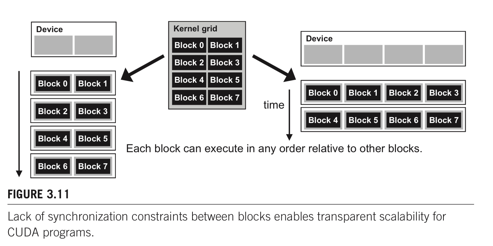
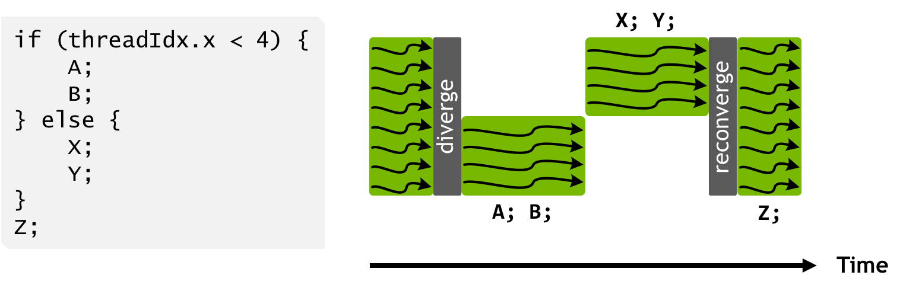
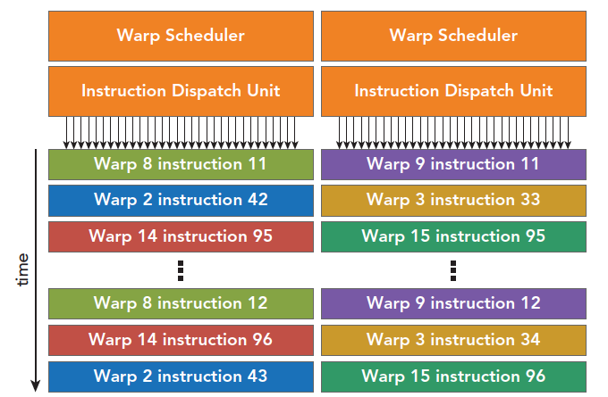
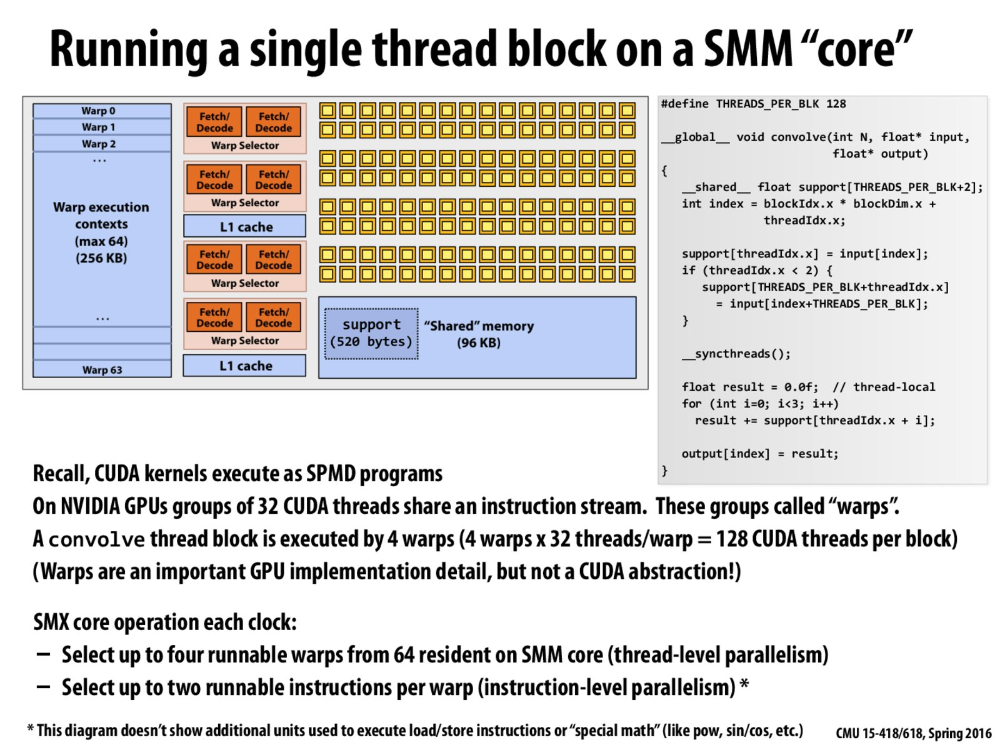
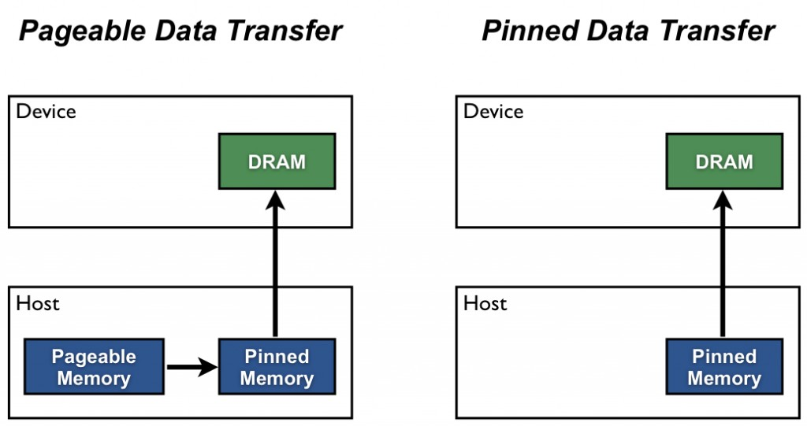

# Program Model

## Program Hierarchy

#### Grid, Block, Warp, Thread


* Grid 

1. 每个kernel function被映射到一个grid上
2. Thread between block 通过global memory进行交流
3. CPU call GPU kernel function 是 asynchronize 的


* Block 

1. 每个block运行在一个sm (GPU Core上)
2. threads in same block 通过shared memory + sync进行交流


* Thread

1. CUDA Threads: SPMD single program multiple data
2. threads on GPUs are extremely lightweight


#### Kernel function

> Reference
>
> 1. Progressional CUDA C programing guide


#### Map to Hardware


#### When to use CUDA

1. 大量数据，大量thread，每个thread有足够的计算（从而CI不会太低），能够充分利用CUDA多线程硬件
2. Host->Device的内存拷贝是很花费时间的，所以只有在device上进行足够的op操作，才值得使用device


#### Handling Error

cuda API会返回`cudaError_t`用于error code，如果没有error的话，则会返回 `cudaSuccess`

可以使用`char* cudaGetErrorString(cudaError_t error)` 得到human readable error message


```cpp
#define CHECK(call) \ 
{\ 
  const cudaError_t error = call; \ 
  if (error != cudaSuccess) \ 
  {\ 
    printf("Error: %s:%d, ", __FILE__, __LINE__); \ 
    printf("code:%d, reason: %s\n", error, cudaGetErrorString(error)); \
    exit(1); \ 
  }\
}

// example usage
CHECK(cudaMemcpy(d_C, gpuRef, nBytes, cudaMemcpyHostToDevice));

kernel_function<<<grid, block>>>(argument list); 
CHECK(cudaDeviceSynchronize());
```


## Device

#### Property

```cpp
cudaDevicePeop dev_prop;
cudaGetDeviceProperties(&dev_prop, 0);

dev_prop.maxThreadsPerBlock;
dev_prop.multiProcessorCount;
dev_prop.clockRate;
dev_prop.maxThreadsDim[0/1/2];
dev_prop.maxGridSize[0/1/2];
dev_prop.warpSize;
dev_prop.regsPerBlock; // 每个sm可以使用的register的个数，通常与算法中总共的thread数量一起使用，从而确定每个thread可以使用多少个register，从而dynamic select which kernel to run。
dev_prop.sharedMemPerBlock; // 每个sm可以使用的shared memory大小。希望host code根据不同的hardware从而使用不同的shared memory大小，从而充分使用硬件。

// 是否支持async compute & memory copy 
// 1: 支持 1 copy + 1 exec
// 2: 支持 1 copy host2device, 1 copy dev2host, 2 exec
dev_prop.asyncEngineCount; 
```


## Block

#### Common Config

> Reference
>
> 1. CUDA best practice guide chapter 10.3


1. block per grid > number of sm
   1. to fully utlize sm resource
2. block per sm > 1
   1. to hide latency due to syncthread
3. Between 128 and 256 threads per block is a good initial range for experimentation with different block sizes.
4. multiple of warp size
5. A minimum of 64 threads per block should be used, and only if there are multiple concurrent blocks per multiprocessor.
6. Use several smaller thread blocks rather than one large thread block per multiprocessor if latency affects performance. This is particularly beneficial to kernels that frequently call __syncthreads().
   1. user lagrger block size does not means better performence.


#### Sync

> Reference
>
> 1. Programming Massively Parallel Processors 3rd edition chapter 3


`__syncthreads()` 用来synchronize all threads in block

如果有if else then statement + syncthreads 在branch内部的话，all threads inside block either all run if or all run else. 否则就会wait forever

CUDA runtime只有在确保一个block所需要的全部resource都有的时候才会run block，否则会出现跑到一半发现resource不够，某些thread无法运行，其余的thread因为synchronize等待无法运行的thread。


#### Transparent calability

> Reference
>
> 1. Programming Massively Parallel Processors 3rd edition chapter 3


同样的代码，在拥有不同资源的硬件(多少个SM)上都可以运行。

blocks can execute in any order relative to each other, which allows for transparent scalability across different devices 不同的block之间的运行顺序是不确定的

CUDA为了保证transparent scalability，所以不允许block之间的synchronize。因为只有block之间不synchonize，block之间没有依赖关系，cuda runtime才可以arbitrary schedule block  on different hardware.




## Warp & Thread

### Branch Divergence

GPU对于每一个thread使用predicated execution。

如果一个warp内的多个thread会走不同的path，则multiple path被实际运行。

```cpp
if ( threadIdx.x > 2 )
{
  // path 1
}
else
{
  // path 2
}
```

如果代码中有branching (if else)，但是warp内的thread只走一个path(都走了if condition)，不会有branching

一个解决branching的常用方法就是branch granularity是warp的倍数、这样就能保证一个warp内的全部thread都只走一个brach，而且依旧two cotrol path

```cpp
if ( threadIdx.x / WARP_SIZE > 2 )
{
  // path 1
}
else
{
  // path2
}
```


### Hide Latency

> Reference
>
> 1. CUDA C++ Programming Guide chapter 5.2.3
> 1. CUDA C++ Best practice guide 11.2


#### Why & How GPU Hide latency

CUDA sm 计算资源的使用率与num resident warps in SM直接相关。每次issue instruction, warp scheduler会选择1个instruction来运行（可能来自于同一个warp/不同的warp）

latency是num clock cycle一个warp可以运行下一个instruction(从waiting变为ready status)。

充分利用sm 硬件是通过让warp scheduler总能找到某些instruction来issue，当等待前一个warp的latency。也就是我们希望有尽量多个instruction ready to be executed. 

从编程的角度，希望更多的warp resident in SM + instruction independent 

Much of this global memory latency can be hidden by the thread scheduler if there are sufficient independent arithmetic instructions that can be issued while waiting for the global memory access to complete.


* Hide L cycle latency需要所少个instruction

cc 5.x 6.1 6.2 7.x 8.x : 4L, 因为4个warp scheduler, 每个clock cycle可以issue1个instruction per warp scheduler

cc 6.0 : 2L, 因为两个warp scheduler,  每个clock cycle可以issue1个instruction per warp scheduler

cc 3.x : 8L : 因为4个warp scheduler, 每个clock cycle可以issue 2个instruction per warp scheduler


#### Source of latency

##### register dependencies

当全部的operands在register上的时候，由于register dependency导致latency，前一个instruction还没有运行结束，没有把结果放到对应register中，导致当前instruction依赖的数据还没有在register


cc 7.x arithmetic instruction 需要 16 warp来hide latency，因为计算操作一般是4 clock cycle，需要4*4(L=4)=16 instruction/warps (cc 7.x 每个warp scheduler issue 1 instruction per clock cycle)。如果ready warp数量不够16的话，会导致idle


##### Off-chip memory 

当arithemetic intensity低的时候，需要更多的warp来hide latency。


##### sync thread block

syncthread 会导致latency (warp not ready to execute next instruction due to barrier)

让sm有更多的resident block可以reduce idle in this case. 当一个block存在syncthread idle的时候，其余block的warp可以运行来hide latency

需要注意的是larger block size并不意味着higher occupancy, 因为sync导致的idle以及resource按照block为单位进行分配


### Warp level primative

> reference
>
> 1. NVIDIA TECH BLOG Using CUDA Warp-Level Primitives [link](https://developer.nvidia.com/blog/using-cuda-warp-level-primitives/)
> 2. Stackoverflow activatemask vs ballot_sync [link](https://stackoverflow.com/questions/54055195/activemask-vs-ballot-sync)
> 3. CUDA C++ Programming Guide chapter K.6


* 是什么：

使用shuffle指令，threads within single warp can access register of other threads within warp. warp内的thread可以访问其余thread的寄存器。

warp内的thread叫做lane。lane number from 0 to 31


* 为什么好

1. 更大的编程flexible
2. 原来thread之间进行数据交换需要使用shared memory，latency以及bandwidth都比register要小。现在在一个warp内部可以使用register，更小的latency以及更大的bandwidth


* example with reduction

```cpp
// warp shuffle for reduction
val += __shfl_down_sync(0xffffffff, val, 16);
val += __shfl_down_sync(0xffffffff, val, 8);
val += __shfl_down_sync(0xffffffff, val, 4);
val += __shfl_down_sync(0xffffffff, val, 2);
val += __shfl_down_sync(0xffffffff, val, 1);

#define FULL_MASK 0xffffffff
for (int offset = 16; offset > 0; offset /= 2)
    val += __shfl_down_sync(FULL_MASK, val, offset);
```


```cpp
// Use XOR mode to perform butterfly reduction
    for (int i=16; i>=1; i/=2)
        value += __shfl_xor_sync(0xffffffff, value, i, 32);
```


#### Independent thread scheduling

> Reference
>
> 1. NVIDIA TECH BLOG Inside Volta: The World’s Most Advanced Data Center GPU [link](https://developer.nvidia.com/blog/inside-volta/)


* 总结

从volta版本开始的program model开始，warp within thread schedule independently，而不是lock step

Volta GV100 is the first GPU to support independent thread scheduling, which enables finer-grain synchronization and cooperation between parallel threads in a program. 


##### Pascal SIMT Model

Pascal and earlier NVIDIA GPUs execute groups of 32 threads—known as warps—in SIMT (Single Instruction, Multiple Thread) fashion. The Pascal SIMT execution model maximizes efficiency by reducing the quantity of resources required to track thread state (one program counter shared across threads in warp) and by aggressively reconverging (下图中的reconverge) threads to maximize parallelism. 之前的GPU arch使用SIMT的运行方法，这样的优点是只用一个control unit. 程序的特点是aggresively reconverge，因为只有reconverge了以后一个instruction才可以被全部的thread运行，最大化instruction的使用（e.g. 如果下面的程序没有在Z之前converge，可能发生的情况就是Z也被分成两个step运行，尽管可以一个step运行）。

保证了lock step的运行结构（在non-diverge的部分）




##### Volta SIMT model

maintaining execution state per thread, including the program counter and call stack 每一个thread都有自己的program counter

threads can now diverge and reconverge at sub-warp granularity, and Volta will still group together threads which are executing the same code and run them in parallel. threads会diverge然后converge，依旧是group thread来运行相同的instruction。


execution is still SIMT: at any given clock cycle CUDA cores execute the same instruction for all active threads in a warp just as before, retaining the execution efficiency of previous architectures. 程序依旧是以SIMT来运行的。在同一个clock cycle，运行instruction给全部的thread，然后用mask mask掉不参与instruction的thread。

只不过现在不同branch的工作允许intreleave了。这也就允许更多的hide latency的可能。

the scheduler supports independent execution of threads (through use of SIMT), it optimizes non-synchronizing code to maintain as much convergence as possible for maximum SIMT efficiency. scheduler允许每个thread独立运行（通过SIMT），但是会尽量converge来增加SIMT利用率，因为只有converge了以后全部的thread才会一起使用instruction。

需要注意的是下图中Z运行之前并没有进行reconverge(因为thread scheduled independently），这是因为compiler认为Z可能与X Y有某些data dependency。但是这也导致SIMT的efficency降低（本来可以一个cycle运行Z，但是现在需要两个cycle，每次跑一部分）。


可以使用cuda9的syncwarp来保证线程之间converge，从而实现更大的SIMT efficency。如果在Z之前就syncwarp，则会提高SIMT利用率。


#### warp shuffle & primative

> Additional Reference
>
> 1. Professional CUDA C Programming Guide chapter 5


##### Synchronized shuffle

* 特点

1. 从Kepler开始，shuffle instruction was introduced as a mechanism to allow threads to directly read another thread’s register 就可以使用shuffle在warp内的thread之间交换数据。

2. has lower latency than shared memory and does not consume extra memory to perform a data exchange. 比shared memory的latency小，不需要额外的memory来进行数据交换

3. lane / lane idx：single thread within a warp

   ```cpp
   // for 1d threads block
   laneId = threadIdx.x % 32;
   warpId = threadIdx.x / 32;
   ```

4. 4个主要shuffle 方程，分别有int和float版本

5. The new primitives perform intra-warp thread-level synchronization if the threads specified by the mask are not already synchronized during execution. 这些sync语句要求thread首先被sync（也就是不需要再单独使用syncwarp()语句了），所以在调用这些语句的时候，数据thread会被sync 

6. Mask 的作用：mask to mean the set of threads in the warp that should participate in the collective operation.

7. 老版本的warp primative 不enforce synchronization。使用老版本的代码叫做implicit warp-synchronous programming，是一个危险的行为。在Volta之前因为是lock step的，所以使用老版本的warp shuffle API没有关系，但是从Volta开始不保证lock step，所以使用老版本的non-sync warp shuffle API是危险的。


* `int __shfl_sync(int var, int srcLane, int width=warpSize);`

setting width permits subdivision of a warp into segments containing width threads each, with a separate shuffle operation performed in each segment. 可以设定width != warp size 从而把warp切分为多个segment

`int y = shfl(x, 3, 16);` threads 0 through 15 would receive the value of x from thread 3, and threads 16 through 31 would receive the value of x from thread 19, srcLane will be referred to as a lane index for the remainder of this section. 对于width != warp size的情况，srcLane是剩下segment的部分

当srcLane > width的话，会warp around the width

When the lane index passed to shfl is the same value for all threads in a warp, the instruction per- forms a warp broadcast operation from the specified lane to all threads in the warp. 当warp内的thread使用shuf使用同一个srcLane的时候，会发生broadcast。


可以使用`shuf_sync` 实现warp内的broadcast


可以使用`shuf_sync` 实现shift-to-left wrap-around operation

```cpp
#define BDIMX 16
__global__ void test_shfl_wrap(int *d_out, int *d_in, int const offset) 
{ 
  int value = d_in[threadIdx.x];
  value = __shfl(value, threadIdx.x + offset, BDIMX);
  d_out[threadIdx.x] = value;
}
test_shfl_wrap<<<1,BDIMX>>>(d_outData, d_inData, 2);
```


* `int __shfl_up_sync(int var, unsigned int delta, int width=warpSize)`

calculates the source lane index by subtracting delta from the caller’s lane index. shifts var up the warp by delta lanes. 把数据shift up delta lanes

lowest delta threads in a warp will be unchanged. 没有wrap around


* `int __shfl_down_sync(int var, unsigned int delta, int width=warpSize)` 

calculates a source lane index by adding delta to the caller’s lane index. shifts var down the warp by delta lanes. 把数据shift down delta lane

upper delta lanes in a warp will remain unchanged. 没有wrap around


* `int __shfl_xor_sync(int var, int laneMask, int width=warpSize)` 

transfers data from a lane based on a bitwise XOR of the caller’s own lane index. calculates a source lane index by performing a bitwise XOR of the caller’s lane index with laneMask. 通过caller lane idx与mask进行XOR计算src lane idx

常用于butterfly address pattern


使用`shuf_xor_sync` 实现butterfly addressing between two thread

```cpp
__global__ void test_shfl_xor(int *d_out, int *d_in, int const mask) 
{ 
  int value = d_in[threadIdx.x];
  value = __shfl_xor (value, mask, BDIMX);
  d_out[threadIdx.x] = value;
}
test_shfl_xor<<<1, BDIMX>>>(d_outData, d_inData, 1);
```


使用`shuf_xor_sync` 实现warp level reduce

```cpp
__inline__ __device__ int warpReduce(int mySum) { 
  mySum += __shfl_xor(mySum, 16);
  mySum += __shfl_xor(mySum, 8);
	mySum += __shfl_xor(mySum, 4);
	mySum += __shfl_xor(mySum, 2); 
  mySum += __shfl_xor(mySum, 1); 
  return mySum;
}


// global reduction with warp level reduxtion
// assume block only have 32 threads block
__global__ void reduceShfl(int *g_idata, int *g_odata, unsigned int n) { 
  // shared memory for each warp sum
	__shared__ int smem[SMEMDIM];
	// boundary check
  unsigned int idx = blockIdx.x*blockDim.x + threadIdx.x; 
  if (idx >= n) return;
  // read from global memory int mySum = g_idata[idx];
  // calculate lane index and warp index 
  int laneIdx = threadIdx.x % warpSize; 
  int warpIdx = threadIdx.x / warpSize;
  // block-wide warp reduce 
  mySum = warpReduce(mySum);
  // save warp sum to shared memory
  if (laneIdx==0) smem[warpIdx] = mySum;
  // block synchronization 
  __syncthreads();
  // last warp reduce
  mySum = (threadIdx.x < SMEMDIM) ? smem[laneIdx]:0; 
  if (warpIdx==0) mySum = warpReduce (mySum);
  // write result for this block to global mem
  if (threadIdx.x == 0) g_odata[blockIdx.x] = mySum; 
}
```


* `unsigned __ballot_sync(unsigned mask, int predicate);` 

会首先synchronize，不同的thread之间交换一个predicate （true/false)。用于create mask for other warp operation

```cpp
// 使用ballot_sync决定warp内只有部分thread参与计算，从而允许reduction计算的时候不是32的倍数
//  __ballot_sync() is used to compute the membership mask for the __shfl_down_sync() operation. __ballot_sync() itself uses FULL_MASK (0xffffffff for 32 threads) because we assume all threads will execute it.
unsigned mask = __ballot_sync(FULL_MASK, threadIdx.x < NUM_ELEMENTS);
if (threadIdx.x < NUM_ELEMENTS) { 
    val = input[threadIdx.x]; 
    for (int offset = 16; offset > 0; offset /= 2)
        val += __shfl_down_sync(mask, val, offset);
}
```


* others

```cpp
__all_sync, __any_sync, __uni_sync, __ballot_sync,
__match_any_sync, __match_all_sync
```


##### Active mask query
returns a 32-bit mask indicating which threads in a warp are active with the current executing thread.

1. 并没有强制caller thread 会进行synchronize。The CUDA execution model does not guarantee that all threads taking the branch together will execute the __activemask() together. Implicit lock step execution is not guaranteed. 也就是一步一步的lock step是不保证的
2. activamask只是用来知道哪些thread碰巧convergent了，并不保证activemask调用后也会lock step。activemask相当于detect，但并不是set。
3. Don’t just use __activemask() as the mask value. __activemask() tells you what threads happen to be convergent when the function is called, which can be different from what you want to be in the collective operation. 不要用avtivemask产生的值作为mask value，这个方程不强制sync，只能用于query

```cpp
__activemask
```


下面这个例子就是一个错误的使用activemask的例子，因为并不保证activemask是被多个thread同clock执行的

```cpp
if (threadIdx.x < NUM_ELEMENTS) { 
    unsigned mask = __activemask(); 
    val = input[threadIdx.x]; 
    for (int offset = 16; offset > 0; offset /= 2)
        val += __shfl_down_sync(mask, val, offset);
}
```


##### Thread synchronization
synchronize threads in a warp and provide a memory fence. 更多memory fence的内容见memory部分

1. 之所以需要使用syncwarp是因为cuda9开始，warp内的thread并不保证在一个clock内同时运行相同的instruction (not lock step)。
2. memory fence的道理是和syncthread与shared memory一起使用相同的。因为warp内的thread并不能保证lock step，所以在写入/读取shared memory的时候，需要使用syncwarp来确保memory fence. 
3. syncwarp need to be insert between any steps where data is exchanged between threads via global or shared memory. Assumptions that code is executed in lockstep or that reads/writes from separate threads are visible across a warp without synchronization are invalid.

```cpp
__syncwarp
```


```cpp
// 一个错误的例子
// read write to shared memory 依旧可能导致race condition, 因为 += 代表read comp write 
shmem[tid] += shmem[tid+16]; __syncwarp();
shmem[tid] += shmem[tid+8];  __syncwarp();
shmem[tid] += shmem[tid+4];  __syncwarp();
shmem[tid] += shmem[tid+2];  __syncwarp();
shmem[tid] += shmem[tid+1];  __syncwarp();

// 正确的例子
// CUDA compiler 会在针对不同版本的arch选择删除_syncwarp。 
// 如果在cuda9之前的硬件上，threads in warp run in lock step, 则会删除这些syncwarp。
unsigned tid = threadIdx.x;
int v = 0;
v += shmem[tid+16]; __syncwarp();
shmem[tid] = v;     __syncwarp();
v += shmem[tid+8];  __syncwarp();
shmem[tid] = v;     __syncwarp();
v += shmem[tid+4];  __syncwarp();
shmem[tid] = v;     __syncwarp();
v += shmem[tid+2];  __syncwarp();
shmem[tid] = v;     __syncwarp();
v += shmem[tid+1];  __syncwarp();
shmem[tid] = v;
```


注意：syncwarp + 老版本的warp primative +  syncwarp 不等于新版本的 warp primative 。因为CUDA program model不保证thread stay convergent after leaving syncwarp


* 老版本效果

可以使用下面的command编译得到老版本的lock step效果

```cpp
 -arch=compute_60 -code=sm_70
```


## Resource

### Dynamic partition of resource

SM resource是动态分配给每一个block的，resource是有限的，需要决定block大小等来within limit of resource + use as many threads as possible

对资源的分配是以block为单位进行分配的


##### 常见限制

1. num threads per sm
2. Num registers per sm
3. shared memory size per sm


#### Block/SM & Thread/Block

thread到硬件的映射是以block为单位的。一个SM可以包含多个（有最多限制）的block。

如果SM内的一种多种resource不够支持最多block一起运行，cuda runtime则会以block为单位减少同时在一个SM上运行的block，从而保证all resources fall into limit of SM


* 假设 (下面的数据会依据使用的不同硬件改变)
1. SM take 8 blocks 
2. SM take 1536 threads 
3. 三个block分块的方式 $8*8, 16*16, 32*32$


* $8*8$ : 

64 threads per block

each sm can take 1536 / 64 = 24 blocks

但是sm限制最多8个block，也就是最多 8 * 64 = 512 threads ( out of 1536 threads ) go into one sm

这个是不好的，我们希望SM中的thread能够多到足够掩盖memory latency （warp schedule data已经好了的）


* $16 * 16$

256 threads per block

each sm can take 1536 / 256 = 6 blocks (小于block/sm的限制)

可以在硬件上使用full threads & block capacity


* $32 * 32$

1024 threads per block

each sm can take 1 block (小于block/sm的限制)

无法使用full threads


#### Shared memory

* 假设
1. 64 kb shared memory per SM
2. 2048 threads / sm
3. 150 GB/s bandwidth
4. 1000 GFlops
5. square matrix computation 使用 simple shared memory 16 / 32 的tile size
6. 使用shared memory进行tilening


* TILE_WIDTH 16

each block 使用 2 (submatrix M and N) * 16 * 16 * 4 bytes (float) = 2048 bytes shared memory

150 / 4 (bytes per float) * 16 = 600 GFlops : not yet fully utilize computation resources

64 kb / 2048 bytes/block = max 32 block per sm due to share memory constrain 

2048 threads / (16*16) = 8 block per sm due to threads limit

每一个时间点会有 2 (two load / threads) * 16*16 * 8 block/sm = 4096 pendig load (通过检查pending load来判断是否有让SM busy)。这个点很重要，因为使用多个thread的目的就是让sm有很多pending load，这样才能swap between warp


* TILE_WIDTH 32

each block 使用 2 * 32 * 32 * 4 bytes (float) = 8kb bytes share memory

150 / 4 (bytes per float) * 32 = 1200 GFlops : have potential to fully utilize computation resource

64/8 = max 8 block per sm due to share memory constrain

2048 / (32*32) = 2 block per sm due to threads limit

每一个时间点会有 2 * 32 * 32 * 2 = 4096 pending loads

同样的memory parallelsim exposed. 

尽管32的复用的内存更大，memory paralle与16一样。可能会存在一些block schedule的问题，因为更少的总block个数。


### Occupancy

#### Basic

> Reference
>
> 1. CUDA C++ Best practice guid chapter 10.1


* 是什么

number of active warp on sm / maximum number of possible active warp

理解为percentage of hardware's abaility to process warp that's actively in use


* 对程序的影响

higher occupancy 并不意味着一定有higher performence，到达某一个point以后再增加occupancy不会improve performance，因为latency已经都被hiding了

lower occupancy一般意味着unable to hide latency, 导致perf不好


#### API

> Reference
>
> 1. CUDA C++ Programming Model chapter 5.2.3.1


##### prediction

`cudaOccupancyMaxActiveBlocksPerMultiprocessor` 给定block size, shared memory usage, 可以预测number of concurrent thread block per multiprocessor. 


##### configure

`cudaOccupancyMaxPotentialBlockSize` and `cudaOccupancyMaxPotentialBlockSizeVariableSMem` 可以计算optimal configuration给定kernel


## Scheduling


### warp scheduling

warp是sm内部的schedule unit。

size of warp 是取决于硬件的，现在的GPU硬件都是warp size32的，但是以后可能改变

最近的architecture，每一个SM可以同时运行多个warp的instruction。

warp within a block can be execute in any order w.r.t each other


* 为什么使用warp

为了share control unit


* block中thread到warp的映射

如果block是1D的，则每32个映射到一个warp上

如果block是2D/3D的，会先把2D/3D project到1D上，然后每32个thread映射到一个warp上


* 为什么每个SM中需要放多个warp，如果同一时间只能跑有限个warp？

如果一个warp的instruction无法立刻执行（等待前一个instruction的资源），则这个warp not selected for execution.

其余的resident warp nolonger waiting for resources会被运行。如果多个resident warp都可以运行，则会采用latency hiding的priority mechanism来选择先运行谁。

每个SM有多个warp，保证了hardware resource会被充分利用（通过schedule来hide latency）




##### threads的状态

1. all thread inside block not scheduled on SM
2. all thread inside block scheduled on SM
   1. Warp that's SM is currently executing
   2. Warp that ready to be executed by SM
   3. Warp that not ready to be executed because of dependency (e.g. load memory not finish yet)


#### Zero-overhead scheduling

是什么：selection of ready warps for execution avoid introducing idle or waisting time into execution timeline. 

如果有sufficent resident warp，则hardware will likely find warp to execute at any point in time.

能够切换到其余的warp来hide latency是GPU不需要大的cache，不需要branch prediction等硬件，可以把更多的硬件给floating point operation的原因

GPU的warp一旦分配到资源，就会占用资源直到block整个运行结束，不存在像是CPU一样需要context switch需要把register保存到memory中的overhead


#### Understand Scheduling with Example

> Reference
>
> 1. CMU 15.418 Spring 2016 lecture 5 slides 56 discussion [link](http://15418.courses.cs.cmu.edu/spring2016/lecture/gpuarch/slide_056)





**注意：下面的讨论都是围绕着slides中特定的硬件版本**

Each clock, the GTX 980 SMM core:

1. Selects up to four unique, runnable warps to run instructions from. These four warps can come from any thread block currently active on the core. This is an instance of simultaneous multi-threading (lecture 2). 每个clock，会从64个active warp中选择4个active wap。（active warp的定义是sm maintain warp execution context)。这里的平行是**simutaneous multi-threading**。之所以能选择4个warp是因为有4个warp scheduler (以及对应的pc)
2. From each of these four warps, the clock attempts to find up to two instructions to execute. This is instruction level parallelism (lecture 1) within the warp. If independent instructions are not present in the warp's instruction stream, then only one instruction from the warp can be executed. There is no ILP in the instruction stream! 每个clock，每个warp (out of 4)，会选择两个独立的instruction来运行。如果找不到两个独立的instruction来运行的话，则运行一个instruction。这里的平行是**ILP**. 这里independent instruction指的是会使用seprate functional units in SM
   1. e.g. 如果程序中有两个独立的FMA，SM硬件中有两组FMA，则在一个clock cycle内这两个FMA会同时运行
   1. 一般GPU支持两种parallel的方式。thread level parallel (也就是同时运行多个warp)还有instruction level parallel（也就是一个thread内的前后两个independent instruction可以在一个clock cycle内运行）
   
3. Out of the eight total instructions the core tries to find (across the four threads), up to four of those can be arithmetic instructions. These instructions will be executed on the four different groups of 32-wide SIMD ALUs that the core has. To be absolutely clear, all 4x32 = 128 ALUs in the SMM execute these four 32-wide instructions at the same time -- true parallel execution. (As pointed out in the footnote, and discussed a bit in the discussion on the previous slide, other non-basic-arithmetic instructions, like loads and stores, or special arithmetic ops like sin/cos/pow can also be executed simultaneously with these four basic-SIMD-arithmetic ops, but I didn't draw the units that perform these operations on this diagram.) 从最多8个可能的instruction里，最多4个是数学计算，可以同时被4个32长度的SIMTD ALU处理（same clock)，也可以同时处理load store


Note that in the diagram above, the core has the ability to maintain execution contexts for up to 64 warps at once (if you like to think in terms of CUDA threads rather than warps, this is 64x32=2048 CUDA threads). These warps are executed concurrently by the SMM core, but in any one clock the core will only execute instructions from at most four of them. This is the idea of interleaved multi-threading as illustrated here. SM可以维持64个active warp通过维持他们的execution context。这64个active warp可以来自多个block。SM对block的schedule是使用或者不使用整个block。SM通过interleave这64个warp来hide latency。


Do not confuse the requirement that all CUDA threads (or their corresponding warps) in a thread block must be live--a.k.a. occupying an execution context on a core-- during the lifetime of the thread block (a requirement that we discuss again on slide 73) with the fact that the core can indeed run instructions from multiple threads simultaneously on its parallel execution units. It seems to me that interleaved multi-threading and simultaneous execution of instructions from multiple threads are being confused in some of the comments posted above. 一个block内thread只要运行的时候就是都active的，因为SM是以block为单位分配资源。


## Task Parallelism & Stream

### Stream

> Reference
>
> 1. UIUC ECE 408 Lecture 22
> 1. Professional CUDA C Programming chapter 6


* 是什么

device requests made from the host code (also from device code) are put into a (task) queue

cuda runtime driver ensure commands in queue are processed in sequence


* stream resource destruction

If there is still pending work in a stream when cudaStreamDestroy is called on that stream, cudaStreamDestroy returns immediately and the resources associated with the stream are released automatically when all work in the stream has completed. 只有当stream全部相关的工作都结束以后，才会释放stream相关的resource。就算是在stream相关工作之前就调用cudaStreamDestroy也只是告诉runtime等这个stream相关工作都运行结束以后就释放resource，也并不是立刻释放resource


#### Concurrency

* stream concurrency & hardware

While from a software point of view CUDA operations in different streams run concurrently; that may not always be the case on physical hardware. Depending on PCIe bus contention or the avail- ability of per-SM resources, different CUDA streams may still need to wait for each other in order to complete. Stream支持concurrency是软件层面的概念，在实际上硬件运行的时候，受限制于硬件，可能并不能做到different CUDA streams run concurrently.


* 常见的使用stream进行concurrency的包含

1. overlap host comp with dev comp
2. overlap host comp and host-device data transfer
3. overlap host-device data transfer and device comp
4. concurrent device comp


* 例子

下面的例子里，尽管使用了3个stream，但是H2D依旧不能被concurrent运行。这是因为他们share a common hardware resource (PCIe bus) 所以他们的执行 execution must be serialized.

如果device PCIe支持duplex PCIe bus, 那么使用different stream + different direction 的memory move是可以overlap的。下图里D2H与H2D就是使用了两个stream，同时数据传输是双向的，所以concurrent运行


* resource constrain

计算在使用了hyper-queue，开启了32个hw work queue，总stream < 32的情况下，依旧可能存在stream不是concurrent运行的可能。(will be covered in below section)

这是因为gpu resource有限，每个kernel使用了过多的resoruce，导致gpu resource不能同时支持concurrent运行多个kernel

下图就是开启了过多的kernel，导致gpu resource不够，所以无法concurrent运行。


* hardware capacity

Fermi 支持最高 16-way concurrent execution, up to 16 grids/kernel execute at once

Kepler 支持最高 32-way concurrent execution


#### How Stream Work

1. host stream (software) can be infinite
2. host stream send operation to device through hardware work queue
   1. single hardware work queue cause false dependency (see below section)
   2. multiple hardware work queue alleviate false dependency issue (may still have, see below section)
3. hardware work queue send job to Engine (copy/kernel)
4. Engine distribute job to comp/pcie
   1. job can run in parallel / multi-way concurrent


stream与kernel / copy engien的conceptual 关系 （ideal）


#### Fermi GPU & False Dependency

##### 特点

single hardware work queue between host and device

all streams (on device) are ultimately multiplexed into a single hardware work queue.

>  Note: Professional CUDA C programming guide chapter 6 中的内容与UIUC ECE 408 lecture slides的有些差异。书中说只有一个hardware queue链接host device。但是lecture slides中说 kernel engien与 copy engien各有一个queue（没有说是hardware的）。
>
> 我理解实际上的实现上只有一个hardware queue，lecture中为了更好理解这个概念把hardware queue中的task分别拆分给kernel engien与copy engien，并且让这两个engien的task互相有依赖关系。

The runtime checks for task dependencies, and waits for any tasks that this task depends on to complete if they are still executing. Finally, when all dependencies are satisfied the new task is dispatched to available SMs. 在work queue front的task，只有前面全部的dependency task都运行完了，才可以被schedule运行。不在queue front的task不会被schedule

single hardware queue result in false dependency. 下面的例子中host stream被serialize的放到single hardware work queue中（A-B-C 接着 P-Q-R 接着 X-Y-Z）。hardware work queue front task只有前面依赖的task都运行完才可以运行。

当B在front的时候，需要等待A运行结束才可以被schedule，这个时候由于P还在queue中，不在queue front所以无法被schedule。

当C在front的时候，需要等待B运行结束后才可以被schedule

当C被schedule了，queue front是P，发现与C没有dependency关系，所以也可以立刻被schedule。

这里在A schedule以后，本来可以scheduleP，但是因为stream是serialize的放到single hardware queue中，所以无法schedule P，所以产生了false dependency


e.g. A B C都是kernel engine来负责，P Q R都是kernel engien来负责，kernel engien同时可以schedule16个grid。但是由于A B C 存在dependency + task queue只有一个，没有运行到C的时候scheduler是看不到还有P这个可以分开执行的task


Fermi使用breath-first / depth-first 需要case by case的分析，不存在某一个一定就一直好的。


##### Breath-First

是什么：launch one operation from each stream


例子1：

通过使用breath-first的方法，消除了例子1里存在的false dependency

需要注意的是，这里使用了breath first让perf变好，只是针对于这个program。对于Fermi arch，有时候breath好，有时候depth好

```cpp
// dispatch job with breadth first way 
for (int i = 0; i < n_streams; i++)
	kernel_1<<<grid, block, 0, streams[i]>>>(); 
for (int i = 0; i < n_streams; i++)
	kernel_2<<<grid, block, 0, streams[i]>>>(); 
for (int i = 0; i < n_streams; i++)
	kernel_3<<<grid, block, 0, streams[i]>>>(); 
for (int i = 0; i < n_streams; i++)
	kernel_4<<<grid, block, 0, streams[i]>>>();
```


例子2：

```cpp
for (int i=0; i<n; i+=SegSize*2) {
  cudaMemcpyAsync(d_A1, h_A+i, SegSize*sizeof(float),.., stream0);
  cudaMemcpyAsync(d_B1, h_B+i, SegSize*sizeof(float),.., stream0);
  cudaMemcpyAsync(d_A2, h_A+i+SegSize, SegSize*sizeof(float),.., stream1);
  cudaMemcpyAsync(d_B2, h_B+i+SegSize, SegSize*sizeof(float),.., stream1);
 
  vecAdd<<<SegSize/256, 256, 0, stream0>>>(d_A0, d_B0, ...);
  cudaMemcpyAsync(h_C+i, d_C1, SegSize*sizeof(float),.., stream0);
  vecAdd<<<SegSize/256, 256, 0, stream1>>>(d_A1, d_B1, ...);
  cudaMemcpyAsync(h_C+i+SegSize, d_C2, SegSize*sizeof(float),.., stream1);
}
```

下面对代码进行reorder，依旧保证stream内部的顺序，但是把copy A.1 B.2放到copy C.0之前，从而避免了A.1 B.1需要等待C.0 & kernel 0


##### Depth-First

是什么：launching full set of operations on stream before starting on the next stream


例子1：

使用了4个stream，运行4个comp kernel，但是由于single hw work queue导致false dependency，只有stream末尾与stream+1的开头可以overlap

```cpp
dim3 block(1);
dim3 grid(1);
for (int i = 0; i < n_streams; i++) {
	kernel_1<<<grid, block, 0, streams[i]>>>(); 
  kernel_2<<<grid, block, 0, streams[i]>>>();
  kernel_3<<<grid, block, 0, streams[i]>>>();
	kernel_4<<<grid, block, 0, streams[i]>>>(); 
}
```


例子2：

下面的例子里，copy A.2 copy B.2本可以运行，但是因为前面有copy C.1在queue中，copy C.1对kernel eng有依赖，所以只有kernel1运行结束，copy C.1运行结束，才可以运行copy A.2 B.2

```cpp
for (int i=0; i<n; i+=SegSize*2) {
  cudaMemcpyAsync(d_A1, h_A+i, SegSize*sizeof(float),.., stream0);
  cudaMemcpyAsync(d_B1, h_B+i, SegSize*sizeof(float),.., stream0);
  vecAdd<<<SegSize/256, 256, 0, stream0>>>(d_A0, d_B0, ...);
  cudaMemcpyAsync(h_C+i, d_C1, SegSize*sizeof(float),.., stream0);

  cudaMemcpyAsync(d_A2, h_A+i+SegSize; SegSize*sizeof(float),.., stream1);
  cudaMemcpyAsync(d_B2, h_B+i+SegSize; SegSize*sizeof(float),.., stream1);
  vecAdd<<<SegSize/256, 256, 0, stream1>>>(d_A1, d_B1, ...);
  cudaMemcpyAsync(h_C+i+SegSize, d_C2, SegSize*sizeof(float),.., stream1);
}
```


#### Kepler GPU & Hyper Queue

##### 特点

multiple hardware work queues between host and device. Kepler GPUs use 32 hardware work queues and allocate one work queue per stream. 

If more than 32 streams are created, multiple streams will share a single hardware work queue. 如果host stream的个数超过32，则会serialize stream on single hardware work queue

The result is full stream-level concurrency with minimal false inter-stream dependencies. 现在每个stream都有一个hardware work queue，所以可以做到max 32 stream level concurrency

依旧可能存在false dependency，如果num stream > num active hardware queue的话，则stream会被serialized on hardware queue


* GMU

Grid Management Unit (GMU). GMU is responsible for managing and prioritizing work sent to the GPU. Analysis performed by the GMU helps reduce false dependencies. 除了有32 hw work queue以外，还有GMU帮助解决false dependency

Fermi devices, grids are passed to the CUDA Work Distributor (CWD) directly from the stream queue (single hw queue). 

Kepler devices, grids are passed to the GMU, and the GMU manages and prioritizes grids to be executed on the GPU.

The GMU creates multiple hardware work queues to reduce or eliminate false dependencies. With the GMU, streams can be kept as individual pipelines of work. Even when the GMU is restricted to a single hardware work queue, test results above verify that grid-dependency analysis performed by the GMU can help elimi- nate false dependencies. 就算是只有single hw queue，因为有了GMU来分析grid dependency, 也能够一定程度的eliminate false dependency


##### Config hw queue

尽管hyper-q有max 32 hardware work queue between host and device. 但是

by default the number of concurrent hardware connections is lim- ited to eight. As each connection requires additional memory and resources, setting the default limit to 8 reduces resource consumption for applications that do not require the full 32 work queues. 默认只开启8个hw queue，因为每个开启的hw queue都会占用资源。

可以通过下面的API来设定一个程序的max connection有多少

```cpp
//shell
setenv CUDA_DEVICE_MAX_CONNECTIONS 32

// c code
setenv("CUDA_DEVICE_MAX_CONNECTIONS", "32", 1);
```


下图的例子里使用了8个stream，但是只开启了4个hw queue，导致false dependency依旧存在。


当开启8个hw queue的时候，就不存在false dependency了

当使用breath-first order的时候（只有4个hw queue），也可以做到不存在false dependency


##### Depth-First


对于kepler device来说，因为有了GMU的帮助，使用depth-first / breath first对整体的影响不大。


例子1：

与Fermi depth-first 例子1相同


#### Stream Priority

For devices with compute capability 3.5 or higher, streams can be assigned priorities.

Stream priorities have no effect on data transfer operations, only on compute kernels. stream priority应用在stream的全部comp kernel上。至于comp kernel起作用，不对data copy起作用

 If the specified priority is outside the meaningful range for a device, it will automatically be clamped to the lowest or the highest number in the range.  如果超过了范围的话，则会clip to min max

lower integer values indicate a higher stream priority. returns zero in both parameters if the cur- rent device does not support stream priorities. 更低的值代表更大的priority

```cpp
cudaError_t cudaStreamCreateWithPriority(cudaStream_t* pStream, unsigned int flags, int priority);

cudaError_t cudaDeviceGetStreamPriorityRange(int *leastPriority, int *greatestPriority);
```


#### Stream callback

Once all of the operations in a stream preceding a stream callback have completed, a host-side function speci- fied by the stream callback is called by the CUDA runtime. 一旦stream在callback function之前的operation完成，callback function就会被调用

```cpp
cudaError_t cudaStreamAddCallback(cudaStream_t stream, cudaStreamCallback_t callback, void *userData, unsigned int flags);
```

will block other work queued after it until the callback function completes. callback function会block stream中其余的operation，只有当callback运行结束以后，stream中其余的operation才可以继续运行。


两个限制

1. No CUDA API function can be called from a callback function. 不可以在callback中调用CUDA API
2. No synchronization can be performed within the callback function. 不可以在callback中调用sync。更深层次的是callback不可以用于管理stream中operation的order


### Stream Synchronization

#### Named stream & null stream

##### Host 

named stream 不会block host code from execution

null stream 会block host code from execution, 除非是kernel launch是async的


##### Blocking stream & non-blocking stream

Named stream分为两种。blocking steram & non-blocking stream


* blocking stream

Streams created using cudaStreamCreate are blocking streams

execution of opera- tions in those streams can be blocked waiting for earlier operations in the NULL stream to complete. blocking stream上的operation，会等待null stream上在它前面被分配的operation运行结束后才会运行。

when an operation is issued to the NULL stream, the CUDA context waits on all operations previously issued to all blocking streams before starting that opera- tion. null stream上的operation会等待blocking stream在它前面被分配的operation运行结束后才会运行


* blocking stream example 1

kernel 2是null stream，会等到blocking stream 1上的kernel 1运行结束后才会运行，因为kernel 1在kernel2之前被assign

kernel 3是blocking stream，会等待null stream上kernel 2运行结束后才会运行，因为kernel 2在kernel 3之前被assign

尽管这个例子里使用了两个stream，但是由于他们是blocking stream + 使用了null stream，导致三个kernel实际上是serialize运行的

```cpp
// stream 1, 2 are blocking stream
kernel_1<<<1, 1, 0, stream_1>>>(); 
kernel_2<<<1, 1>>>(); 
kernel_3<<<1, 1, 0, stream_2>>>();
```


* blocking stream example 2

each kernel_3 launch prevents any further execution in all other blocking streams.

```cpp
// dispatch job with depth first ordering 
for (int i = 0; i < n_streams; i++) {
	kernel_1<<<grid, block, 0, streams[i]>>>(); 
  kernel_2<<<grid, block, 0, streams[i]>>>(); 
  kernel_3<<<grid, block>>>(); 
  kernel_4<<<grid, block, 0, streams[i]>>>();
}
```


* non-blocking stream

stream created using 下面的API并且set flag是non-blocking的是non-blocking stream

non-blocking stream不与null stream进行synchronize

```cpp
cudaError_t cudaStreamCreateWithFlags(cudaStream_t* pStream, unsigned int flags);

cudaStreamDefault: default stream creation flag (blocking)
cudaStreamNonBlocking: asynchronous stream creation flag (non-blocking)
```


#### Explicit Sync

##### Sync on Device

block host thread until device compleet all precedding tasks

```cpp
cudaError_t cudaDeviceSynchronize(void);
```


##### Sync on Stream

block the host thread until all operations in a stream complete using

```cpp
cudaError_t cudaStreamSynchronize(cudaStream_t stream); 
cudaError_t cudaStreamQuery(cudaStream_t stream);
```


##### Sync on Event in Stream

block host until event on stream finish

```cpp
cudaError_t cudaEventSynchronize(cudaEvent_t event); 
cudaError_t cudaEventQuery(cudaEvent_t event);
```


##### Sync across stream using event

causes the specified stream to wait on the specified event before executing any operations queued in stream after the call to cudaStreamWaitEvent. The event may be associ- ated with either the same stream, or a different stream. 让stream等待某个event结束，这个event可以不是当前stream的event。

用于：某个stream要等待其余stream运行到某个步骤，才可以开始运行。这时候就可以在其他stream使用event，让某个stream等待其他stream的event。

```cpp
cudaError_t cudaStreamWaitEvent(cudaStream_t stream, cudaEvent_t event);
```


* example

want the work in one stream to only start after work in all other streams completes.

cudaStreamWaitEvent to force the last stream (that is, streams[n_streams-1]) to wait for all other streams

```cpp
// dispatch job with depth first way 
for (int i=0; i<n_streams; i++) {
	kernel_1<<<grid, block, 0, streams[i]>>>(); 
  kernel_2<<<grid, block, 0, streams[i]>>>(); 
  kernel_3<<<grid, block, 0, streams[i]>>>(); 
  kernel_4<<<grid, block, 0, streams[i]>>>();
	cudaEventRecord(kernelEvent[i], streams[i]);
	cudaStreamWaitEvent(streams[n_streams-1], kernelEvent[i], 0); 
}
```


#### Events

* API

```cpp
cudaError_t cudaEventCreateWithFlags(cudaEvent_t* event, unsigned int flags);


cudaEventDefault // host会时不时的check event是否完成，占用cpu资源
cudaEventBlockingSync // 让host gives up the core it is running on to another thread or process by going to sleep until the event is satisfied. 当host resource有限的时候可以通过这个方法减少对host的占用。但是可能让event finish latency增加，因为需要等待thread重新从ready到execute
cudaEventDisableTiming // 该event不用于timing，可以让cudaStreamWaitEvent & cudaEventQuery速度更快
cudaEventInterprocess // event 用于inter-process
```


### Pinned Memory
> Reference
>
> 1. NVIDIA Tech Blog How to Optimize Data Transfers in CUDA C/C++ [link](https://developer.nvidia.com/blog/how-optimize-data-transfers-cuda-cc/)
>    1. 包含了一个memory bandwidth test的代码
> 2. Stackoverflow Why is CUDA pinned memory so fast? [link](https://stackoverflow.com/questions/5736968/why-is-cuda-pinned-memory-so-fast)


#### Sync copy

* 内存拷贝时发生了什么

Host (CPU) data allocations are pageable by default. The GPU cannot access data directly from pageable host memory, so when a data transfer from pageable host memory to device memory is invoked, the CUDA driver must first allocate a temporary page-locked, or “pinned”, host array, copy the host data to the pinned array, and then transfer the data from the pinned array to device memory. 为了避免要拷贝的数据page  out，首先会使用一个临时的pinned memory拷贝数据到那里，然后再拷贝到device上（下图左）。尽管是从CPU的memory->memory，这个过程会经过CPU core，导致内存收到限制。（CMU的最新arch研究关于如何从cpu mem直接拷贝的mem，不经过cpu）

Not-locked memory can generate a page fault on access, and it is stored not only in memory (e.g. it can be in swap), so driver need to access every page of non-locked memory, copy it into pinned buffer and pass it to DMA 如果内存不是pinned的，则访问的时候对应的内存可能在disk/ssd上，需要经过CPU进行page swap，拷贝到临时的pinned memory，再使用DMA从临时pinned memory拷贝到device global memory上

```cpp
int *h_a = (int*)malloc(bytes);
memset(h_a, 0, bytes);

int *d_a;
cudaMalloc((int**)&d_a, bytes);
// synchronize copy
cudaMemcpy(d_a, h_a, bytes, cudaMemcpyHostToDevice);
```


#### Async copy


* 是什么 & 为了什么

为了避免cpu change memory page, 需要使用pinned memory

之所以async是为了overlap data transfer with computation


* 特点

1. 可以有higher bandwidth比起没有pinned的内存。
2. Locked memory is stored in the physical memory (RAM), so device can fetch it w/o help from CPU (DMA, aka Async copy; device only need list of physical pages). pinned内存可以直接使用DMA拷贝到GPU，不需要经过CPU，从而有更大的bandwidth。
3. 因为pinned内存是有限的资源，分配pinned内存可能会失败，所以一定要检查是否有失败
4. You should not over-allocate pinned memory. Doing so can reduce overall system performance because it reduces the amount of physical memory available to the operating system and other programs. 不要过度使用pinned memory，这会导致系统整体速度变慢





* example

```cpp
int *h_aPinned, d_a;
cudaMallocHost((int**)&h_aPinned, bytes);
memset(h_aPinned, 0, bytes);

cudaMalloc((void**)&d_a, bytes);

// synchronize copy
cudaMemcpy(d_a, h_a, bytes, cudaMemcpyHostToDevice);

// pin memory on the fly without need to allocate seprate buffer
cudaHostRegister()
```


##### API

1. `cudHostAlloc()` and `cudaFreeHost` 分配page locked host memory

2. `cudaHostRegister()` page-locks a range of memory allocated by malloc()


##### Portable Memory

> Reference
>
> 1. CUDA C++ Programming Guide chapter 3.2.5


默认page-locked memory只可被分配时所对应的device看见。

如果希望全部的device都可以看见page-locked host memory，passing the flag cudaHostAllocPortable to cudaHostAlloc() or page-locked by passing the flag cudaHostRegisterPortable to cudaHostRegister().


##### Write-combining memory

> Reference
>
> 1. CUDA C++ Programming Guide chapter 3.2.5


默认page lock host memory是cachable，可以read+write。

可以config page-lock内存为write-combine by passing flag cudaHostAllocWriteCombined to cudaHostAlloc()。这样可以

1. free up host L1 L2
2. not snooped during transfers across the PCI Express bus, which can improve transfer performance by up to 40%. 增加host to device memory transfer的带宽

但是在使用write-combine了以后，只能write。如果read from host的话会非常的慢


### Overlap comp w/ memory

> Reference
>
> 1. CUDA C++ Best Practices Guide chapter 9.1.2


* 查看设备是否支持同时comp与内存拷贝

```cpp
cudaDevicePeop dev_prop;
cudaGetDeviceProperties(&dev_prop, 0);

// 是否支持async compute & memory copy 
// 1: 支持 1 copy + 1 exec
// 2: 支持 1 copy host2device, 1 copy dev2host, 2 exec
dev_prop.asyncEngineCount; 
```


* example

```cpp
size=N*sizeof(float)/nStreams;
for (i=0; i<nStreams; i++) 
{
  offset = i*N/nStreams;
  cudaMemcpyAsync(a_d+offset, a_h+offset, size, dir, stream[i]);
  kernel<<<N/(nThreads*nStreams), nThreads, 0, stream[i]>>>(a_d+offset);
}

```


## Dynamic Parallelisim

> Reference
>
> 1. Programming Massively Parallel Processors 3rd edition Chapter 13
> 1. C++ Programming Guide Appendix D
> 1. UIUC ECE 508 Lecture 9


* 是什么

Kepler之前，GPU kernel只能从CPU启动

Kepler开始，GPU Kernel也可以启动GPU Kernel，从而允许更多的编程flexible

是通过改变GPU hardware和runtime library实现的dynamic parallle的支持


* simple example


#### Pros & Cons

* Pros

1. expose more parallelisim, 之前一个thread做多个工作，现在多个工作被打包成新的kernel来平行运行。
2. better load balance。之前一个thread做多个工作的时候，多个工作有imbalance。现在每个thread的工作成为新的kernel，平行运算，允许了更多的balance
3. 减少idle resource。之前可能存在idle SM，当使用child kernel以后这些idle sm会被使用
4. 减少了CPU GPU之间kernel parameter传输的次数，从而减少等待kernel launch的时间。


使用Arm core启动GPU kernel，由于CPU速度慢，无法在单位时间内启动足够多的kernel给gpu来计算，导致GPU underutilize。


当有了dynamic paralle以后，可以在device code上call library function （kernel code），从而避免了CPU速度慢无法满足GPU工作需要的问题。

负责在device 上启动library kernel的kernel叫做wrapper kernel。


* Cons

1. more index calculation，希望memory access可以hide这部分的latency
2. more kernel launch overhead。launch kernel is 100 - 1000 cycles
3. 如果child kernel 只有small number of thread，会导致underutilize of GPU resource. 一般child kernel需要在千为单位，跨多个block


### Memory & Stream

#### Global memory

* CUDA memory consistency 特点

kernel's result is guaranteed to be in global memory only after the kernel terminate. 

这是由于allow use of GPU cache to hold modified result before write it to global memory. 

被一个kernel / thread block / thread 所更改的数据，可能对其他的 kernel / thread block / thread 不可见。


例子：block 0 写入global memory location，block 1 读取相同的global memory location，block 1 不保证能读取到block 0写入的数据。

可以使用memory fence function来解决这个问题


* 特点

dynamic parallel保证两种parent child的global memory consistency

1. all global memory operations in the parent thread prior to invoking the child grid are visible to the child grid. 尽管这时候parent kernel is in the middle of execution
2. all memory operations of the child grid are visible to the parent thread after the parent has synchronized on the child grid’s completion

需要注意这两种consistency都是针对parent kernel单独thread的，而不是针对整个parent thread block的。


* example

由于global memory consistency是for parent thread的

child kernel只能保证看到 data[0] = 0, 并不能保证看到 data[1] = 1, data[2] = 2, data[3] = 3

parent kernel只有thread 0保证能看到child kernel对内存的更改，parent kernel thread 1,2,3不保证看到child kernel对global memory的更改

```cpp
__global__ void parent_launch(int *data) {
   data[threadIdx.x] = threadIdx.x;

   if (threadIdx.x == 0) {
       child_launch<<< 1, 256 >>>(data);
       cudaDeviceSynchronize();
   }
  
}
```


通过使用syncthread within block的方法，

保证child kernel可以看到parent threads block内全部对global memory的操作

保证parent thread 1,2,3能看到child kernel对global memory的更改

```cpp
__global__ void parent_launch(int *data) {
   data[threadIdx.x] = threadIdx.x;

  // ensure child kernel see all parent threads block memory access
   __syncthreads();
  
   if (threadIdx.x == 0) {
       child_launch<<< 1, 256 >>>(data);
       cudaDeviceSynchronize();
   }
 
   __syncthreads();
}
```


#### Constant memory

constant memory只能在host设定，在parent kernel上无法改变


#### Local memory

* 特点

local memory是private to thread，不可以在child kernel上使用

为了避免把local memory传入child kernel，传入child kernel的ptr必须是explicitly allocated from global memory heap


* API

```cpp
// ok
__device__ int value;
__device__ void x()
{
  child<<1, 1>>(&value);
}

// illegle
__device__ void x()
{
  // value is on local storage
  int value[100];
  child<<1, 1>>(&value);
}
```


* safety check

可以在runtime的时候使用 `__isGlobal()` intrinsic来检查某pointer是指向global memory的，从而决定是否safe to pass to child


#### Shared memory

shared memory 不可以与child kernel共享。

child kernel可能运行在任意一个SM上，所以共享某个SM对应的shared memory就是没意义的。


#### Memory allocation

device kernel可以调用 cudaMalloc, cudaFree来分配global memory。

device kernel上能分配的global memory可能比实际上的global memory要小。因为host和device上分配内存走了两个逻辑

device kernel上分配的global memory，只能使用device kernel 来释放，可以不用是同一个kernel。


device kernel上实现memory allocation是通过scan across threads，计算出来threads block中全部thread所需要的dynamic memory，合并为一个cuda malloc call，然后partition大的内存给多个thread来使用。


#### Stream

* 特点

The scope of a stream is private to the block in which the stream was created. stream是threads block scope的

streams created by a thread may be used by any thread within the same thread-block. thread block中某一个thread创建的stream，可以被thread block中其余的thread使用。

stream不可以传递给child kernel使用。Streams created on the host have undefined behavior when used within any kernel, just as streams created by a parent grid have undefined behavior if used within a child grid.

如果parent kernel有两个threads block，则每个threads block各有自己的null stream，一共有两个null stream

An unlimited number of named streams are supported per block, but the maximum concurrency supported by the platform is limited. If more streams are created than can support concurrent execution, some of these may serialize or alias with each other. 用户可以启动无限的named stream，但是hw只支持有限的concurrency。如果用户启动的stream > max concurrency的话，runtime可能选择alias / serialize stream来满足max concurrency

work launched into separate streams may run concurrently, but actual concurrency is not guaranteed. 可以使用多个stream来达到concurrency，但是runtime由于hw的限制不保证不同的stream的kernel一定是concurrent的


* 使用时间

当GPU underutilize的时候，使用named stream的效果最好。当GPU fully utilized的时候，使用default null stream也够充分利用硬件。

下图当x轴向右，GPU充分被使用，default stream 和 named stream 的差异就不大了


* null / default stream

null stream也是threads block scope的，如果启动child ernel的时候没有使用named stream，则默认使用null stream，导致all child kernel laumnch from parent kernel threads block are serialized的。

图片左边是使用default stream，右边是使用per thread named stream


* Compiler

编译的时候可以使用这个flag，从而默认使用per thread named stream，而不是default null stream

```shell
--default-stream per-thread
```


* synchronize

Streams created within a thread-block are implicitly synchronized when all threads in the thread-block exit execution. 也就是threads block terminate的时候，all stream created by threads in threads block will be implicitly sync。

The cudaStreamSynchronize() API is not available within a kernel, only cudaDe- viceSynchronize() can be used to wait explicitly for launched work to complete. 不可以像host stream那样sync based on stream. 


* destruction

CUDA delays stream destruction （有关stream的resource） until the last operation on the stream has completed.


* API

```cpp
cudaStreamCreateWithFlags( cudaStreamNonBlocking ) ;
```


#### Event

* 特点

device event are visible to all threads in threads block, can not share event with child kernel

针对某一个特定的stream的event是不支持的。

cudaEventSynchronize(), timing with cudaEventElapsedTime(), and event query via cudaEventQuery() are not supported on device


### Synchronization

#### Launch Process

allocate global memory space to store child kernel parameter

launch command send from SM to KUM(kernel management unit)'s launch pool

when kernel reach the front of launch pool (queue), dispatch kernel from KMU to KD(kernel distrubutor) 也就是scheduler

run kernel on some SM


#### Running

all device-side kernel launches are asynchronous with respect to the launching thread.

The grid launch is posted to the device and will execute independently of the parent thread. 只有在parent kernel sync child kernel的时候，才能保证child kernel是开始运行的。 

Only the device on which a kernel is running will be controllable from that kernel. 也就代表着child kernel只能在当前device上运行，不可能跨device运行


#### Explicit Parent Child Sync

* 特点

kernel launches from the device are non- blocking. 

A thread that invokes `cudaDeviceSynchronize()` call will wait until all kernels launched by any thread in the thread-block have completed.  注意（1）这里是caller thread会等待整个thread block在call之前启动的全部child kernel运行结束。（2）这里的sync是只针对caller thread的，如果想让整个thread block都等待child kernel运行结束，还需要使用`__syncthreads()`


* block wide sync

如果threads block内的thread都在launch child kernel 并且显性sync child kernel。需要确保thread block内全部的launch child kernel is called before any thread call explicit sync


下面的代码可能会出现launch child kernel只被部分部分thread运行，导致launch pool中只有部分child kernel。然后就有thread运行cudaDeviceSync，导致launch pool中的kernel被drain out。

```cpp
__device__ void func()
{
  child_kernel<<1, 1>>();
  
  cudaDeviceSync();
}
```


正确的做法是使用syncthread从而确保全部的child kernel都被launch了

```cpp
__device__ void func()
{
  child_kernel<<1, 1>>();
  
  __syncthread();
  cudaDeviceSync();
}
```


#### Implicit Parent Child Sync

如果没有使用explicit sync的话。CUDA runtime会保证implicit sync before parent kernel terminate. 从而保证no kernel completes before its child have complete.

下面的图片显示了parent kernel中的某个thread等待child kernel运行结束，所以整个parent kernel都不会结束。


### Launch Configuration

#### Early GPU

Kernel & memory management function 是被 cpu driver code执行的。

任何的dynamic activity（分配内存）需要cpu的支持


#### Launch Env Config

All global device configuration settings (e.g., shared memory and L1 cache size as returned from cudaDeviceGetCacheConfig(), and device limits returned from cudaDeviceGetLimit()) will be inherited from the parent. 


#### Nested Depth

hardware支持最大24 nested depth。


#### Synchronization Depth

* locked down parent state

一般来说，parent kernel resources (registers, shared memory) are locked down while any child kernel execution.

因为saving and restoring parent resource是复杂的


* swap out parent state

a parent kernel performs explicit synchronization on a child kernel, it may be swapped out of execution while waiting for the child kernel to complete. 当显性sync的时候，parent kernel可能会被swap out execution

swap out execution需要有memory用于储存parent kernel state。

对于each level of kernel that would be swaped out, 需要有足够的memory来储存max num of thread的kernel state（而不是实际上使用的thread）

sync depth受限制于amount of memory allocated by software for backing store. default是2


#### Launch Pool

* 特点

launch pool用于track kernels that are executing or waiting to be executed. 

有两种launch pool。finite pending launch buffer 2048，如果超过了的话则使用virtualized extended pending launch buffer

在CUDA 6之前，如果overflow hardware launch pool的话，会导致runtime error

可以通过API设定virtualized extended pending launch buffer，从而overflow到software queue中


* API

```cpp
// query
cudaDeviceGetLimit();

// setting
// 改变fixed size launch pool的大小，从而避免使用virtualize pool
cudaDeviceSetLimit(cudaLimitDevRuntimePendi ngLaunchCount, N_LINES);
```


#### Error

child kernel返回的error是per parent thread based的

For device-side exceptions, e.g., access to an invalid address, an error in a child grid will be returned to the host instead of being returned by the parent's call to cudaDeviceSynchronize(). child kernel的error可能会被返回给host side


#### Launch Failure

如果resource不够的话，不会导致child kernel deadlock，cuda runtime会error


too many kernel at once

too deep a nested loop

all resource in use


### Aggregation

> Additional Reference
>
> 1. I. El Hajj, "Techniques for Optimizing Dynamic Parallelism on Graphics Processing Units," Ph.D. Dissertation, 2018, [link](https://www.ideals.illinois.edu/items/109506)


* 是什么

aggregate launches of child kernel from threads within each block into one larger child kernel launch per thread block. 也就是原来threads block里每个thread都launch kernel，现在在每个threads block只有thread 0 负责launch kernel，launch一个大的kernel。


* 作用

减少kernel launch overhead


* 假设

假设child kernel的代码是一样的，唯一不一样的是负责计算不同部分的data


* 启动

储存args into args array

储存 gd, bd

new gd = sum of gd

new bd = max of bd，因为需要确保全部的kernel launch have enough thread

选择thread 0启动aggregated launch


* child kernel内使用

计算出没有aggregate之前parent thread idx （红色）

计算出没有aggregate之前parent block idx（黄色）

使用计算出来的信息，运行kernel


parent thread idx 和 parent block idx 可以使用binary search计算得到


## Cooperative Groups

> Reference
>
> 1. NVDIA TECH BLOG Cooperative Groups: Flexible CUDA Thread Programming [link](https://developer.nvidia.com/blog/cooperative-groups/)

* 是什么

原来的sync是within block的，从CUDA9开始，现在支持自定义thread group，可以是smaller than block，也可以是across block，甚至across gpu。group内的thread可以进行synchonize


* question

不确定这样的group synchronize从效率上来讲是好还是坏

